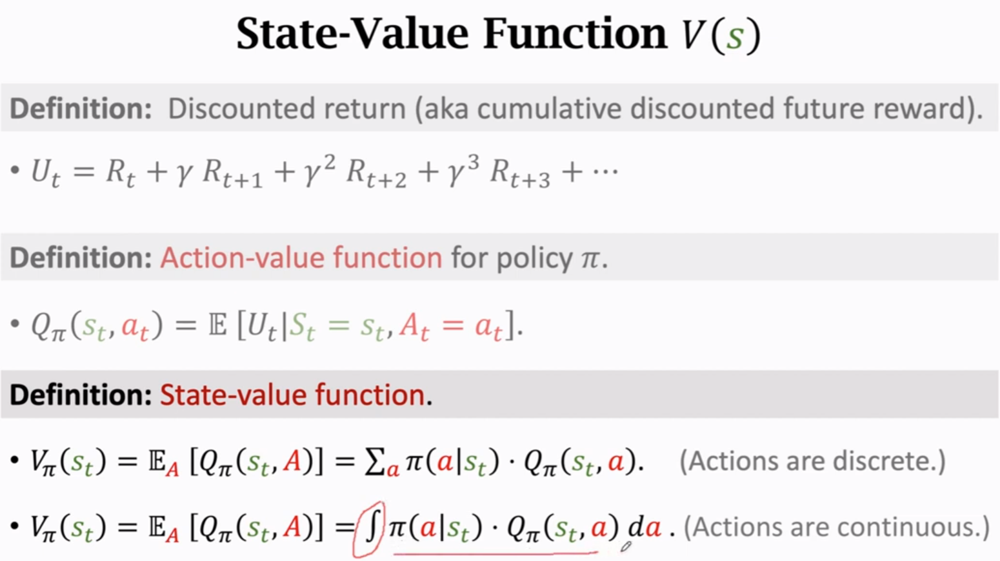
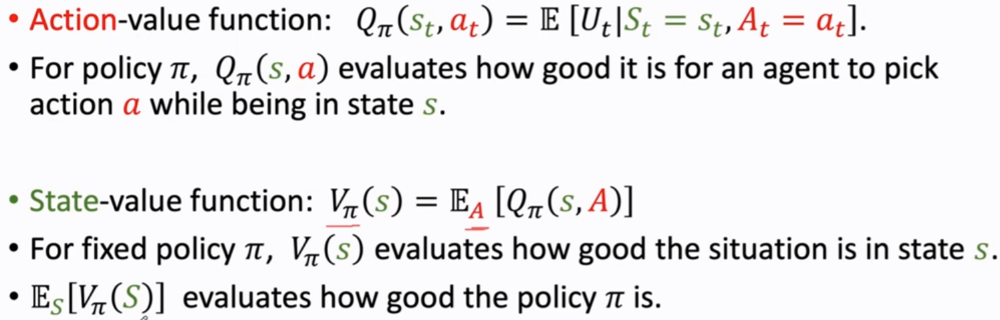

- [[RL]] [[math]] 
  [[return]] : cummulative future reward
  
  [[value function]] 
  $E_A$: expectation w.r.t action $a_t \sim \pi(.|s_t)$
   
  [[optimal action-value function]]
  $$Q*(a, s)=\max_{\pi}Q_{\pi}(a, s)$$
- [[math]] [[RL]] 
  [[random sampling]]
  **~** means 'sampling from' 
  **.** denotes variable that was sampled
  
- [[math]] [[RL]] 
- [[math]] [[RL]] 
  Probability Distribution Function [[PDF]]
  
- [[math]] [[RL]]
  [[Expectation]]
  
- [[math]][[RL]] 
  Policy function
  
- [[math]] [[RL]]
  state transition
  