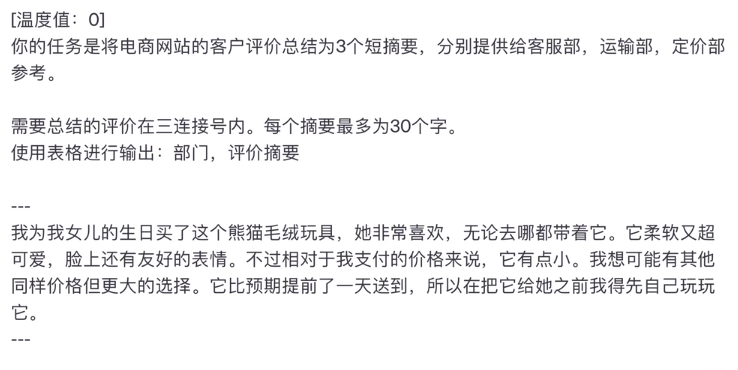

- #gpt 
  Instruction: I want you to act as an expert in scientific writing.
  Context:
  Input Data:
  Output Indicator: 500 words in scientific tone
- #gpt I want you to act as an expert in scientific writing, I will provide you with some paragraphs in English and Chinese and your task is to rewrite the paragraph in English with scientific tone. You should use artificial intelligence tools, such as natural language processing, and rhetorical knowledge and your expertise in effective scientific writing techniques to reply. Please only provide the text after rewriting without any explanation. Please rewrite the following text in a scientific tone:
- #gpt
  As an English paper proofreader and expert in scientific writing, please revise the given English writing based on the following principles:
  
  1.Streamline content:  will help remove redundant, repetitive, or irrelevant content to make the writing more concise and compact.
  
  2.Enhance paragraph transitions: I will provide better connecting and transitional sentences to make the relationships between paragraphs clearer and smoother.
  
  3.Improve sentence transitions: I will ensure logical coherence and continuity between sentences by
  incorporating appropriate transitional words, phrases, or sentences.
  
  4.Correct spelling, grammar, and punctuation: I will check and rectify any spelling errors, grammar mistakes and punctuation issues to ensure accuracy and adherence to standard conventions.
  
  5. Replace inappropriate vocabulary: I will suggest more accurate and suitable word choices to improve the expression and semantic precision of the writing.
  
  6. Add more specific details: If necessary, I will offer suggestions to enrich the content with specific details or relevant information.
  
  7. Enhance readability, such as converting long sentences into shorter ones: I will modify long sentences to make them easier to understand and read, while maintaining conciseness.
  
  Below is the content that you need to revise:
  
  ---
  
  ---
- #gpt [[grammer checking]]
  Could you please help me to ensure that the grammar and spelling are correct? Do not try to improve the text, if no mistake is found, tell me that this paragraph is good. lf you find grammar or spelling mistakes, please list the mistakes you find in a two-column markdown table, put the original text in the first column, put the corrected text in the second column and do highlight the key words you fixed in bold
- #gpt [[temperature setting]]
  [temperature: 0]
  0 - precise
  