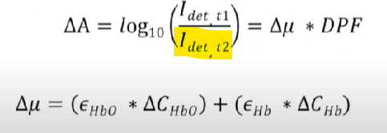
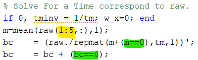
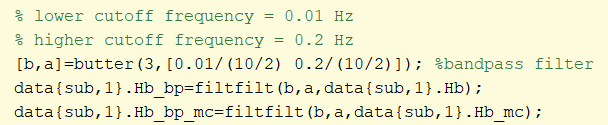
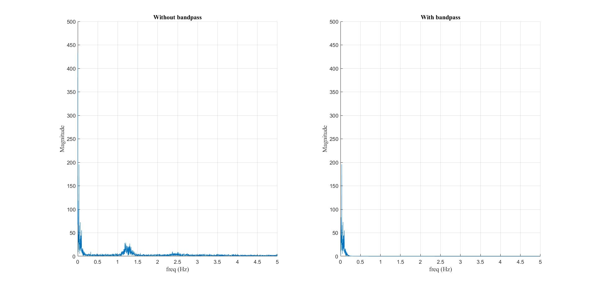

- [[question]]
	- Question about the $I_{det, t1}$ when calculating [[attenuation]]
	  logseq.order-list-type:: number
		- 
		- I saw some resources mentioned that baseline value, $I_{det, t1}$ is commonly calculated by averaging [[light intensity]] over entire scan.
		- 
		- When I refer to the provided Matlab code, $I_{det, t1}$ is calculated based on the average light intensity of the first five timestamps. I understand that the value of $I_{det, t1}$ isn't very significant since [[dMBLL]] calculates the changes in HbO concentration. However, won't this affect the results when comparing [[GLM]] outcomes between different brain areas, since the [[cHRF]] starts at an ideal baseline value while the HbO concentration doesn't start at a true baseline value? Or does this code assume that the brain activity during the first five timestamps is at rest (baseline value)?
			- Also, in [[Optimizing Mental Workload Estimation by Detecting Baseline State Using Vector Phase Analysis Approach]], I found a statement of 'we have additionally analyzed the activation by choosing several time periods for the baseline correction (data not shown), up to 0–5 s from the current 0–0.5 s. We observed that the correlation strength reduced with the increase in the time period used for baseline correction, implying the large HR variability in the rest period can affect the computation of task-evoked activation to a certain degree.' I was wondering, does this statement has any relation with the calculation of $I_{det, t1}$.
		- Also, I understood that $m==0$ and $bc==0$ are to avoid error from division by zero, but won't this also affect the baseline value of HbO?
	- How the order, low and high cutoff frequency are determined?
	  logseq.order-list-type:: number
		- in Matlab the code, these are the cutoff frequencies
			- 
		- And these are my plot with [[discrete fourier transform]]
			- 
		- I understand that higher cutoff frequency is to attenuate sensor noise. Whereas lower cutoff frequency, during previous meeting, sir has mentioned that baseline correction is performed via this lower cutoff frequency.
		- Are these cutoff frequencies been determined via any digital signal processing technique? Or are these cutoff frequencies been tuned based the increase in [[p-value]] of [[General Linear Model]] analysis?
	- [[multi-distance channel measurement]]
	  logseq.order-list-type:: number
		- Short Source-Detector Separation
		- reduce noise
		- increase [[Spatial resolution]]
	- How [[hemodynamic response function]] is determined?
	  logseq.order-list-type:: number
		- amplitude
			- or amplitude does not affect significantly the result of [[GLM]] analysis?
		- why HRF_10Hz.mat does not have:
			- time and dispersion derivative