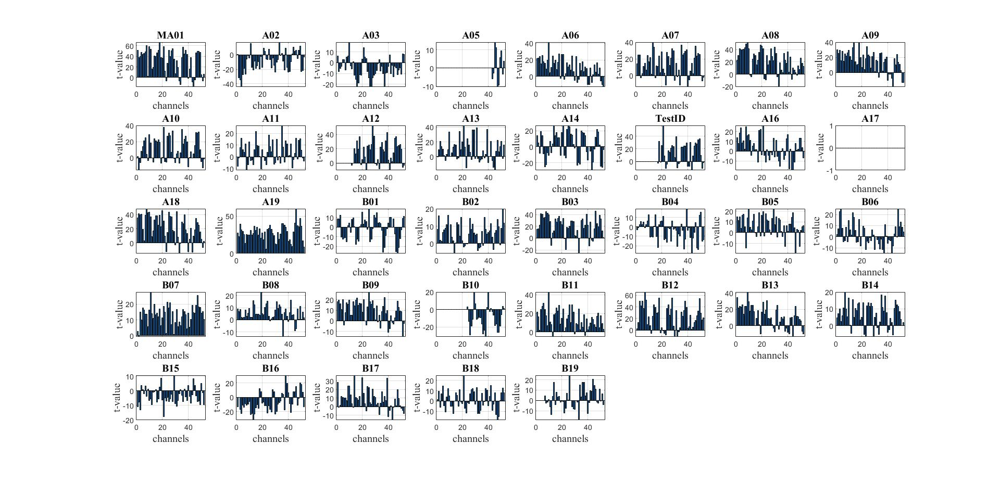

- [[Meeting with Dr Lim Lam Ghai]]
	- [[question]]
		- NOW [[t-test]]
		  logseq.order-list-type:: number
		  :LOGBOOK:
		  CLOCK: [2024-06-13 Thu 00:42:51]
		  CLOCK: [2024-06-13 Thu 00:42:55]
		  :END:
			- 
			- 
		- NOW [[p-value]] definition
		  logseq.order-list-type:: number
		  :LOGBOOK:
		  CLOCK: [2024-06-20 Thu 09:55:47]
		  :END:
		- NOW robustfit vs fitlm
		  logseq.order-list-type:: number
		  :LOGBOOK:
		  CLOCK: [2024-06-13 Thu 02:17:43]
		  CLOCK: [2024-06-13 Thu 02:17:57]
		  CLOCK: [2024-06-13 Thu 02:18:01]
		  :END:
			- {:height 340, :width 688}
			- 
		- NOW region of interest
		  logseq.order-list-type:: number
		  :LOGBOOK:
		  CLOCK: [2024-06-13 Thu 02:18:14]
		  CLOCK: [2024-06-13 Thu 02:18:17]
		  :END:
			- {:height 340, :width 688}
			- 
			- [[brodmann areas]]
			   
		- LATER task relationship
		  logseq.order-list-type:: number
		  :LOGBOOK:
		  CLOCK: [2024-06-13 Thu 02:23:21]
		  CLOCK: [2024-06-13 Thu 02:23:29]
		  :END:
		- LATER [[Principal component analysis]] and [[independent component analysis]]
		  logseq.order-list-type:: number
		  :LOGBOOK:
		  CLOCK: [2024-06-12 Wed 23:37:09]--[2024-06-12 Wed 23:38:19] =>  00:01:10
		  :END:
		- LATER Drift_signal.m & Real time denoising.m
		  logseq.order-list-type:: number
		  :LOGBOOK:
		  CLOCK: [2024-06-12 Wed 23:37:13]
		  CLOCK: [2024-06-12 Wed 23:38:39]--[2024-06-12 Wed 23:38:41] =>  00:00:02
		  :END:
		- NOW miscellaneous
		  logseq.order-list-type:: number
		  collapsed:: true
		  :LOGBOOK:
		  CLOCK: [2024-06-20 Thu 01:00:00]
		  CLOCK: [2024-06-20 Thu 01:00:07]
		  :END:
			- stipend
			  logseq.order-list-type:: number
				- date
				  logseq.order-list-type:: number
				- socso, epf
				  logseq.order-list-type:: number
			- accommodation
			  logseq.order-list-type:: number