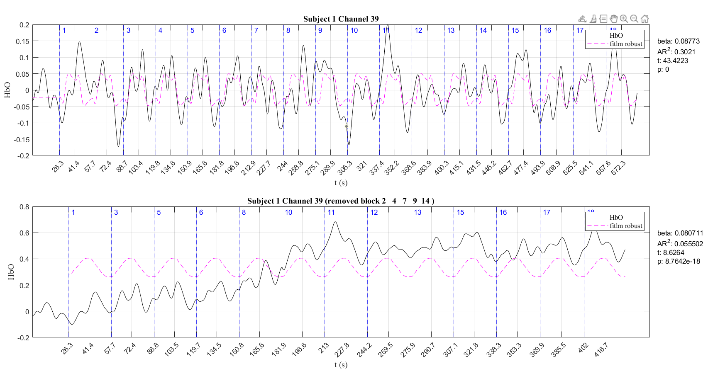
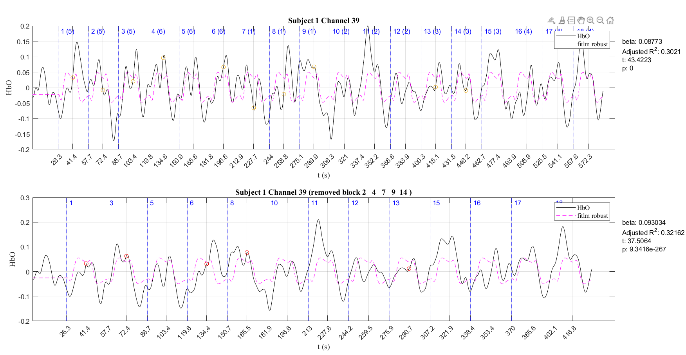
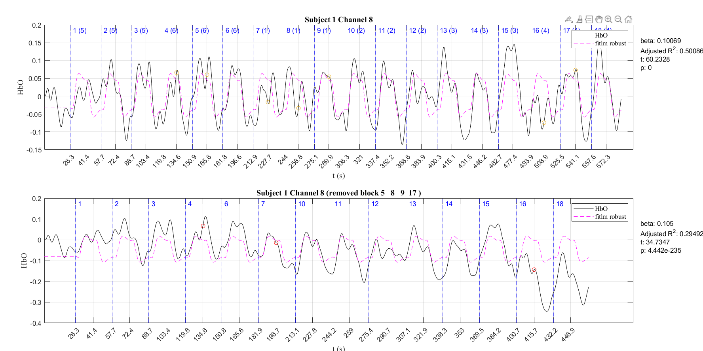
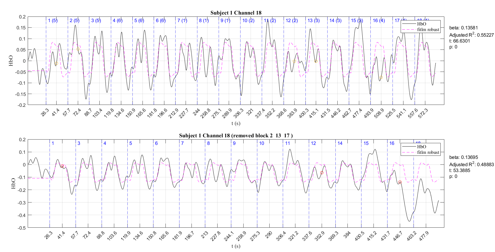
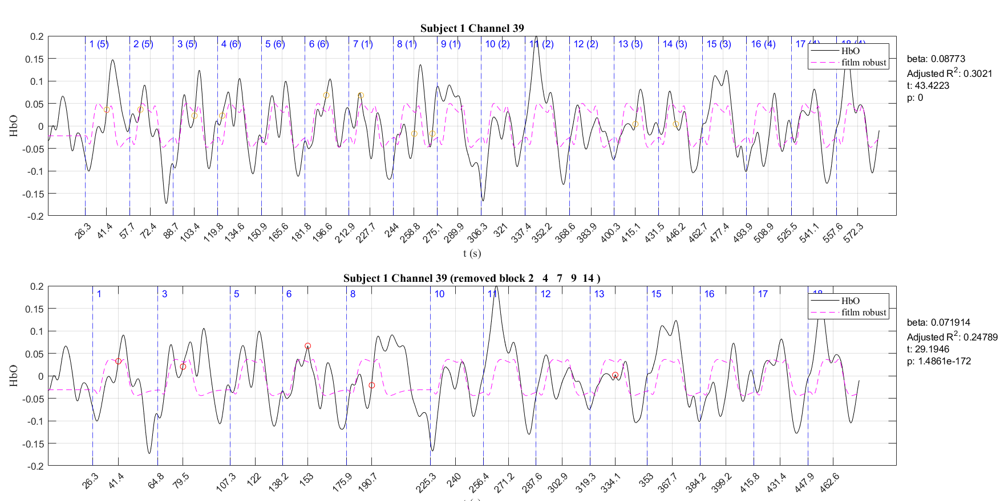
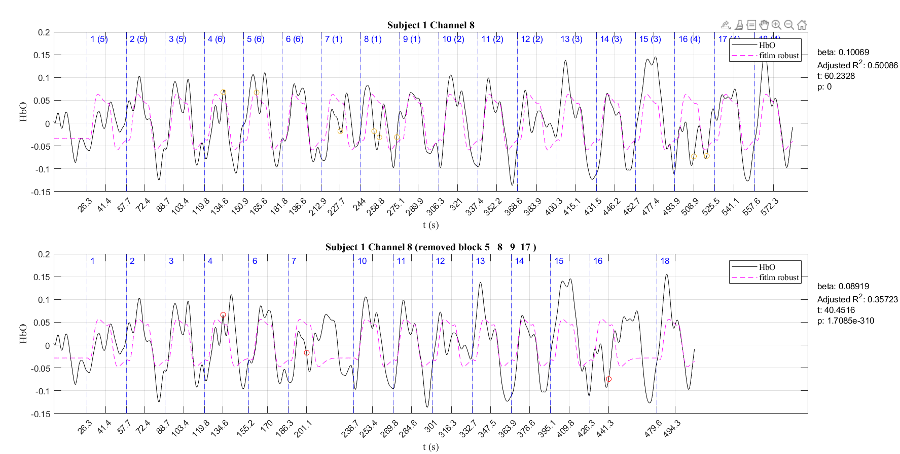
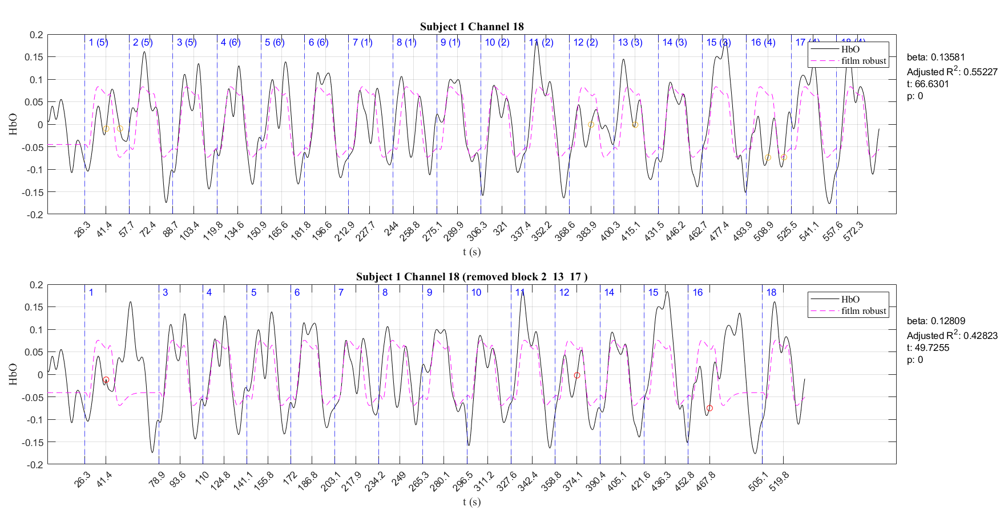
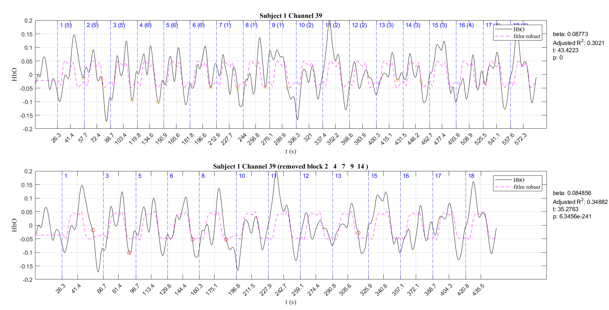
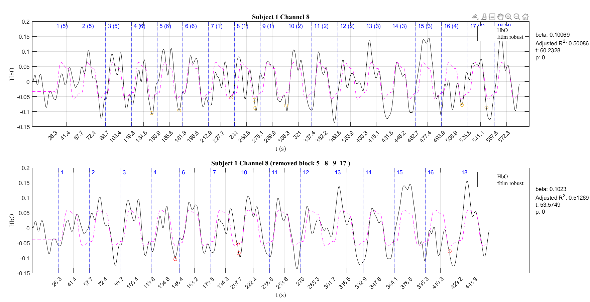
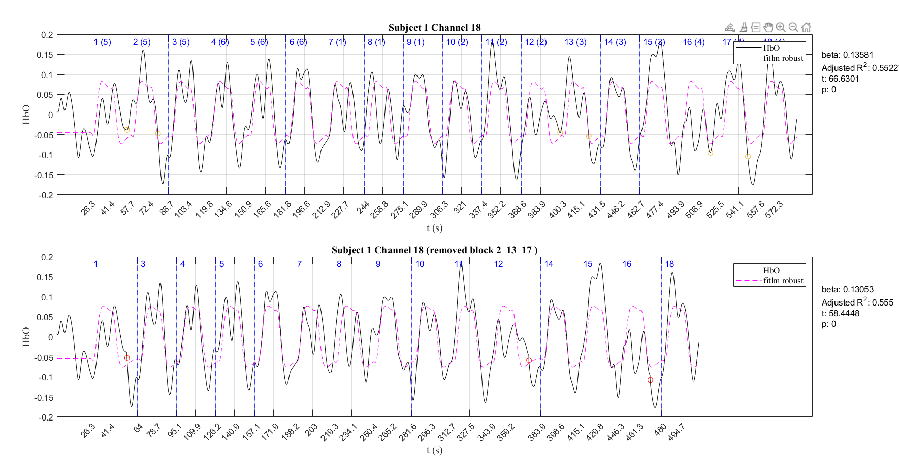

- [[Meeting with Dr Lim Lam Ghai]]
	- results
	  logseq.order-list-type:: number
		- simple way (start to start)
		  logseq.order-list-type:: number
			- 
		- simple way (rest to rest)
		  logseq.order-list-type:: number
			- 
			- 
			- 
		- adaptive rest period
		  logseq.order-list-type:: number
			- 
			- 
			- 
		- min to min
		  logseq.order-list-type:: number
			- 
			- 
			- 