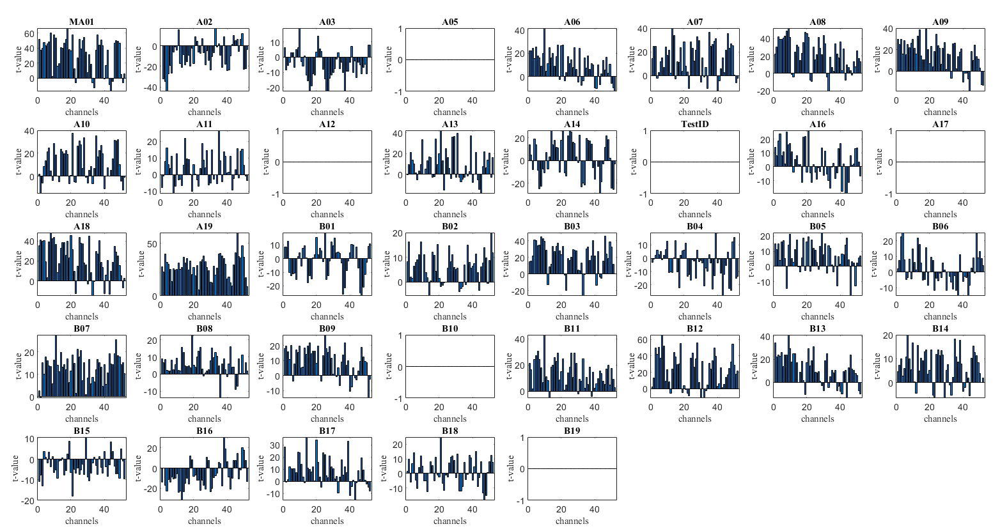

- [[Meeting with Dr Lim Lam Ghai]]
	- [[Signal-to-Noise Ratio]]
		- 
	- [[region of interest]]
		- without [[Temporal Derivative Distribution Repair]]
			- 
			- 
		- with [[TDDR]]
			- {:height 250, :width 439}
			- {:height 390, :width 719}