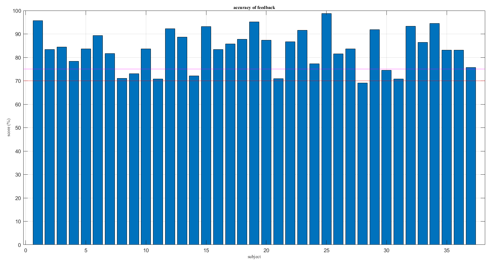

- [[Meeting with Dr Lim Lam Ghai]]
	- [[TDDR]]
	  logseq.order-list-type:: number
	- accuracy of subject's feedback
	  logseq.order-list-type:: number
		- 
		  logseq.order-list-type:: number
	- method of baseline detection
	  logseq.order-list-type:: number
		- DONE vector phase analysis
		  logseq.order-list-type:: number
		- DONE HbO only
		  logseq.order-list-type:: number
		- WAITING HbR only
		  logseq.order-list-type:: number
	- method of labelling
	  logseq.order-list-type:: number
		- [[brodmann areas]]
		  logseq.order-list-type:: number
		- beta: [[softmax]]
		  logseq.order-list-type:: number
		- beta: [[ReLU]]
		  logseq.order-list-type:: number