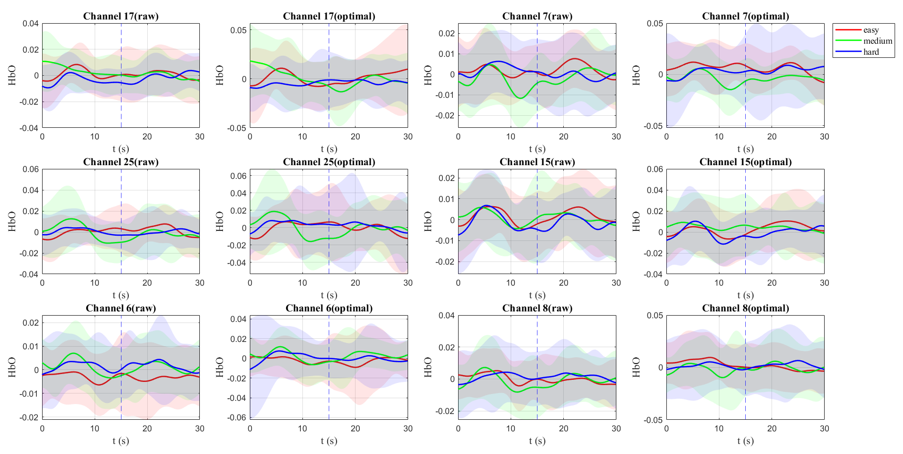
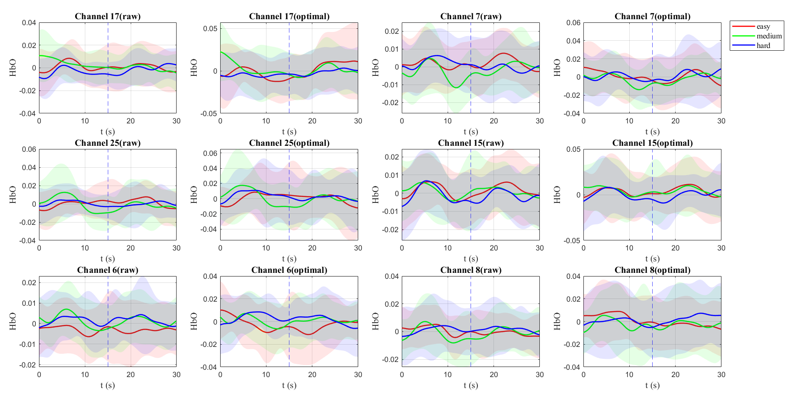
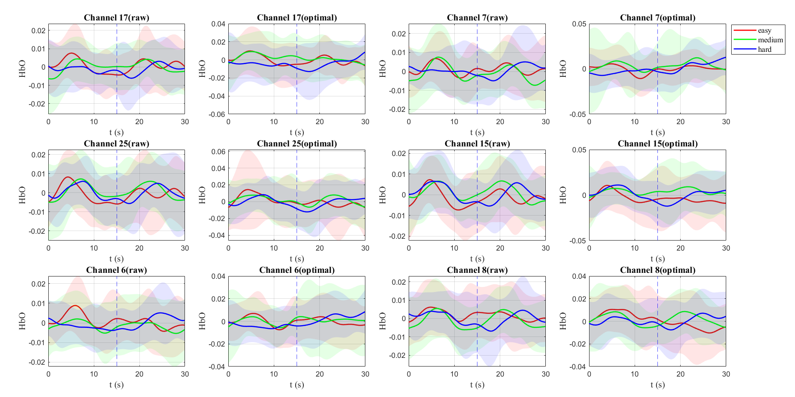
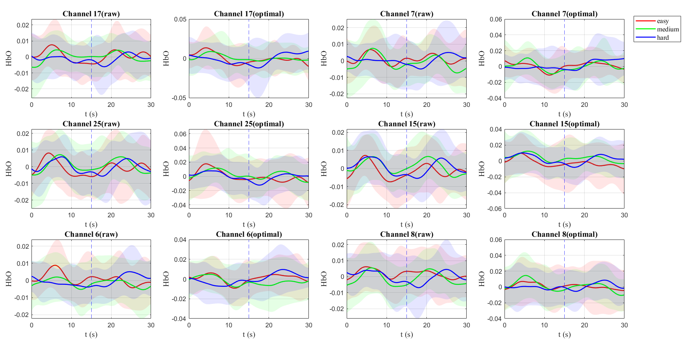
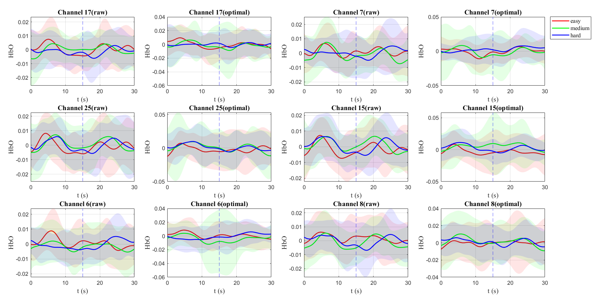
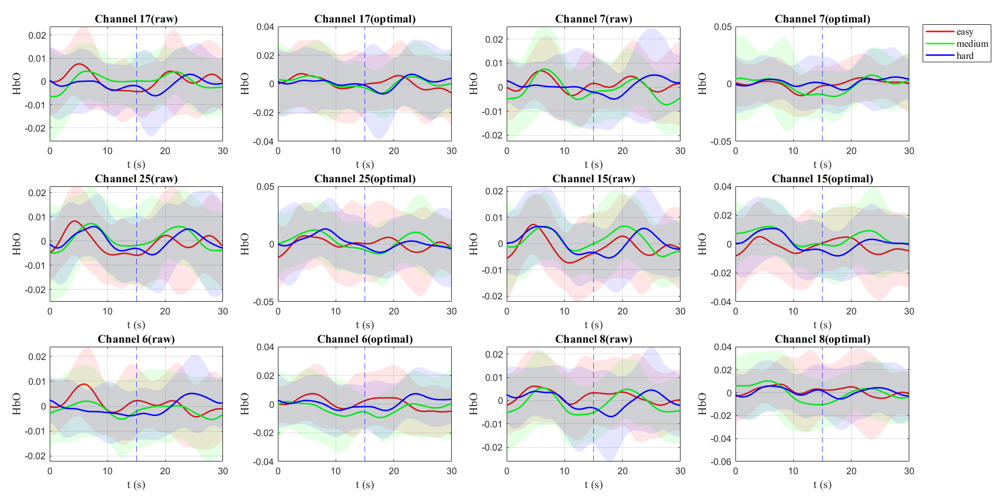
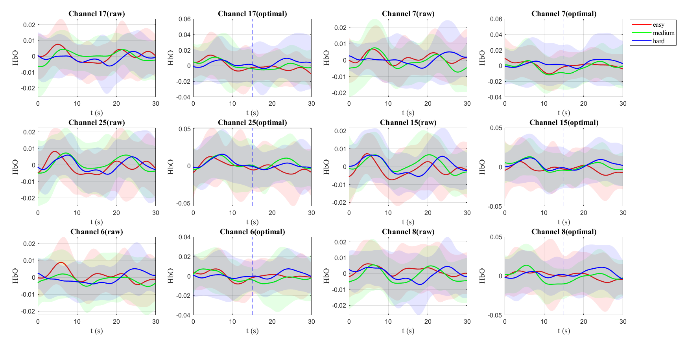
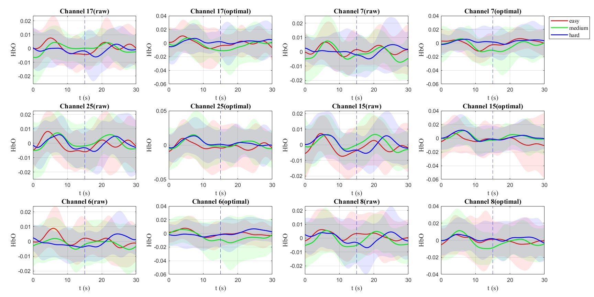

- [[Meeting with Dr Lim Lam Ghai]]
	- performance of subjects
	  collapsed:: true
		- 
		- 
	- baseline detector
	  collapsed:: true
		- 
		- dataset 1 (18 trials)
			- without multichannel labelling
				- vector phase analysis
					- 
				- hbo_baseline_detection
					- 
			- multi labelling
			  collapsed:: true
				- vector phase analysis
					- BA
						- 
					- softmax
						- 
					- relu
						- 
				- hbo_baseline_detection
					- BA
						- 
					- softmax
						- 
					- relu
						- 
		- dataset 2 (60 trials)
			- without multichannel labelling
				- vector phase analysis
					- 
				- hbo_baseline_detection
					- 
			- multi labelling
				- vector phase analysis
					- BA
						- 
					- softmax
						- 
					- relu
						- 
				- hbo_baseline_detection
					- BA
						- 
					- softmax
						- 
					- relu
						- 
	- variance reduction
		- determine via [[t-test]]
	- beginning of block average
		- https://pdf.cdn.readpaper.com/parsed/fetch_target/0d37d28970c3acdd7d0e173fa7568415_5_Figure_5_-640585680.png{:height 902, :width 719}