- [[Meeting with Dr Lim Lam Ghai]]
	- performance of subjects
	  collapsed:: true
		- 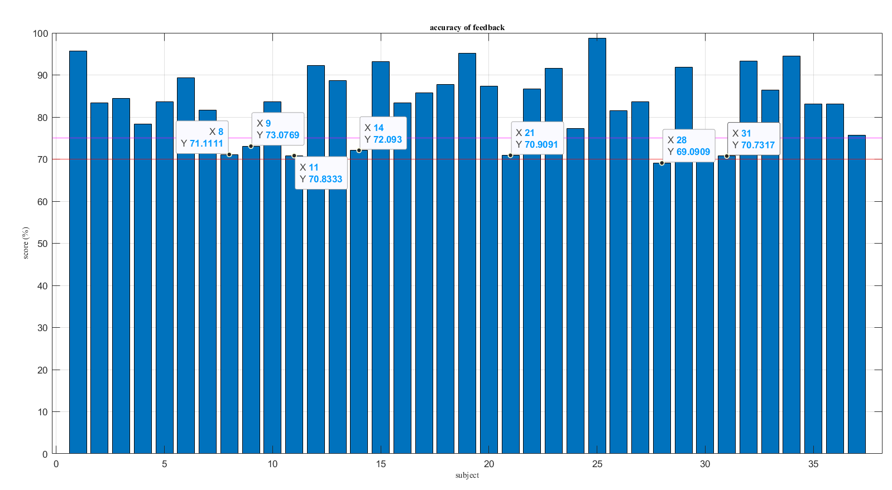
		- 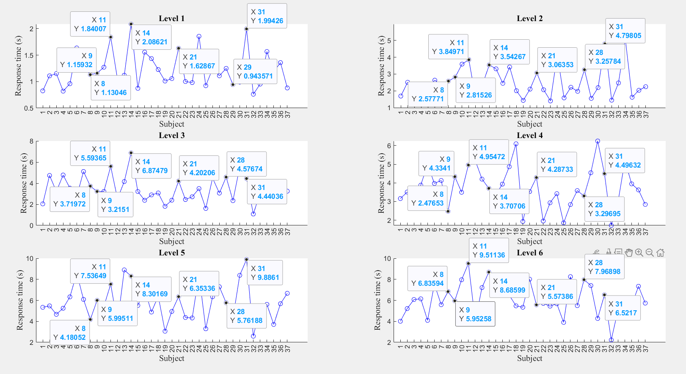
	- baseline detector
		- 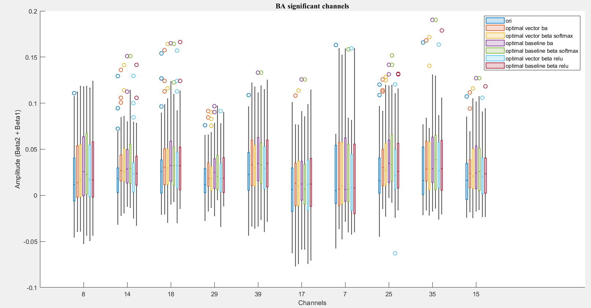
		- without multichannel labelling
			- vector phase analysis
				- 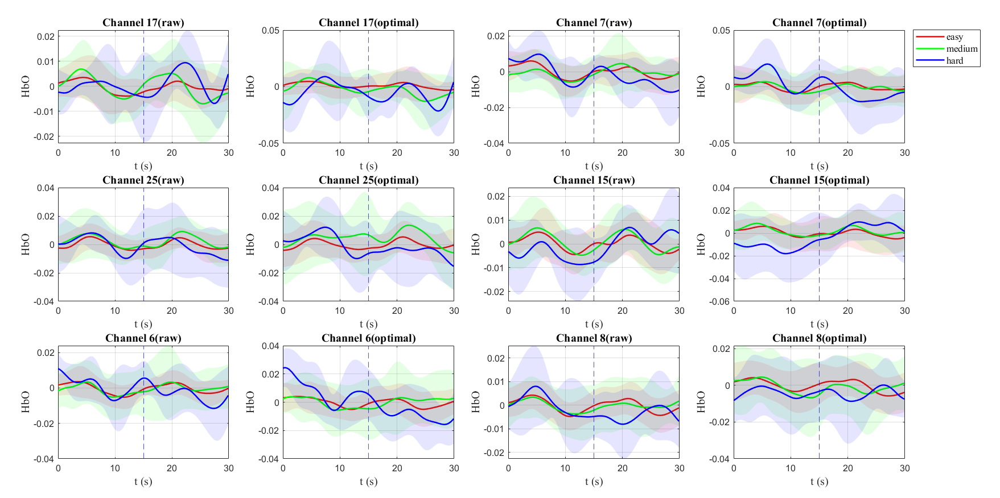
			- hbo_baseline_detection
				- 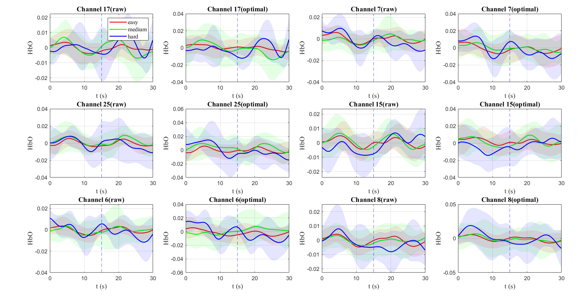
			- multi labelling
				- vector phase analysis
					- BA
						- 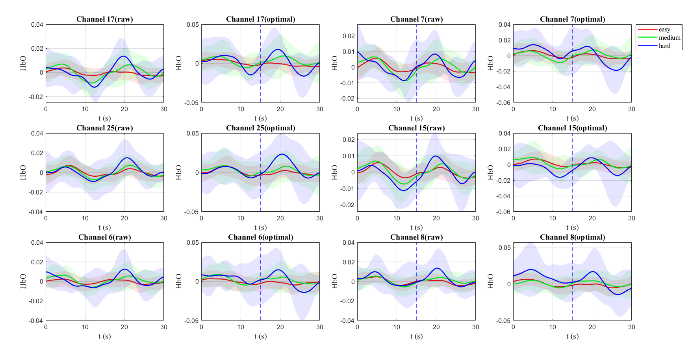
					- softmax
						- 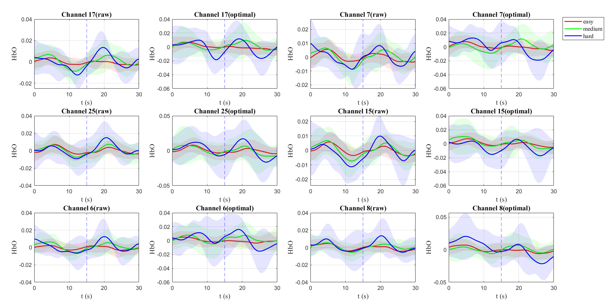
					- relu
						- 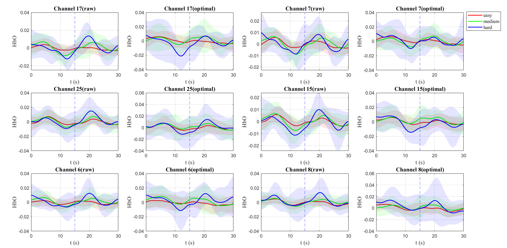
				- hbo_baseline_detection
					- BA
						- 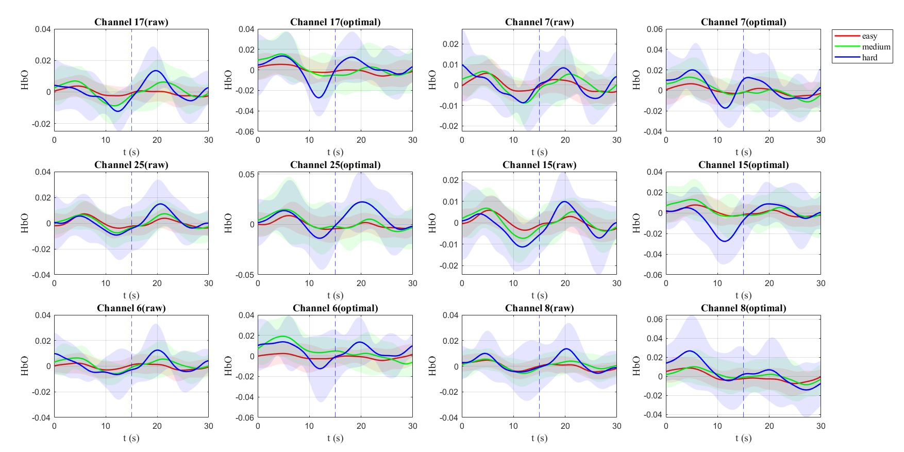
					- softmax
						- 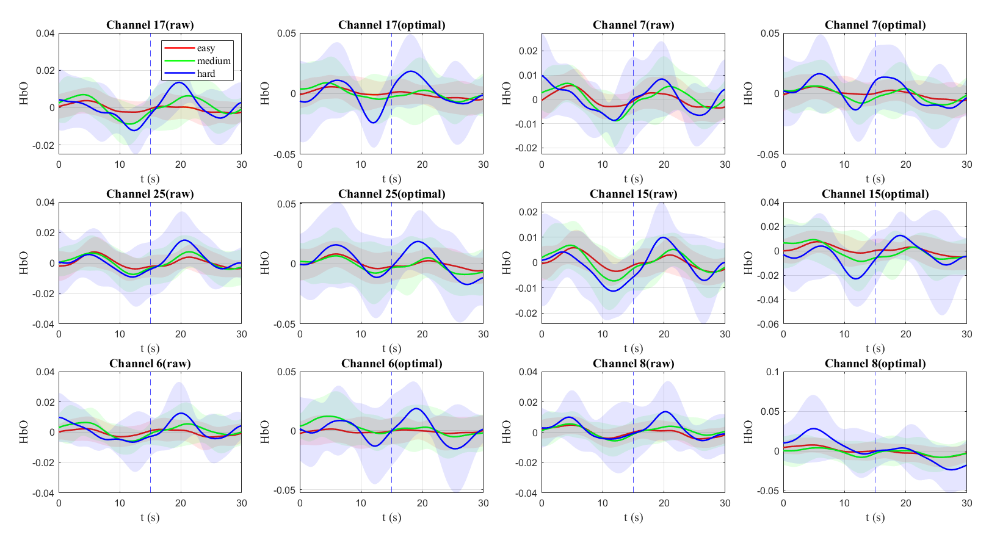
					- relu
						- 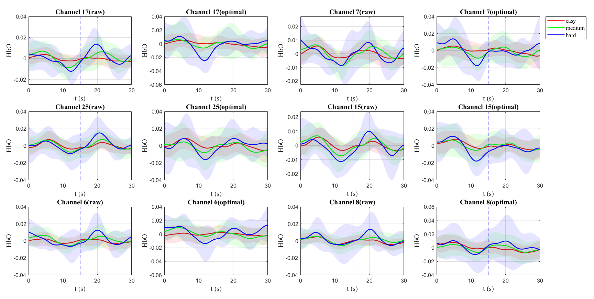