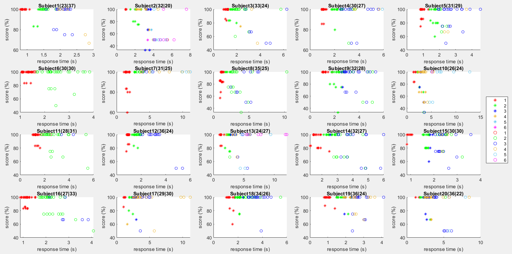
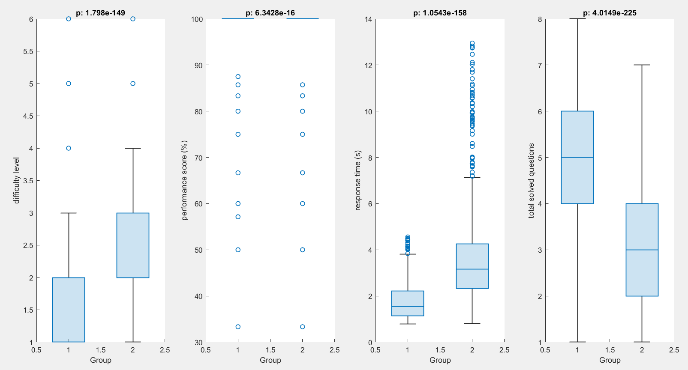
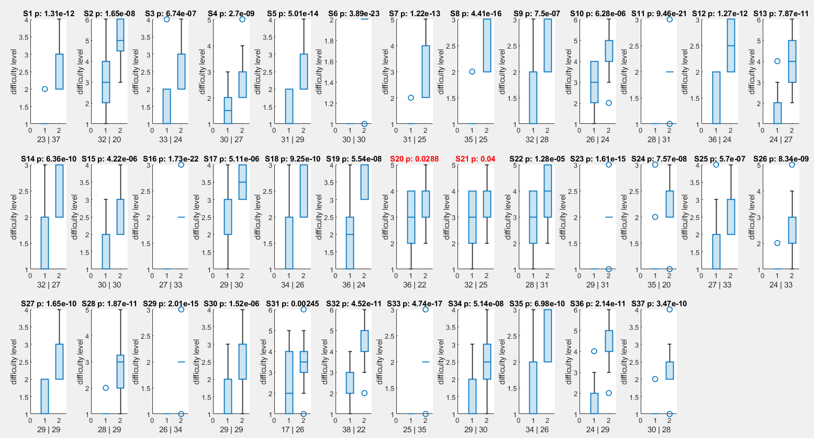
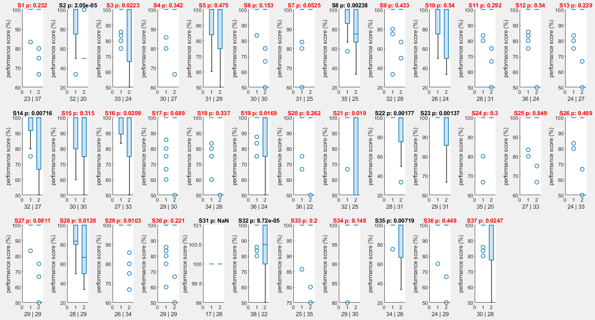
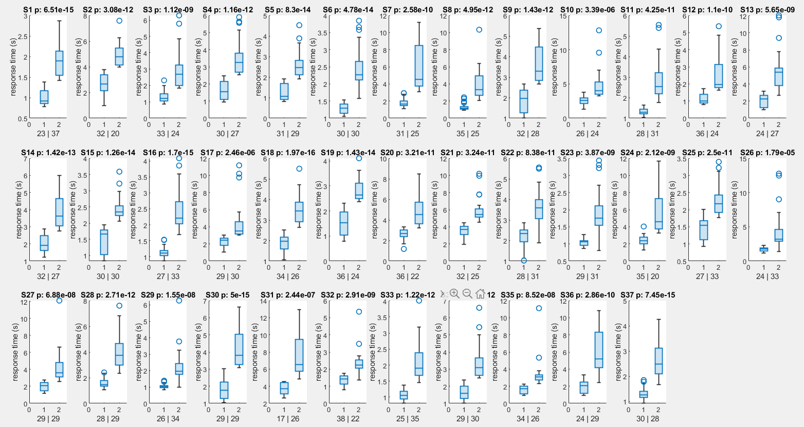
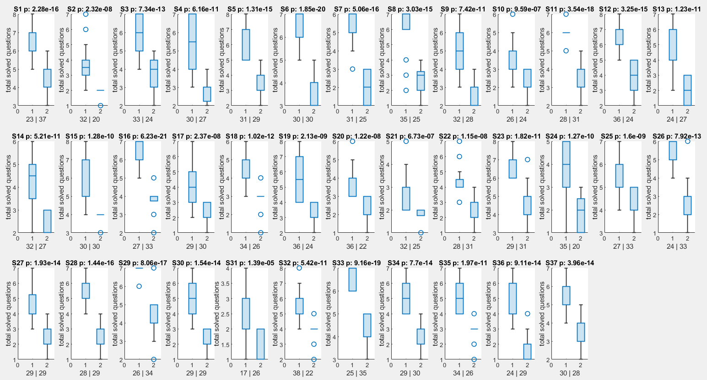
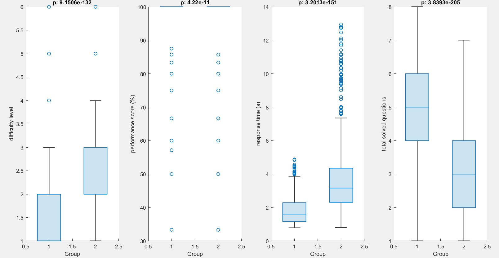
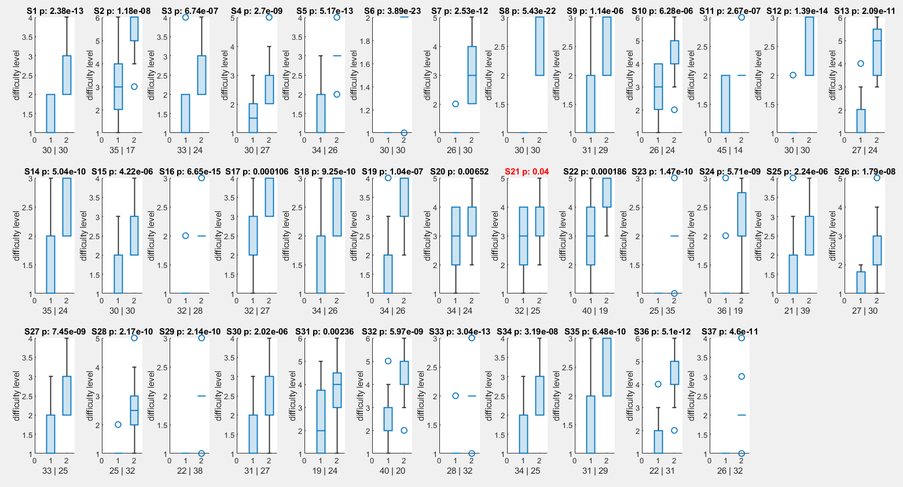
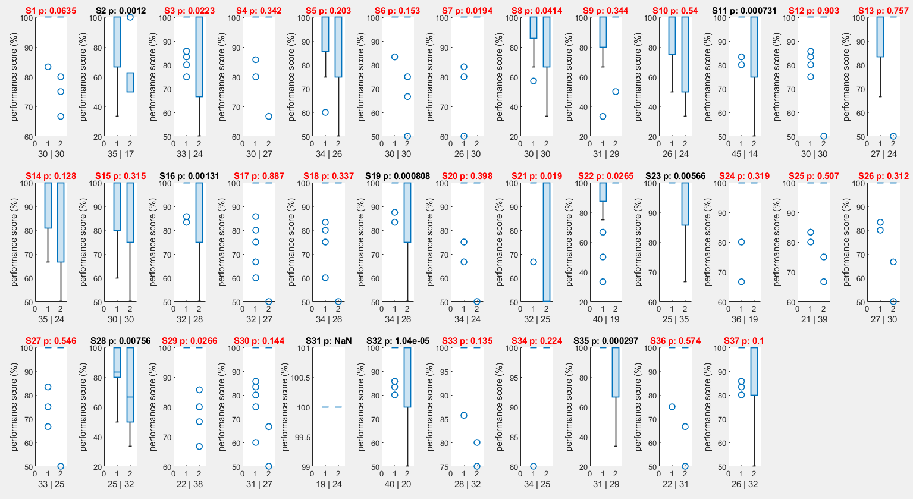
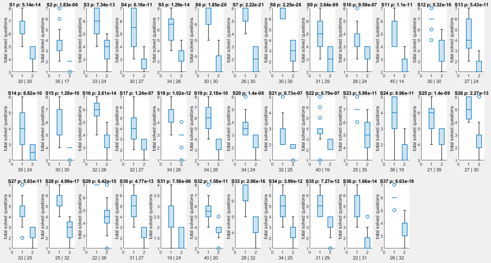

- [[Meeting with Dr Lim Lam Ghai]]
	- clustering methods:
		- [[k-means clustering]]
		  logseq.order-list-type:: number
			- result
			  logseq.order-list-type:: number
				- 
				- 
			- validation
			  logseq.order-list-type:: number
				- 
				- 
				- 
				- {:height 360, :width 658}
				- 
		- Median
		  logseq.order-list-type:: number
			- result
			  logseq.order-list-type:: number
				- 
				- 
			- validation
			  logseq.order-list-type:: number
				- 
				- 
				- 
				- 
				- 
		- [[Hierarchical Clustering]]
		  logseq.order-list-type:: number
			- cutoff at third quartile of inconsistency coefficient (without removing zeros inconsistency coefficient)
			  logseq.order-list-type:: number
			  collapsed:: true
				- result
				  logseq.order-list-type:: number
					- 
					- 
				- validation
				  logseq.order-list-type:: number
					- 
					- 
					- 
					- 
					- 
			- cutoff at third quartile of inconsistency coefficient
			  logseq.order-list-type:: number
				- result
				  logseq.order-list-type:: number
					- 
					- 
				- validation
				  logseq.order-list-type:: number
					- 
					- 
					- 
					- 
					- {:height 345, :width 627}
			- cutoff at mean between third quartile and maximum inconsistency coefficient
			  logseq.order-list-type:: number
				- result
				  logseq.order-list-type:: number
					- 
					- 
					-
				- validation
				  logseq.order-list-type:: number