- [[Meeting with Dr Lim Lam Ghai]]
	- clustering methods:
		- [[k-means clustering]]
		  logseq.order-list-type:: number
			- result
			  logseq.order-list-type:: number
				- 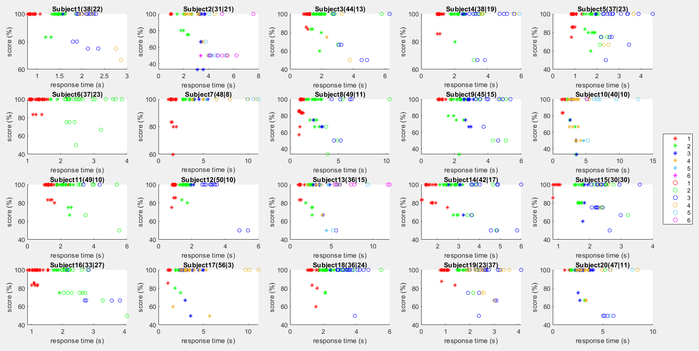
				- 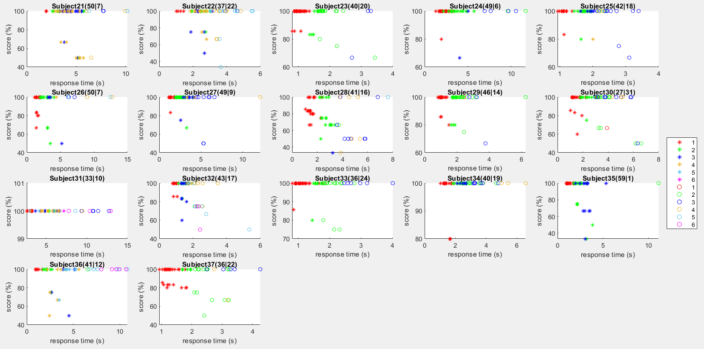
			- validation
			  logseq.order-list-type:: number
				- 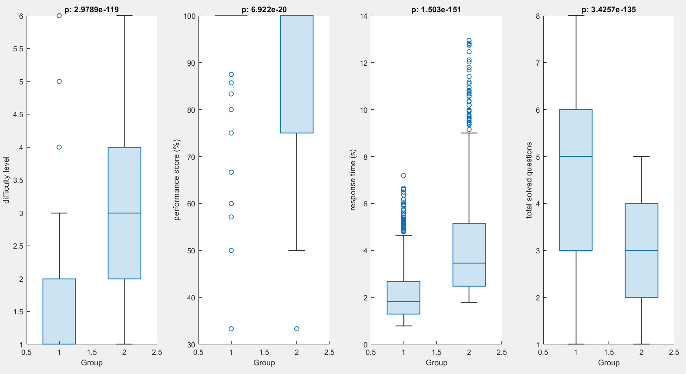
				- 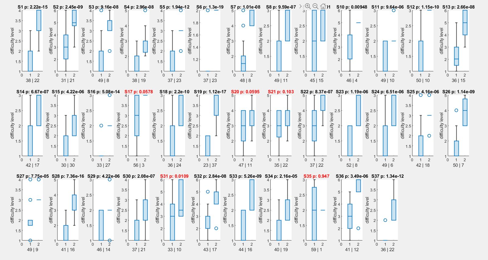
				- 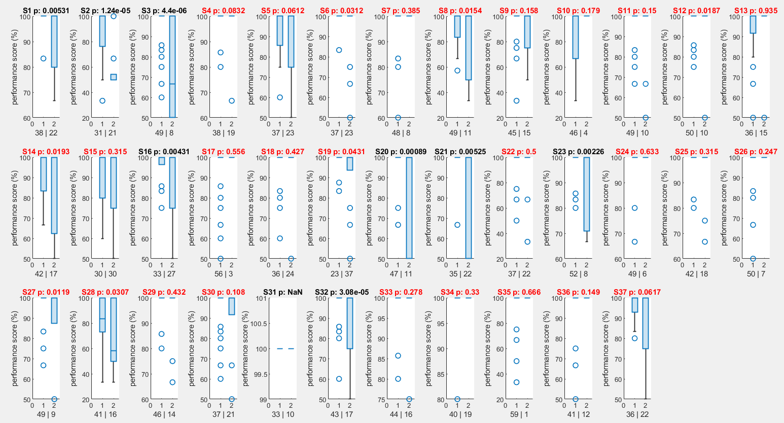
				- 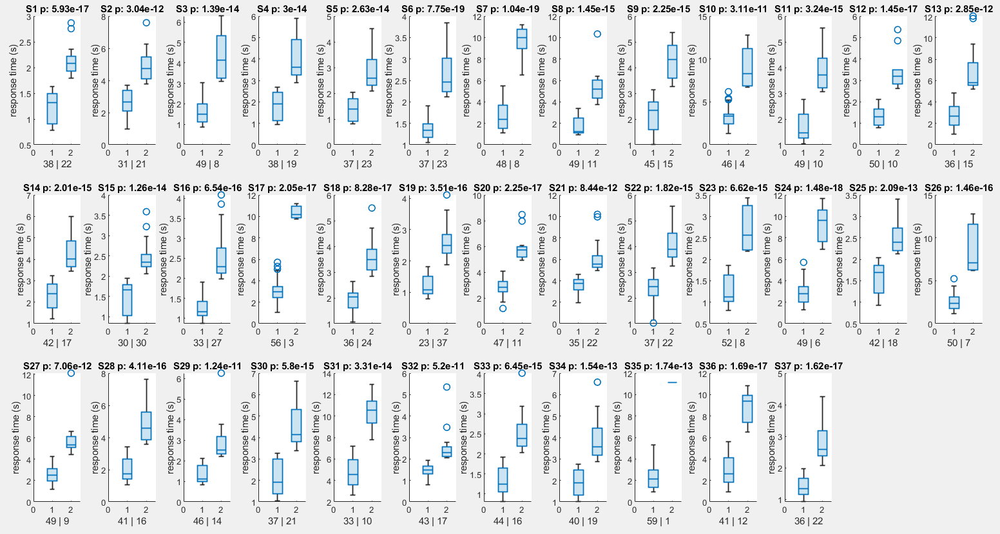{:height 360, :width 658}
				- 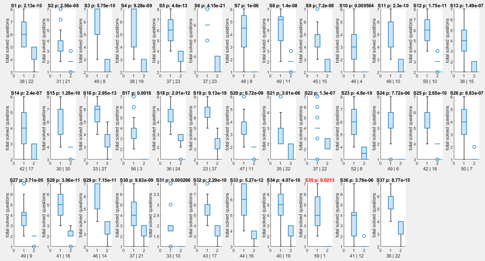
		- Median
		  logseq.order-list-type:: number
			- result
			  logseq.order-list-type:: number
				- 
				- 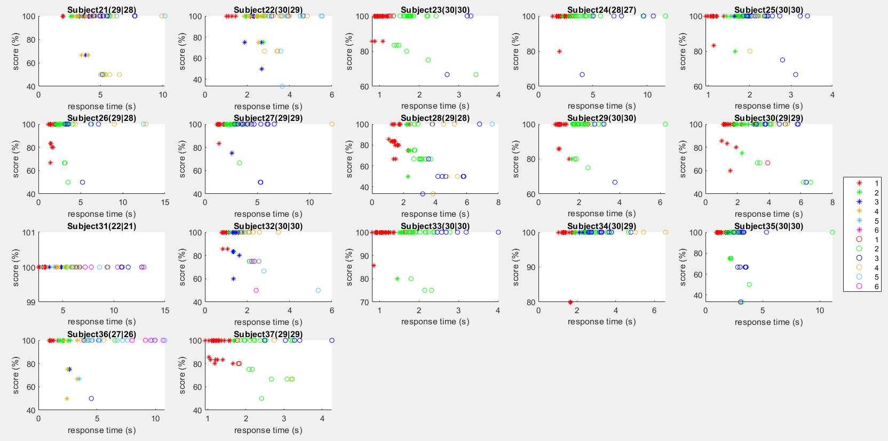
			- validation
			  logseq.order-list-type:: number
				- 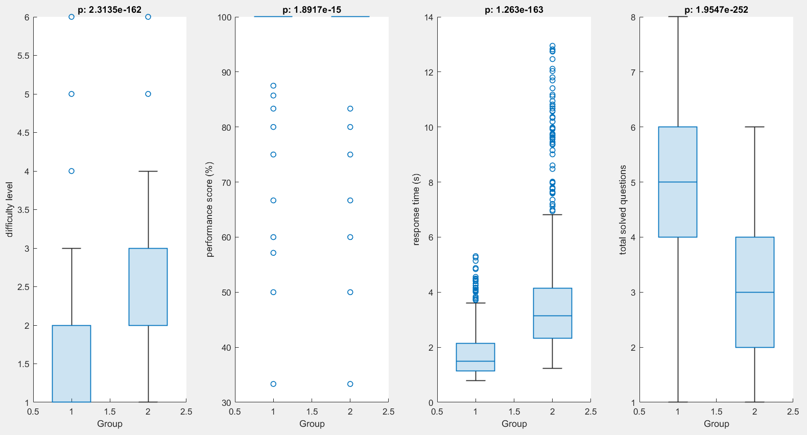
				- 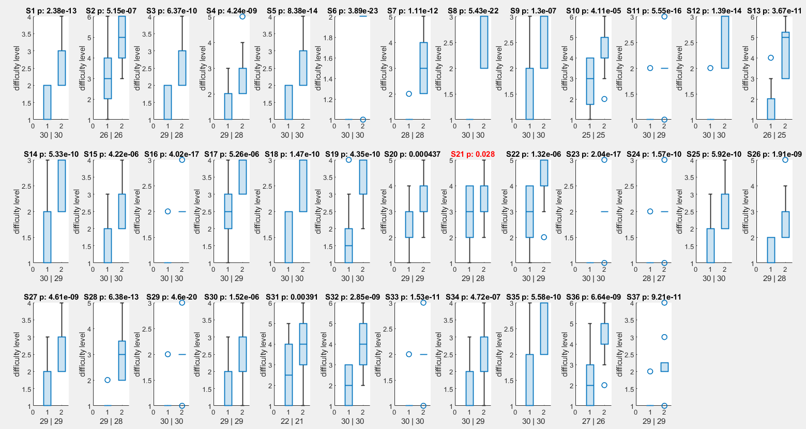
				- 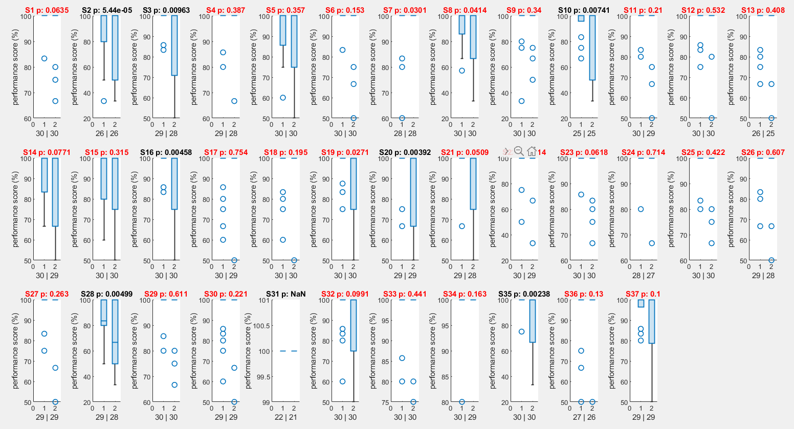
				- 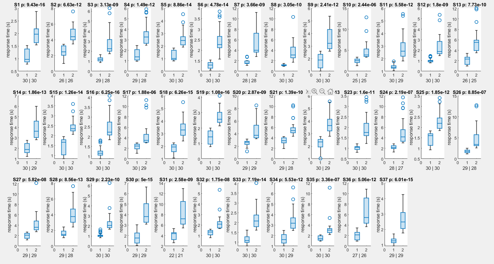
				- 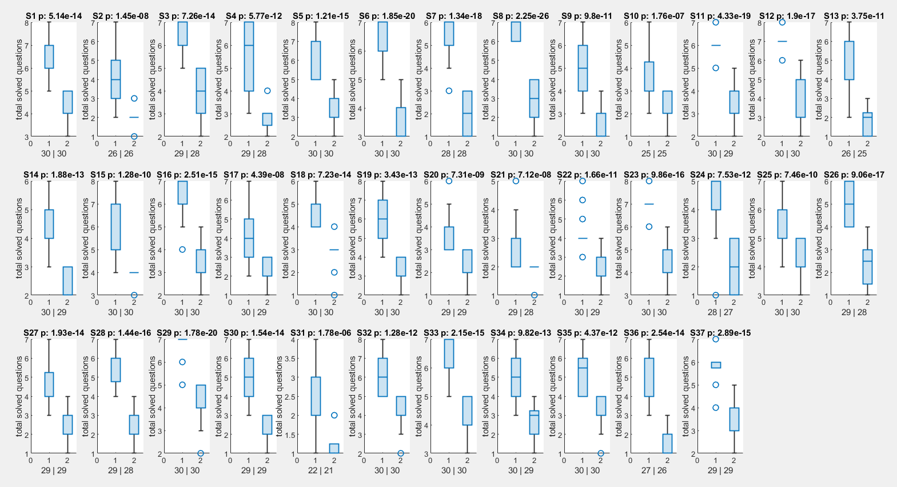
		- [[Hierarchical Clustering]]
		  logseq.order-list-type:: number
			- result
			  logseq.order-list-type:: number
				-
			- validation
			  logseq.order-list-type:: number
				-