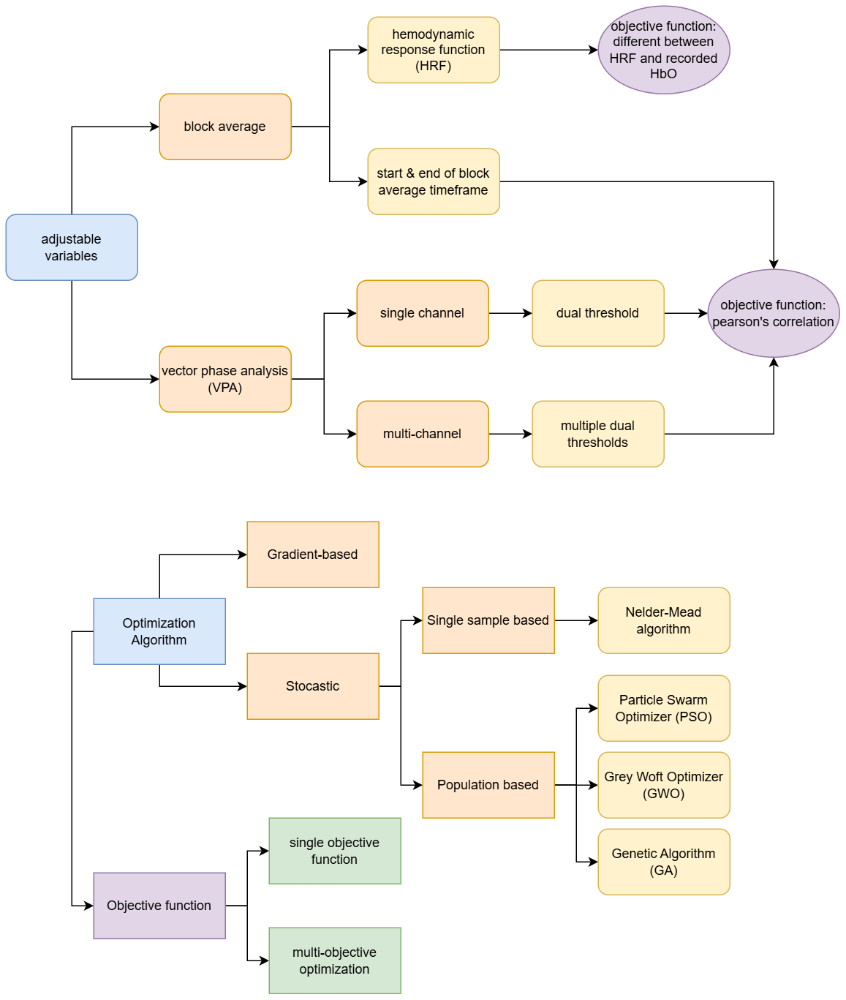

- [[Meeting with Dr Lim Lam Ghai]]
	- {:height 832, :width 697}
	- Suggestion by Dr Lim:
		- Left and right dorsolateral prefrontal cortex
		- Due to physiological noise, HbR might increase together with HbO during task block
		- Objective function: t-test on mean and variance of block average