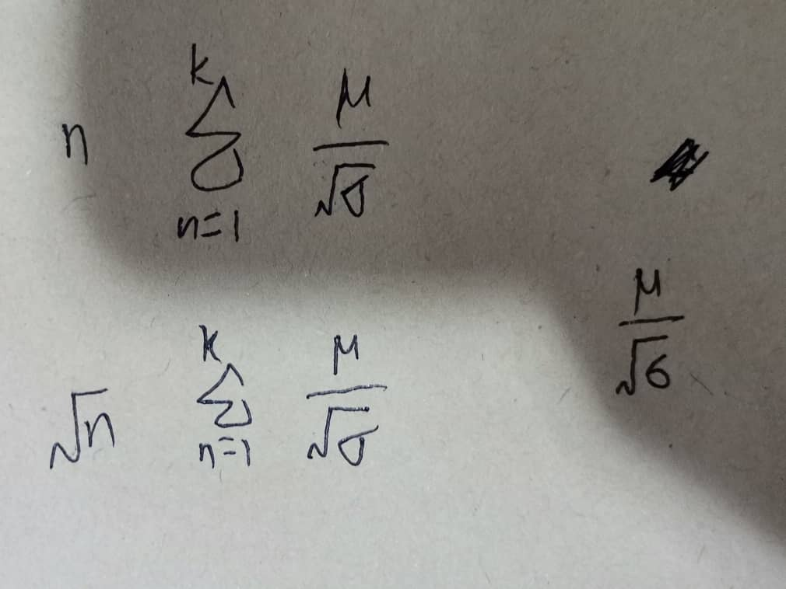

- [[Meeting with Dr Lim Lam Ghai]]
	- objective function
		- 
	- suggestion from Dr Lim
		- TODO Another info for you to validate your results for trials that have good baseline (predicted by your method). you can take the mean HbO change over 15-s for that task for each predicted OBB. let say you have 30 OBB, then if you take **one-tail t-test against 0** (30 values against 0), you will expect the t-value is positive and larger (more significant) than the 60 RBB. similarly, if you take one-tail t-test against 0 for HbR change (60 values against 0), you will expect the t-value is negative and larger in magnitude (more significant) than the 60 RBB. this scenario should be observed in working memory channels.
		- TODO I have thought about how to apply your objective function for baseline detection. Let say our experimental design is task_1, rest_1, task_2, rest_2, task_3, rest_3, etc. We should expect the mean HbO change in 15-s task_1 is higher than the **last 5-s mean** HbO change in rest_1. The objective function should maximize this. when this is maximize, we will say the activated HbO during task_1 has properly returned to baseline, hence task_2 should have a proper baseline before the task starts. What do you think?
			- we will expect std of HbO change in 15-s task_1 is higher than the std of HbO change in the last 5-s of rest_1. Thus, you can build the objective function using mean and std accordingly.
	- task
		- TODO justify my methodology is justified to still obey block removal based on baseline return
			- plan:
				- correlation between optimized dual-threshold and objective function