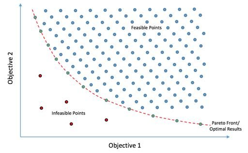

- [[Meeting with Dr Lim Lam Ghai]]
	- My theory:
		- using [[particle swarm optimization]] to optimize [[vector phase analysis]]
		- Objective function:
			- since task-block average is the significant indicator for activation level, objective function only tend to increase task-block average, but still obey [[VPA]] (which justify that still removes blocks based on baseline return)
			  logseq.order-list-type:: number
			- objective function tend to ensure HbO signal return to baseline at the end of rest period, but still obey [[VPA]] (which justify that still removes blocks based on baseline return)
			  logseq.order-list-type:: number
			- objective function only tend to make HbO signal to looks like a [[hemodynamic response function]] , but still obey [[VPA]] (which justify that still removes blocks based on baseline return)
			  logseq.order-list-type:: number
	- ["Monash University" :: Milestone: 6 Month Interview Form](https://forms.apps.monash.edu/frevvo/web/tn/monash.edu/u/614aac3c-8ab8-4309-9283-375663fa97d8/app/_osCiEMiQEemO4vS8r8AETw/flow/_qmDNAaT4Ee-C6-gWlMnDqA/current?typeId=_4K3GMe-0Ee2lSKVrcLNpAw&typeId=_4K3GMe-0Ee2lSKVrcLNpAw&embed=true&embed=true&_method=get&locale=en,eng&_formTz=Asia%252FShanghai&_cur_activity_id=__GtGBcC-hEeucE-qiM_jy9w)
	- Possibly to implement [[multi-objective optimization]]
		- {:height 323, :width 512}