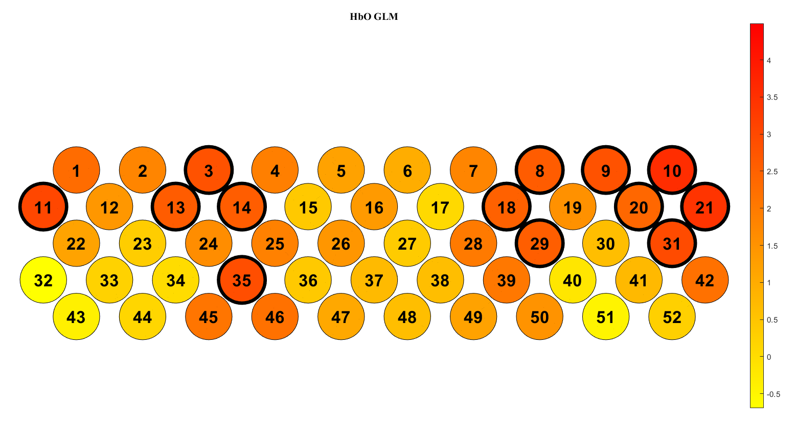
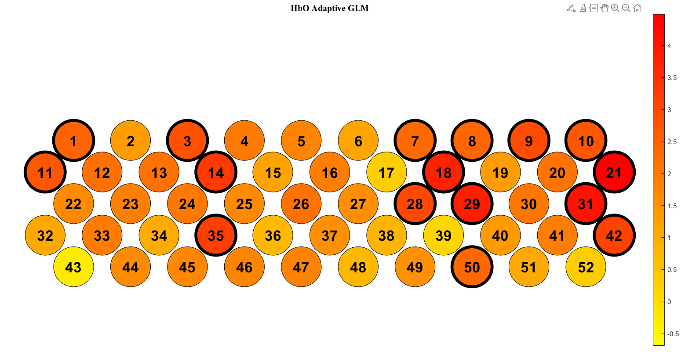
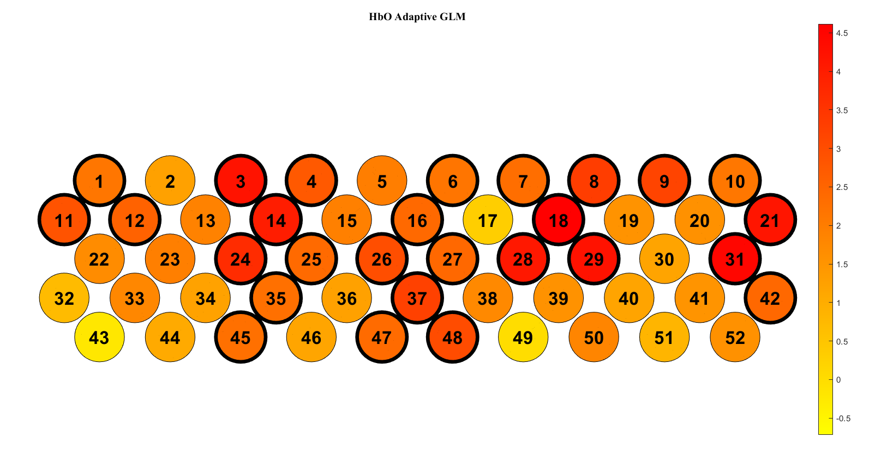
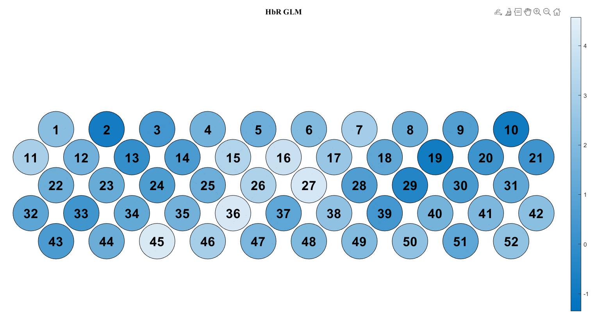
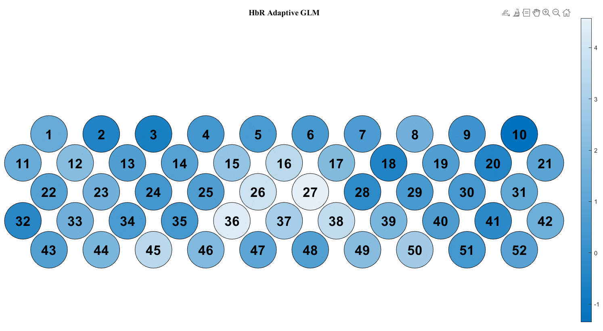

- [[Meeting with Dr Lim Lam Ghai]]
	- HbO
		- task
			- systemic (HbO and HbR together significant to exclude systemic error)
			- shorten experiment length
			- remove culprit channel
			- focus on BA channel
			- why non-BA channel activated
		- strict
		  id:: 67e4a862-be51-4c46-bf13-3560cff88a3a
			- 
			- 
		- less strict
			- 
	- HbR
		- 
		- 