- tolerance: 0.1
	- [[Bonferroni correction]]
		- 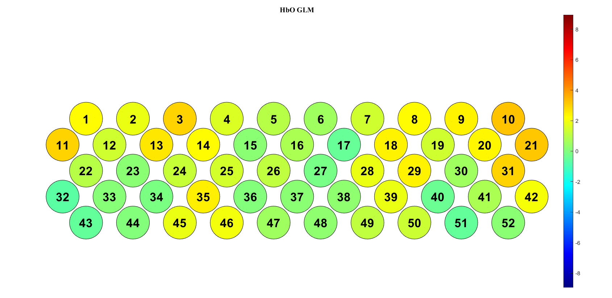
		- 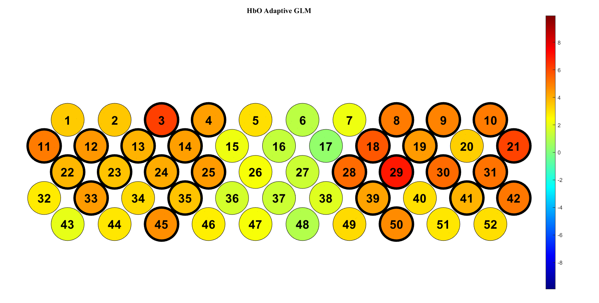
		- 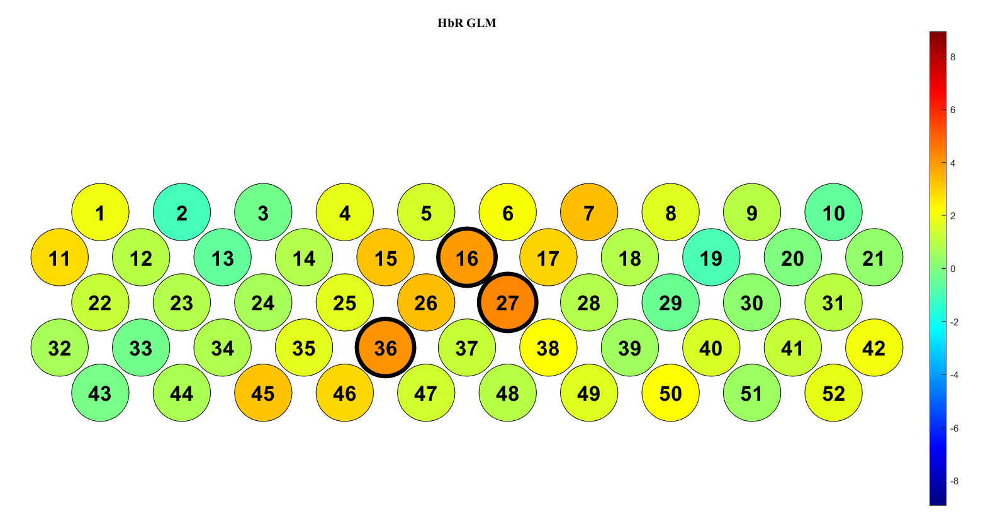
		- 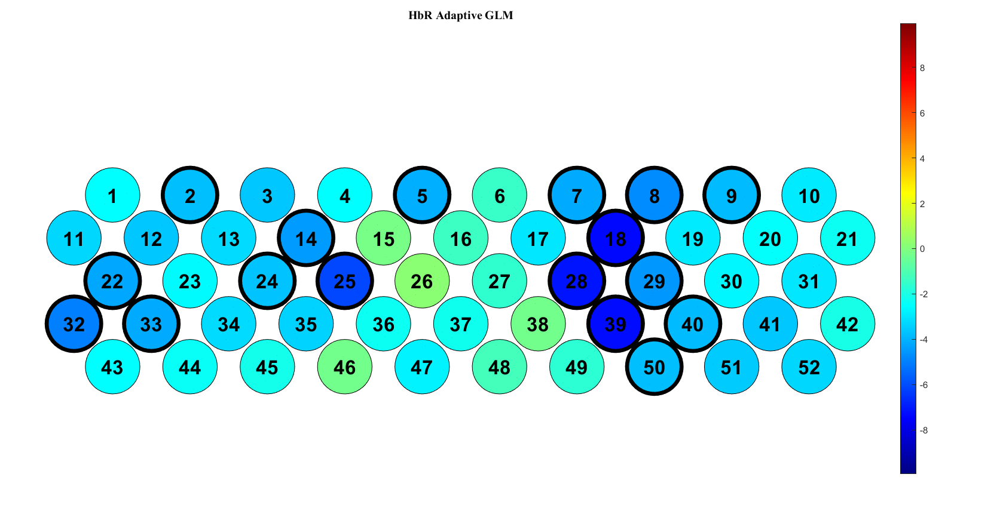
	- [[holm-bonferroni correction]]
		- 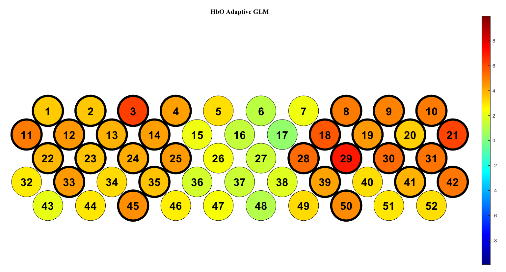
		- 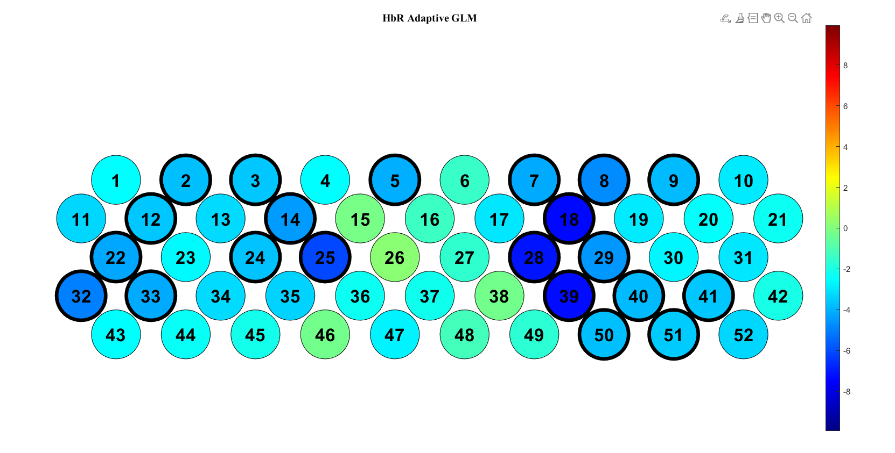{:height 272, :width 521}
- tolerance: 0.05
	- [[Bonferroni correction]]
		- 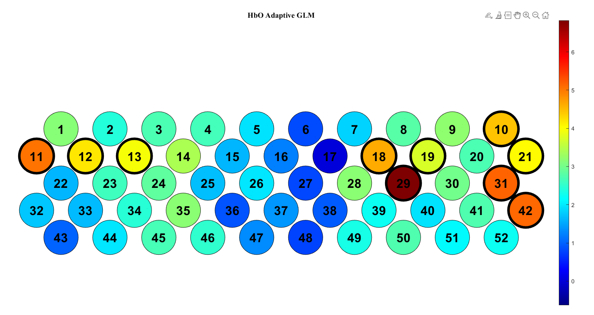
		- 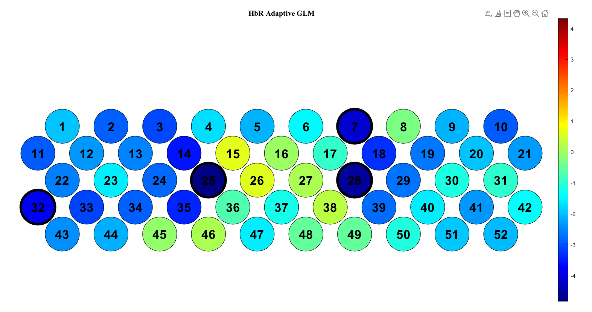
	- [[holm-bonferroni correction]]
		- 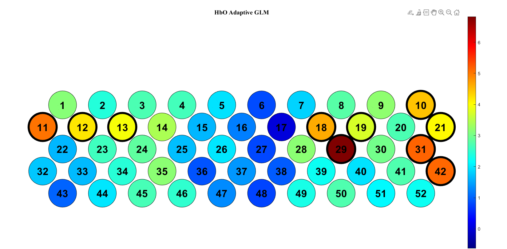
		- 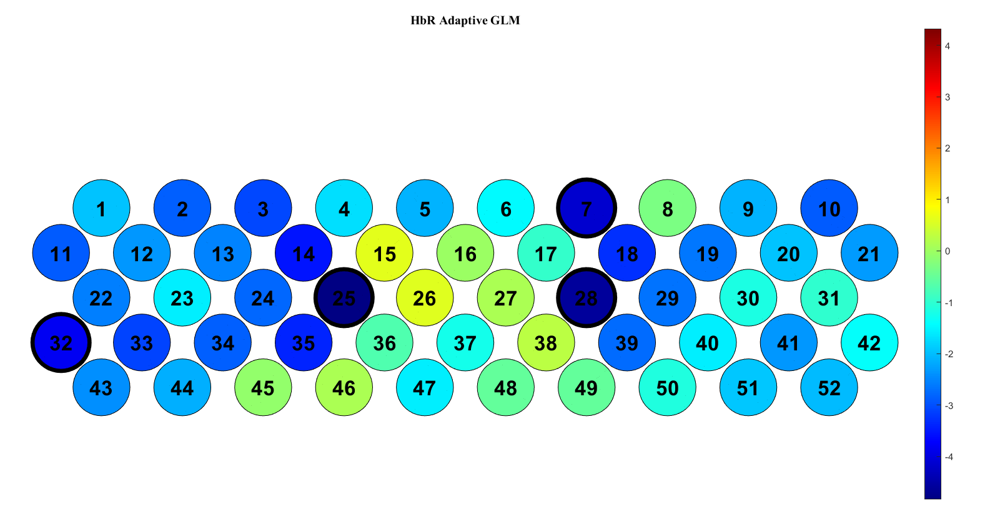
	- [[Benjamini-Hochberg correction]]
		- 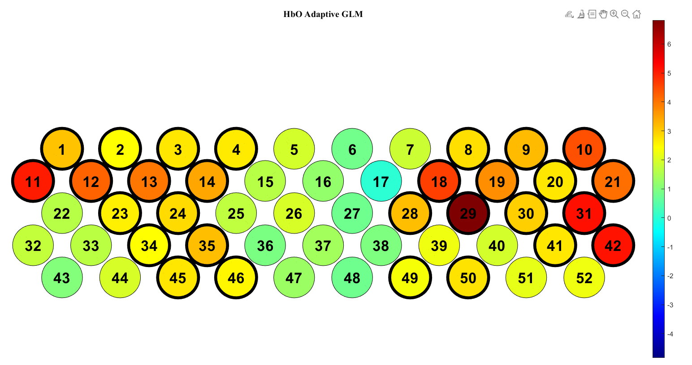
		- 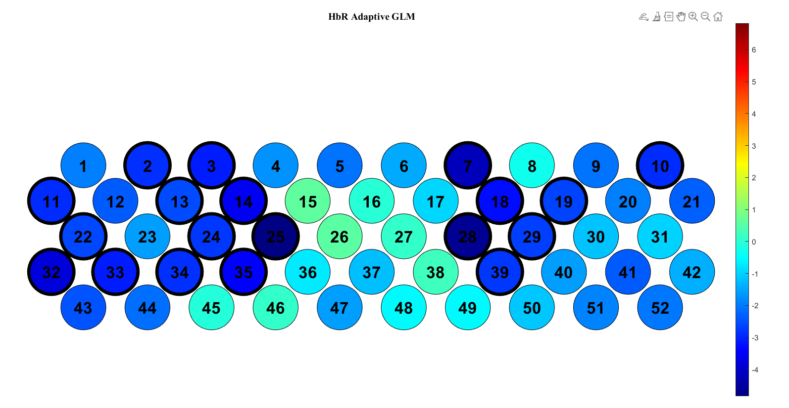