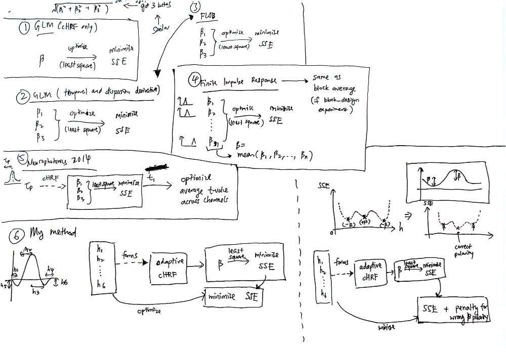

- [[Meeting with Dr Lim Lam Ghai]]
	- [[Optimizing the general linear model for fNIRS - an adaptive hemodynamic response function approach]]
		- [[Bonferroni correction]]
			- {:height 343, :width 688}
			- 
		- [[Benjamini-Hochberg correction]]
			- 
			- 
	- My method
		- 
		- {:height 310, :width 561}
		- group analysis block average plot (no baseline correction)
			- description
				- legend
					- black line: conventional GLM (GLM)
					- green line: Adaptive GLM (AGLM)
				- caption
					- Channel num (number of valid subjects): t-value of GLM | t-value of AGLM
			- HbO GLM and AGLM
				- Red bounding box: HbO beta is significant
				- {:height 207, :width 658}
			- HbR GLM and AGLM
				- Blue bounding box: HbR beta is significant
				- {:height 207, :width 658}
			- HbO and HbR reading
				- Green bounding: both HbO and HbR betas are significant
				- {:height 207, :width 658}
		- Channels need to be investigate
			- forehead (positive significant HbR t-value in GLM)
				- may due to ambient light which cause harmonic frequency reading
				- channels:
					- DONE 27
					- DONE 36
			- side channels
				- TODO 11
				- TODO 32
				- TODO 21
				- TODO 42
			- bottom row channels
				- TODO 50
				- TODO 51
			- channels which HbR t-value are significantly negative in AGLM, but HbO t-value aren't significantly positive in AGLM
				- TODO 5
				- TODO 7
				- TODO 32
				- TODO 40
				- TODO 51
				-