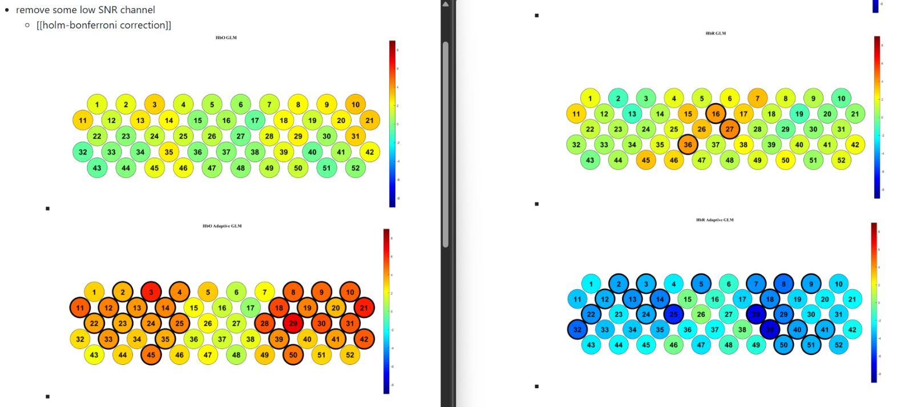

- [[Meeting with Dr Lim Lam Ghai]]
	- 
	- group analysis block average plot
		- description
			- legend
				- black line: conventional GLM (GLM)
				- green line: Adaptive GLM (AGLM)
			- caption
				- Channel num (number of valid subjects): t-value of GLM | t-value of AGLM
		- HbO GLM and AGLM
			- Red bounding box: HbO beta is significant
			- 
		- HbR GLM and AGLM
			- Blue bounding box: HbR beta is significant
			- 
		- HbO and HbR reading
			- Green bounding: both HbO and HbR betas are significant
			- 