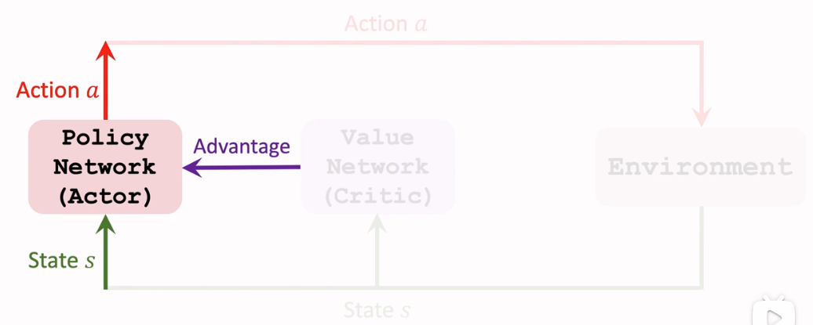
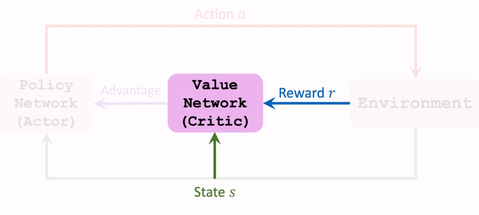
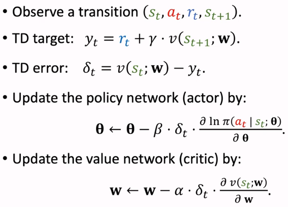
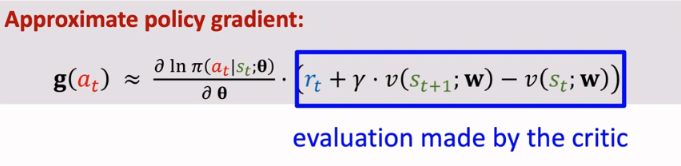
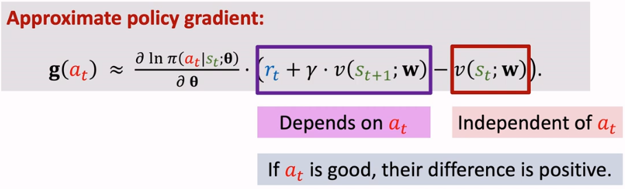
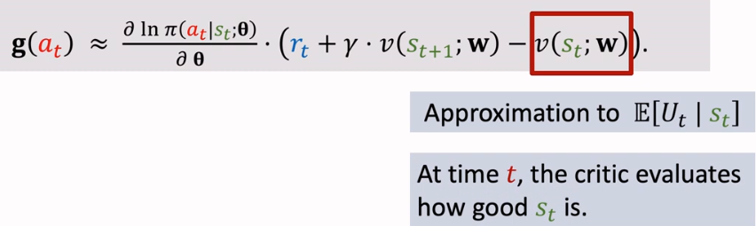
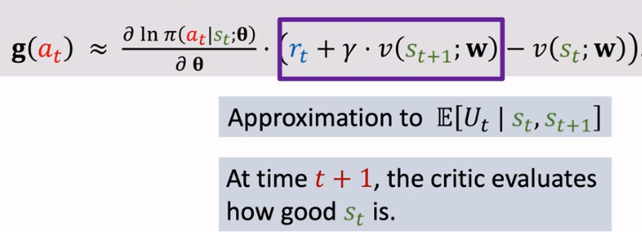

alias:: Advantage Actor-Critic

- 
- 
- 
- [[A2C]] is similar to [[reinforce with baseline]], except:
	- [[reinforce with baseline]]: ((64f60c4a-fd9a-4123-a838-7f2c2f114f66))
	  which is not [[bootstrapping]]
	- but, [[A2C]] utilised [[temporal difference]] to approximate $Q_{\pi}(s_t, A_t)$
	  $$Q_\pi\left(s_t, a_t\right) \approx r_t+\gamma \cdot V_\pi\left(s_{t+1}\right)$$
	  which is [[bootstrapping]]
		- As the result, the [[stochastic policy gradient]] would be:
		  
		  where the evaluation of $a_t$ made by the critic is also called as [[advantage function]]
			- intuitively, this is how [[advantage function]] affected by $a_t$
			  
				- 
				- 
		- Consequently,
			- the [[value network]] in [[reinforce with baseline]] only acts as [[baseline]] to speed up the convergence of [[stochastic policy gradient]]
			- but, the [[value network]] in [[Advantage Actor-Critic]] also acts as [[critic]] to evaluate $a_t$