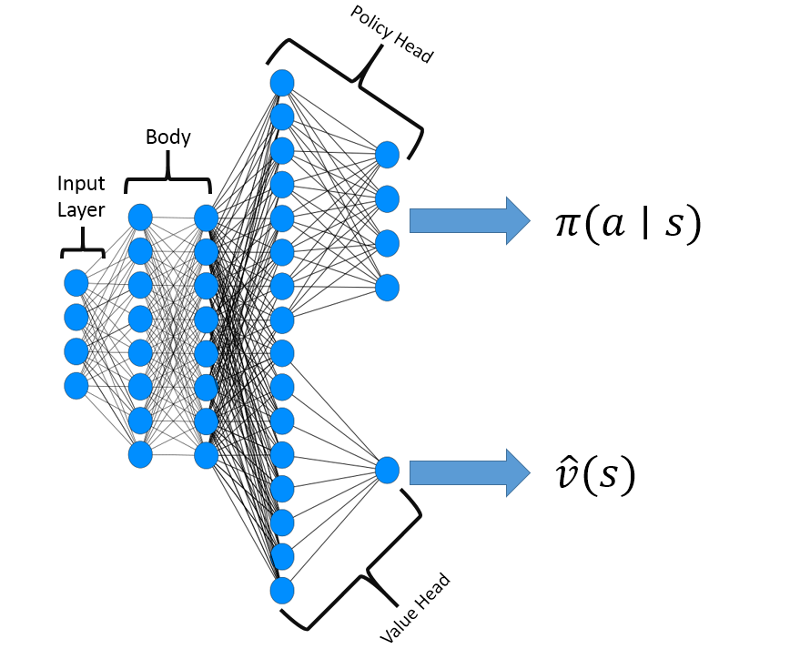
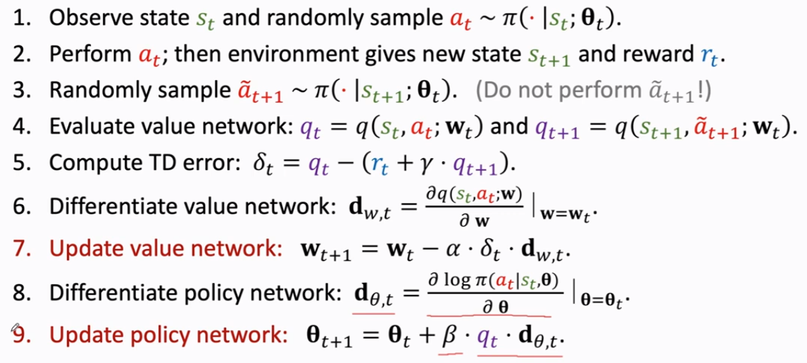
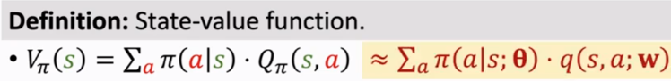
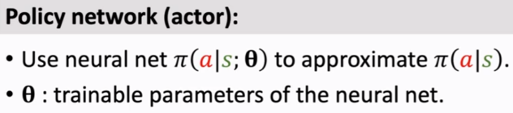
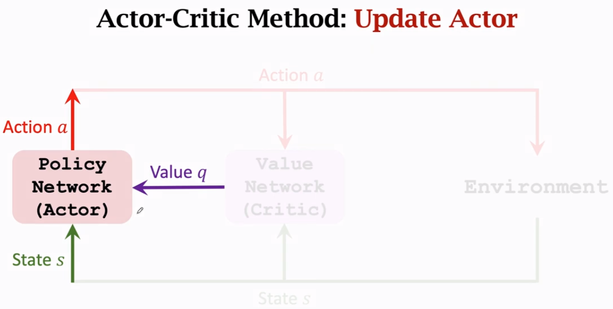
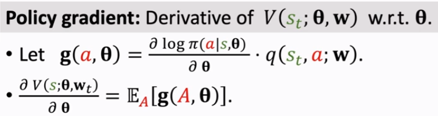
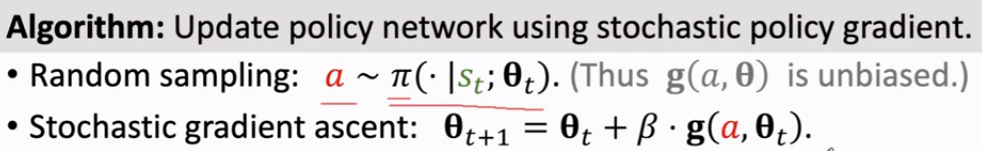
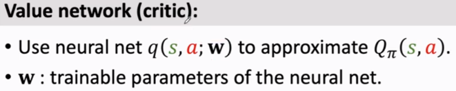
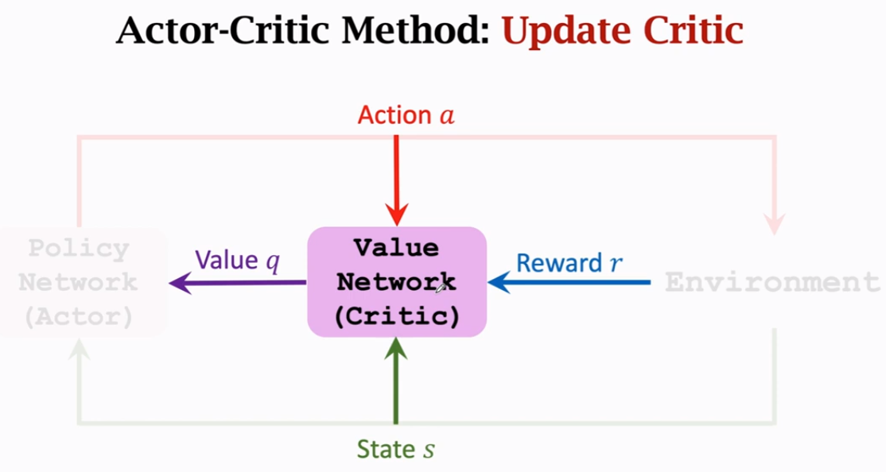
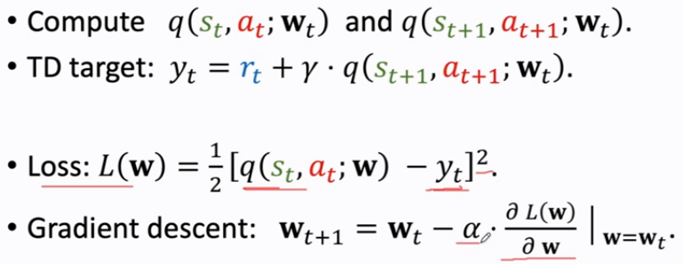

alias:: actor-critic

- 
- **Framework**
  
	- To obtain better performance, step 9 could be changed to:
	  $$\mathbf{\theta}_{t+1} = \mathbf{\theta}_t + \beta\cdot \delta_t \cdot \mathbf{d}_{\theta, t} $$
	  this method is called [[reinforce with baseline]]
- **Main objective** is similar to [[Policy Gradient]]:
  maximise $E_s[V_\pi(s)]$  
   
  [[state-value function]] can be approximated using neural network, $\theta$ and $\mathbf{w}$
	- [[policy network]] [[actor]]
	  
		- update [[policy network]], $\pi(a|s;\mathbf{\theta})$ to increase the [[state value function]], $V(s; \mathbf{\theta}, \mathbf{w})$:
		  
			- so that [[actor]] gradually performs better
			- supervision is purely from the [[value network]] ([[critic]])
			- update [[policy network]], $\pi$ using [[Policy Gradient]]
			  
			- update [[policy network]] , $\pi$ using [[stochastic policy gradient]]
			  
	- [[value network]] [[critic]]
	  
		- update value network, $q(s,a; \mathbf{w})$ to better estimate the [[return]] 
		  
			- so that [[critic]]'s judgement becomes more accurate
			- supervision is purely from the [[rewards]]
			- update [[value network]], $q$ using [[TD]]
			  