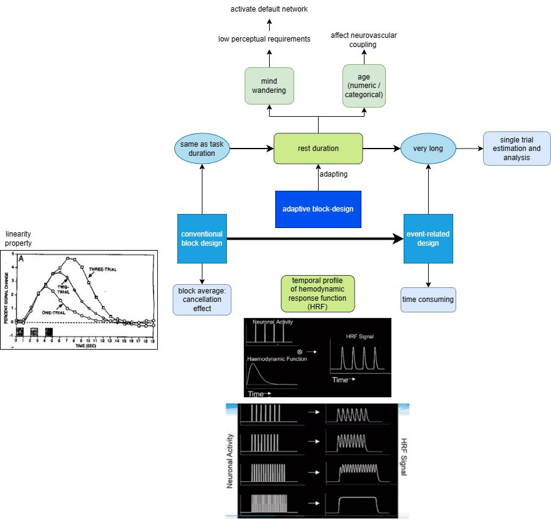

- Plan
  collapsed:: true
	- Prerequisites
	  collapsed:: true
		- preprocessing
			- DONE [[butterworth bandpass filter]]
			- DONE [[Temporal Derivative Distribution Repair]]
			- LATER [[baseline correction]]
		- analysis
			- DOING [[General Linear Model]]
			  :LOGBOOK:
			  CLOCK: [2024-06-12 Wed 00:22:46]
			  CLOCK: [2024-06-12 Wed 00:22:54]
			  :END:
			- DOING [[t-test]]
			  :LOGBOOK:
			  CLOCK: [2024-06-12 Wed 00:23:00]
			  CLOCK: [2024-06-12 Wed 00:23:05]
			  :END:
			- DOING [[ANOVA]]
			  :LOGBOOK:
			  CLOCK: [2024-06-12 Wed 02:00:15]
			  CLOCK: [2024-06-12 Wed 02:00:18]
			  :END:
			- TODO [[bonferroni post hoc]]
			- TODO [[Geisser-Greenhouse correction]]
			- TODO [[Pearson correlation coefficient]]
	- activities
		- DOING [[Meeting with Dr Lim Lam Ghai]]
		  :LOGBOOK:
		  CLOCK: [2024-06-12 Wed 00:28:00]
		  CLOCK: [2024-06-12 Wed 00:28:05]
		  :END:
	- dataset
		- DOING [[dataset detail]]
		  :LOGBOOK:
		  CLOCK: [2024-06-12 Wed 01:07:39]
		  :END:
		- LATER manual labelling
		  :LOGBOOK:
		  CLOCK: [2024-06-12 Wed 00:24:15]--[2024-06-12 Wed 00:24:15] =>  00:00:00
		  CLOCK: [2024-06-12 Wed 00:24:16]--[2024-06-12 Wed 00:24:16] =>  00:00:00
		  CLOCK: [2024-06-12 Wed 00:24:25]--[2024-06-12 Wed 00:24:26] =>  00:00:01
		  CLOCK: [2024-06-12 Wed 00:24:26]--[2024-06-12 Wed 00:24:27] =>  00:00:01
		  :END:
	- research
		- LATER perform experiments at [[University Teknologi Petronas]]
	- paper
		- LATER paper 1
		- LATER paper 2
- PhD duration: july 2024 ~ march 2027
- Brief summary
  collapsed:: true
	- {{renderer :wordcount_}}/
		- The study aims to enhance cognitive load estimation using fNIRS by proposing an adaptive block-design paradigm with deep learning. This method optimizes task timing based on neural baseline recovery, improving state assessment and aiding cognitive impairment diagnosis.
	- {{renderer :wordcountchar_}}
		- Functional near-infrared spectroscopy (fNIRS) is a neuroimaging technique that indirectly measures neuronal activity via the hemodynamic response (HR). In recent years, fNIRS-based brain-computer interfaces have shown tremendous potential in assessing cognitive state. Adopting the conventional block-design paradigm, a control block is fixed after each task block to allow the evoked HR to return to the baseline. However, several studies have reported that improper baseline recovery may occur, causing large variabilities in the observed brain activations to the extent that affects result interpretations. This implies that the individual’s evoked HR requires different amounts of time to recover to baseline. Hence, we aim to enhance cognitive load estimation by proposing an adaptive block-design paradigm with a novel deep learning-assisted approach. First, a proof of concept will be conducted by identifying and labeling 2000 recorded fNIRS data containing a variety of 15-s hemodynamic responses into four classes; (i) optimal baseline, (ii) suboptimal baseline, (iii) activation, and (iv) oscillation. Several promising deep learning techniques, i.e., convolutional neural network, long short-term memory, and transformer, will be used to train the data. Another fNIRS dataset, recorded from 40 participants performing multiple difficulty levels of mental arithmetic, will be used to assess the effectiveness of the proposed method. Using the most suitable deep learning technique, the proposed method will be applied in a real-time setup to optimize the control duration accordingly. A new task block will begin whenever the proposed method detects a proper neural baseline recovery. We expect to observe a significant improvement in cognitive load estimation as compared to the conventional block-design paradigm. This novel project will be the first study to attempt an adaptive block-design paradigm, offering a practical and promising solution to assess and diagnose cognitive impairments, such as in individuals with Alzheimer’s disease.
- Abstract
  collapsed:: true
	- {{renderer :wordcount_}}
		- Functional near-infrared spectroscopy (fNIRS) is a neuroimaging technique that indirectly measures neuronal activity via the hemodynamic response (HR). In recent years, fNIRS-based brain-computer interfaces have shown tremendous potential in assessing cognitive state. Adopting the conventional **block-design** paradigm, a control block is fixed after each task block to allow the **evoked HR** to return to the **baseline**. However, several studies have reported that **improper baseline recovery** may occur, causing large variabilities in the observed brain activations to the extent that affects result interpretations. This implies that the individual’s evoked HR requires different amounts of time to recover to baseline. Hence, we aim to enhance cognitive load estimation by proposing an adaptive block-design paradigm with a novel deep learning-assisted approach. First, **a proof of concept will be conducted by identifying and labeling 2000 recorded fNIRS data containing a variety of 15-s hemodynamic responses into four classes; (i) optimal baseline, (ii) suboptimal baseline, (iii) activation, and (iv) oscillation**. Several promising deep learning techniques, i.e., convolutional neural network, long short-term memory, and transformer, will be used to train the data. Another fNIRS dataset, recorded from 40 participants performing multiple difficulty levels of mental arithmetic, will be used to assess the effectiveness of the proposed method. Using the most suitable deep learning technique, the proposed method will be applied in a **real-time** setup to optimize the control duration accordingly. A new task block will **begin whenever the proposed method detects a proper neural baseline recovery**. We expect to observe a significant improvement in cognitive load estimation as compared to the conventional block-design paradigm. This novel project will be the first study to attempt an adaptive block-design paradigm, offering a practical and promising solution to assess and diagnose cognitive impairments, such as in individuals with Alzheimer’s disease.
	- 6-month review
		- {{renderer :wordcount_}}
			- Key Research Topic
			  Functional near-infrared spectroscopy (fNIRS) is a neuroimaging technique that indirectly measures neuronal activity via the hemodynamic response (HR). In recent years, fNIRS-based brain-computer interfaces have shown tremendous potential in assessing cognitive state. The conventional block-design paradigm in fNIRS studies employs a fixed control block after each task block to allow the evoked HR to return to the baseline. However, improper baseline recovery has been reported in several studies, causing large variabilities in observed brain activations and complicating result interpretations. Individual variations in HR recovery time necessitate an adaptive approach. This research aims to enhance cognitive load estimation by proposing an adaptive block-design paradigm with a novel deep learning-assisted approach.
			  
			  Detailed Research Questions
			  How can the variability in hemodynamic responses caused by improper baseline recovery be quantified and addressed in fNIRS-based experiments?
			  What are the critical features in hemodynamic response data that indicate baseline recovery, and how can these be effectively classified using deep learning?
			  Which deep learning architecture (CNN, LSTM, Transformer) performs best in accurately classifying baseline recovery states, and why?
			  How does the proposed adaptive block-design paradigm improve the accuracy and reliability of cognitive load estimation compared to the conventional block-design paradigm?
			  Can real-time detection of baseline recovery enhance the applicability of fNIRS for diagnosing cognitive impairments?
			  
			  Methods
			  A proof of concept will involve identifying and labeling 2000 recorded fNIRS data containing 15-second hemodynamic responses into four categories; (i) optimal baseline, (ii) suboptimal baseline, (iii) activation and (iv) oscillation. Several promising deep learning techniques, i.e., convolutional neural network, long short-term memory, and transformer, will be used to train the data. The proposed adaptive method will then be validated using an fNIRS dataset collected from 40 participants performing mental arithmetic tasks at varying difficulty levels. Next, the method will be implemented in a real-time setup to adjust control block durations dynamically. A new task block will begin only after proper neural baseline recovery is detected by the proposed model. The effectiveness of the adaptive block-design paradigm will be evaluated by comparing its cognitive load estimation accuracy to that of the conventional paradigm.
- Proposal
  collapsed:: true
	- Abstract
	- Introduction
	- {{renderer :wordcount_}}
		- Functional brain imaging techniques are vital tools for delving into the complexities of neural function and cognition. Among these techniques, functional magnetic resonance imaging (fMRI) has long been the go-to, providing unparalleled spatial resolution and coverage of the entire brain. However, in recent years, there has been a notable increase in the use of functional near-infrared spectroscopy (fNIRS) to study neurovascular coupling dynamics. This shift is driven by several factors, including the portability and cost-effectiveness of fNIRS systems, as well as their reduced susceptibility to motion artifacts. Additionally, fNIRS offers a higher temporal resolution compared to fMRI, enabling more precise tracking of rapid changes in hemodynamic responses. Another advantage of fNIRS is its ability to measure concentration changes in both oxygenated and deoxygenated hemoglobin, providing a more comprehensive assessment of cerebral hemodynamics.
		  
		  However, both fMRI and fNIRS face challenges when using conventional block-design paradigms for estimating cognitive load. These paradigms typically involve alternating periods of task stimulation and rest to allow task-evoked hemodynamic responses to return to baseline levels. However, determining the optimal duration of rest periods is a critical issue, especially with longer task durations. Prolonged recovery times require control periods of equal or greater duration to ensure accurate baseline measurements. Additionally, individual differences in hemodynamic response characteristics, influenced by factors such as age and clinical conditions, introduce variability in recovery times across different populations. In essence, the challenge of determining the appropriate duration of rest periods is compounded by the inherent variability in hemodynamic responses among individuals and experimental conditions. This variability presents a significant obstacle to accurately estimating cognitive load using conventional block-design paradigms.
		  
		  Therefore, the rigid structure of conventional block designs limits their adaptability to individual differences and dynamic changes in cognitive demands. As a result, relying on fixed rest periods in block-design experiments may lead to inaccurate assessments of cognitive load, compromising the reliability and validity of study findings. In the most severe instances, improper return of baseline could distort the temporal characteristics of task-induced hemodynamic responses, potentially resulting in misinterpretation of detected activations.
	- **Research questions**
		- is this research gap?
	- Hypothesis
		- We expect to observe a significant improvement in cognitive load estimation as compared to the conventional block-design paradigm.
	- Objectives
	- Literature review
		- [[cHRF]] analysis
			- [[GLM]]
			- assumption:
				- neural activity function is correct
				- HRF is correct
				- [[cHRF]] is [[LTI]] system
		- cognitive load estimation
			- average of activation amplitude
			- [[GLM]]
				- [[t-test]]
				- [[p-value]]
				- activation region
	- Methodology
		- type of cognitive task
			- what is the purpose of baseline return detection
		- labelling (multi-channel)
			- Dataset
				- first-stage (**training** and **testing**)
					- a proof of concept will be conducted by identifying and labeling 2000 recorded fNIRS data containing a variety of 15-s hemodynamic responses into four classes; (i) optimal baseline, (ii) suboptimal baseline, (iii) activation, and (iv) oscillation.
				- second-stage (**validation**)
					- Another fNIRS dataset, recorded from 40 participants performing multiple difficulty levels of mental arithmetic, will be used to assess the effectiveness of the proposed method.
- Overview
  collapsed:: true
	- [[fNIRS]] 
	  
- Journal
	- Papers
		- First paper: Adaptive HRF
			- target
				- (i) IEEE Transactions on Medical Imaging
				- (ii) IEEE Journal of Biomedical and Health Informatics
				- (iii) IEEE Transactions on Neural Systems and Rehabilitation Engineering
			- objective
				- design GLM design matrix
					- robust to variability in HRF shape
						- [[initial dip]]
						- [[post stimulus undershoot]]
					- robust to noise ([[autoregression]] model)
			- literature review
				- argument that HbR not suppose to have same [[cHRF]] as HbO
					- from [[Optimizing the general linear model for fNIRS - an adaptive hemodynamic response function approach]]
						- "Hoshi raised a concern about blindly adapting the GLM approach to fNIRS data and emphasized the necessity of taking hemodynamic variations into account."
			- evaluation
				- [[parametric modulator]]
		- Second paper: multi-channel VPA
			- Targets
				- (i) IEEE Journal of Biomedical and Health Informatics, impact factor 6.7, Q1
				- (ii) IEEE Transactions on Cognitive and Developmental Systems, impact factor 5, Q1
				- (iii) IEEE Transactions on Neural Systems and Rehabilitation Engineering, impact factor 4.8, Q1
			- result and discussion
				- [[parametric modulator]]
				- [[multi-voxel pattern analysis]]
				- optimization of parameters
				- inter-subject result analysis
					- Number of OBB
					- Bar chart of Beta (Group average)
					- Bar chart of t-value (one sample t-test)
					- Excel file of p-value (paired t-test)
					- Group Block Plot
				- intra-subject result analysis
					- Fixed ROI Channel: choose few subjects to compare (subjects which has lots of OBB vs less OBB)
				- comparison of performance with other methods
					- should I do comparison with single channel VPA on the previously defined ROI
				- correlation with response time