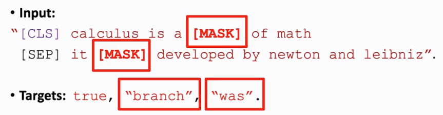
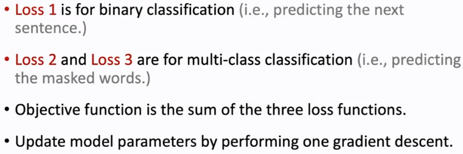
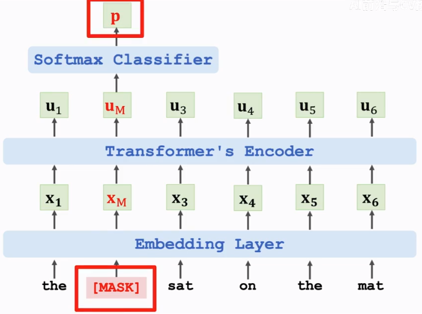
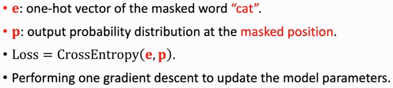
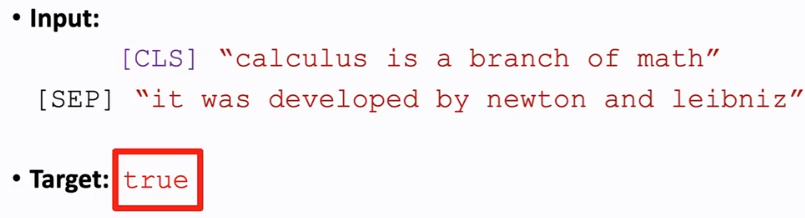
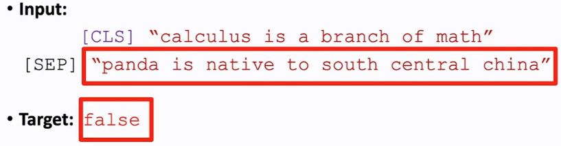
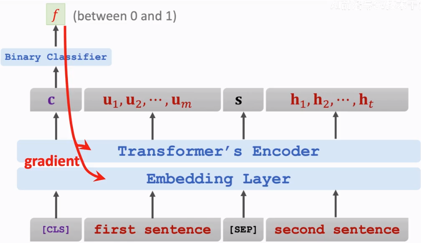

alias:: bidirectional encoder representations from transformers

- Pretrain the [[transformer/encoder]]
	- [[BERT]] doesn't need manually label data
	  {:height 138, :width 501}
	  
		- **Randomly mask a word**
		  
		  
		- **Predict the next sentence**
			- dataset
				- True sample
				  
				- False sample
				  
				  the next sentence is randomly sampled from the dataset
			- training
			  