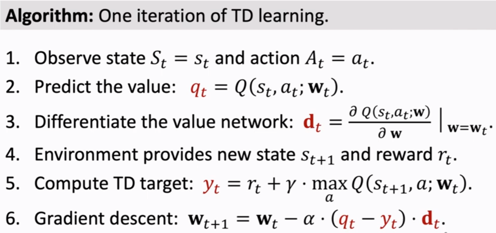

alias:: Deep Q network

- **Main objective**:
  use neural network $Q(s,a; \mathbf{w})$ to approximate [[optimal action-value function]], $Q^*(s,a)$
- 
	- loss function is estimated by using [[TD]]
	  $$\delta_t = q_t -  [r_t + \gamma \max_a Q(s_{t+1},a;\mathbf{w}_t)]$$