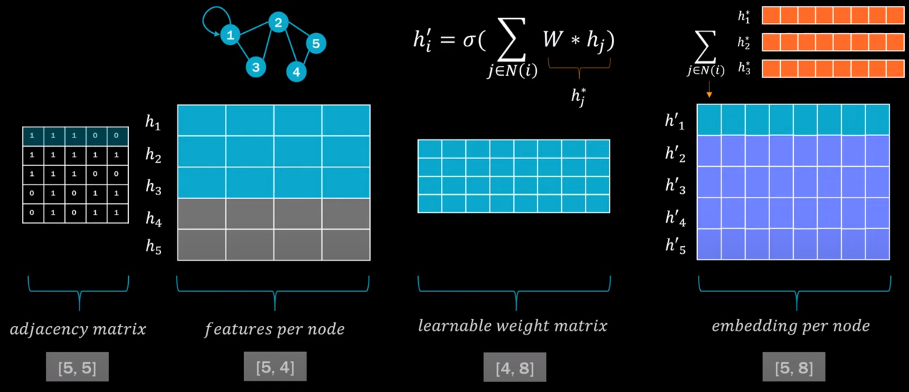

alias:: graph convolutional network

- {{video https://www.bilibili.com/video/BV1w64y197Cw/?spm_id_from=333.337.search-card.all.click&vd_source=a35754dd1fb6720eedad1b04619c7217}}
- 
	- adjacency matrix (features per node * learnable weight matrix)