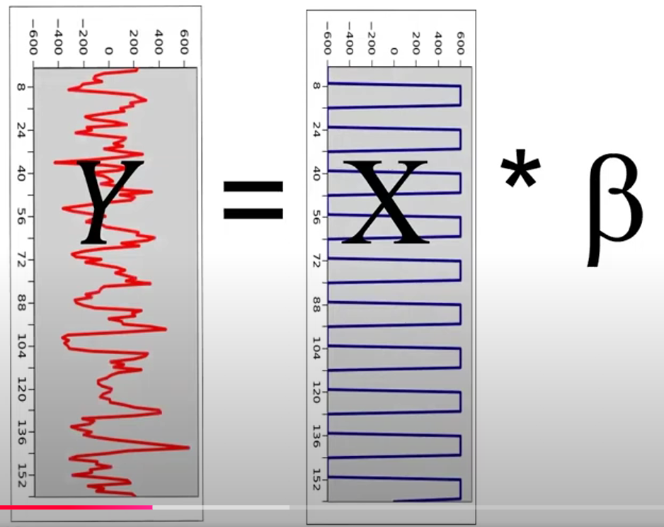

alias:: GLM, Generalized Linear Model

- [[design matrix]] may consists
	- [[cHRF]]
	- [[time derivative]]
	- [[dispersion derivative]]
- with [[cHRF]] only
  collapsed:: true
	- 
- with [[cHRF]], [[time derivative]] and [[dispersion derivative]]
	- 