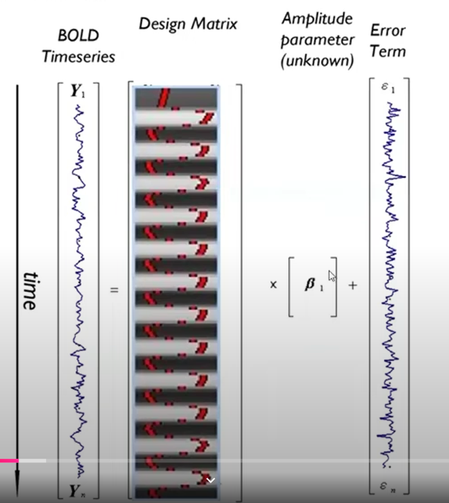
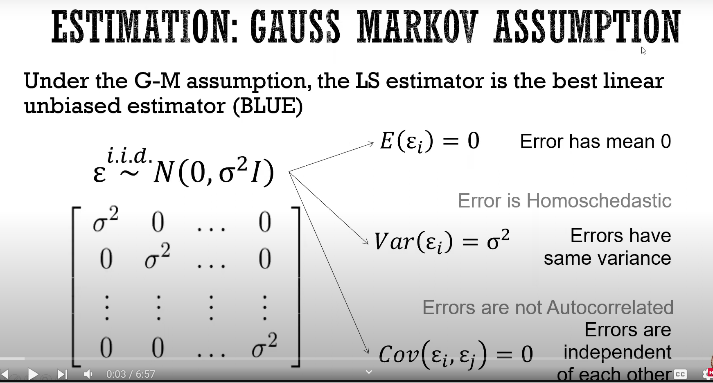

alias:: GLM

- [[design matrix]] may consists
	- [[cHRF]]
	- [[time derivative]]
	- [[dispersion derivative]]
	- 
- based on [[gauss markov assumption]]
	- 
	- [[least square]] estimator is the [[best linear unbiased estimator]]
		- with assumption: error is [[IID]] with zero mean and constant variance
			- same definition as [[white noise]]