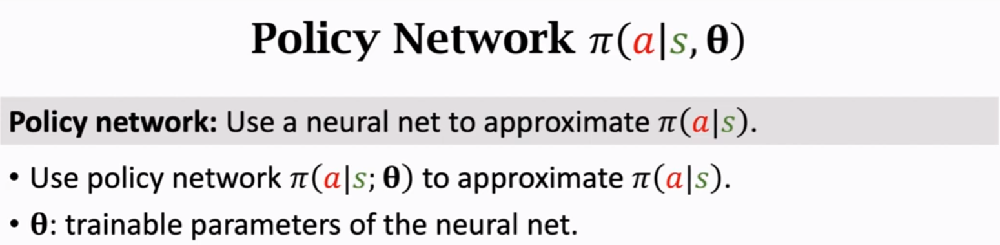
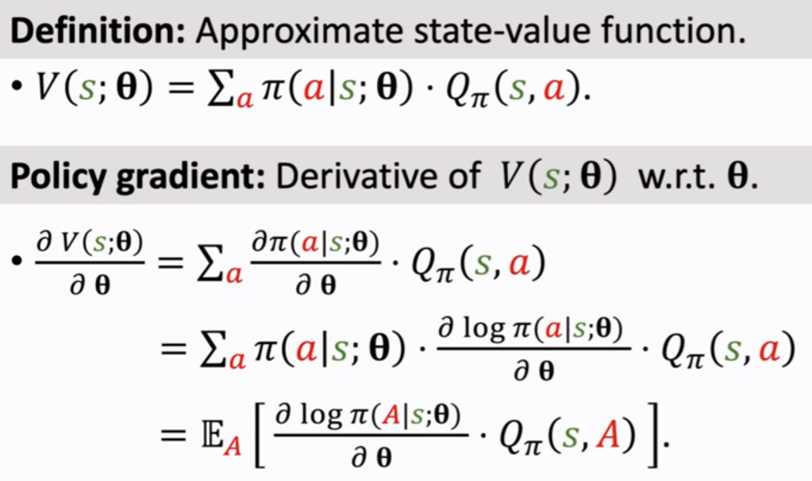
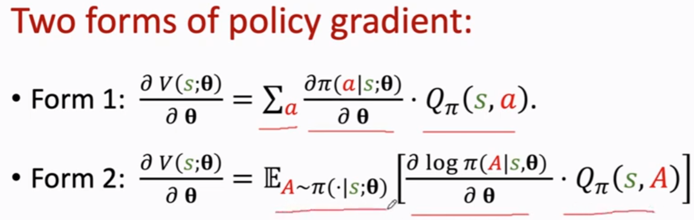
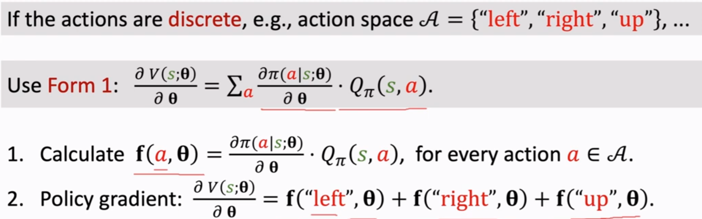
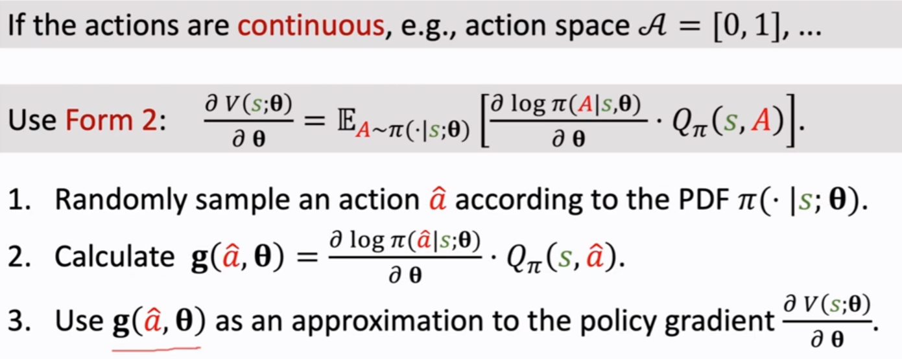
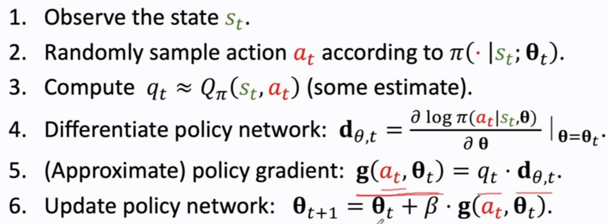
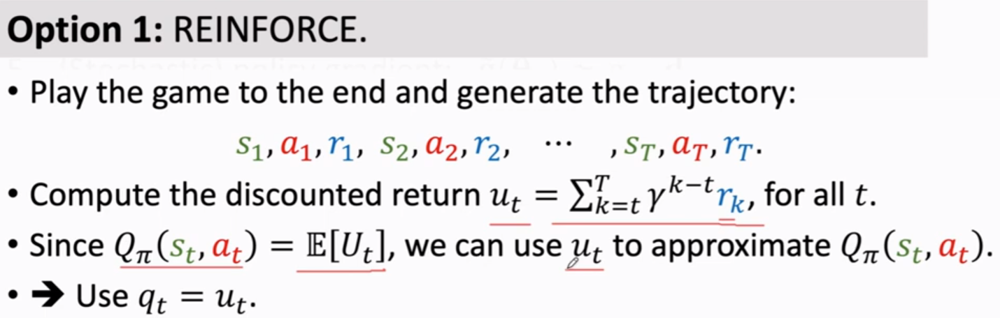

- Use neural network, $\theta$ to construct the policy, $\pi(a|s)$
  $\pi(a|s)$ outputs a distribution, which is a [[PDF]] of action, $a$ 
  {:height 139, :width 532}
- **Main objective** of policy gradient: 
  maximise $E_s[V(s; \theta)]$ by learning $\theta$
  
- **Form 1**: only applicable for discrete action
  **Form 2**: applicable for discrete and continuous action
  {:height 256, :width 780}
- **Form 1**: only applicable for discrete action
  
- **Form 2**: leverages monte carlo sampling method
  Since
  $$E_A[g(A, \theta)]=\frac{\partial V(s;\theta)}{\partial\theta}$$
  $g(\hat{a}, \theta)$ is an unbiased estimate of $\frac{\partial V(s;\theta)}{\partial\theta}$
  
- **Framework of Policy Gradient**
  [[stochastic policy gradient]] is used, since $a$ is randomly sampled  at every iteration.
  
  $q_t$ can be estimated by:
	- [[Monte Carlo]]
	  Disadvantage: need record of the whole trajectory
	  
	- [[Actor-Critic Methods]]