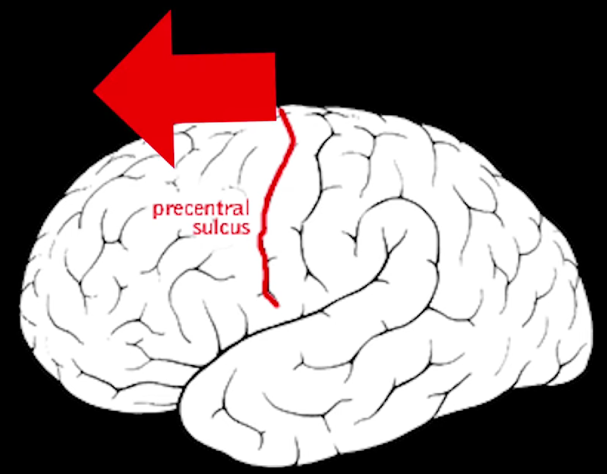
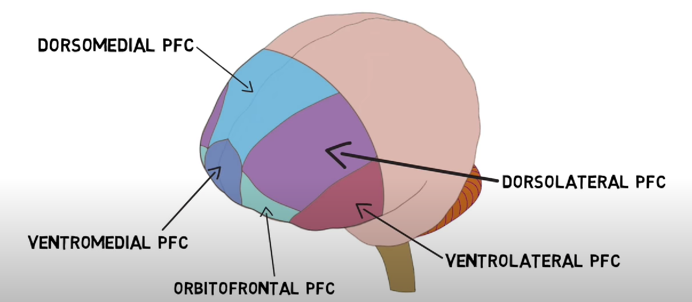

alias:: PFC

- part of [[frontal lobe]] that is anterior to / infront of [[precentral sulcus]]
	- 
	- {:height 458, :width 749}
- 
	- [[dorsomedial pfc]]
	- [[dorsolateral pfc]]
	- [[ventromedial pfc]]
	- [[ventrolateral pfc]]
	- [[orbitofrontal pfc]]