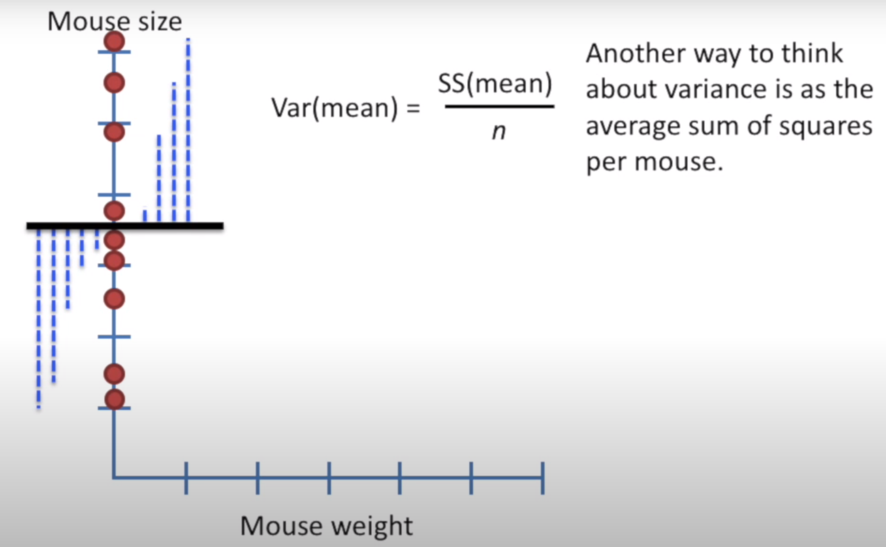
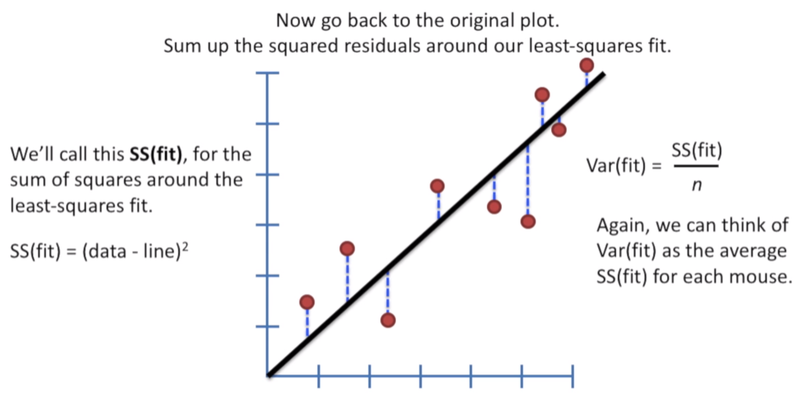
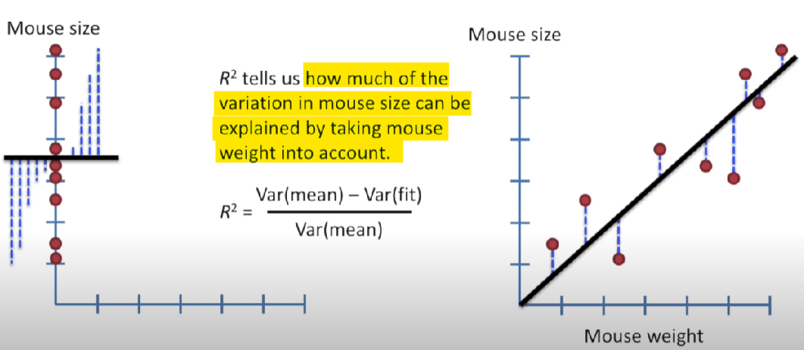
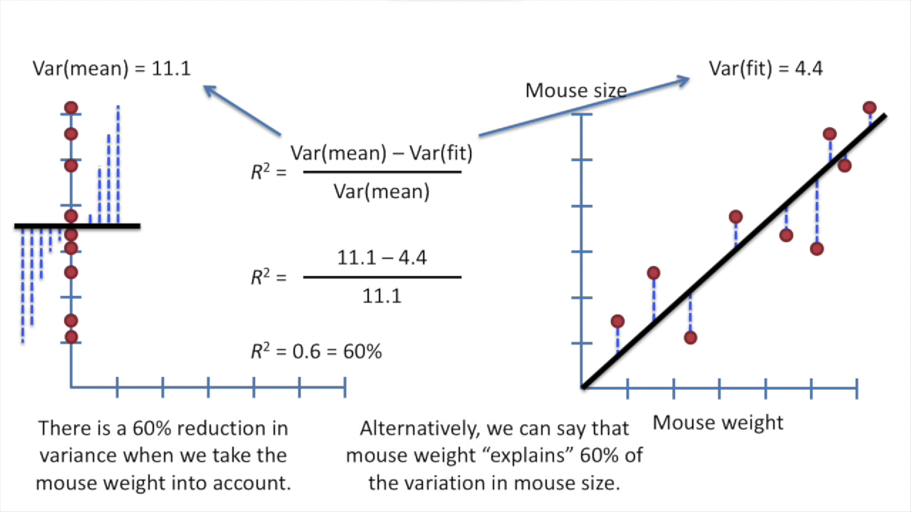
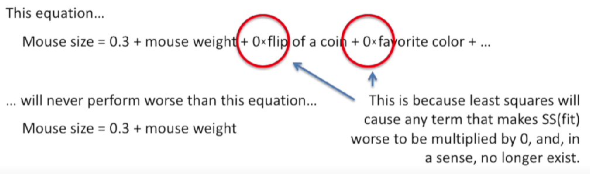

alias:: R square, R^2, R2

- Calculate how much **reduction in variation** after taking the parameters into account.
- denotes goodness of fit
	- thus greater is better
- Procedure:
	- Calculate variance with respect to mean
	  
	- Calculate variance with respect to fit
	  
	- 
	- 
	  Also can be 
	  $R^2=\frac{SS(mean)-SS(fit)}{SS(mean)}$
- $R^2$ must be scaled by number of parameters
	- because
		- 
		- the more parameters we add to equation, the more opportunities we have for random events to reduce $SS(fit)$ and improve $R^2$