collapsed:: true

	- Notation
	  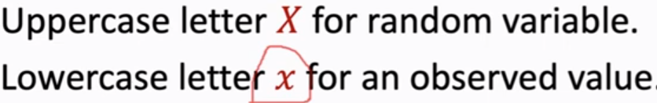
	- [[Probability Distribution Function]] 
	  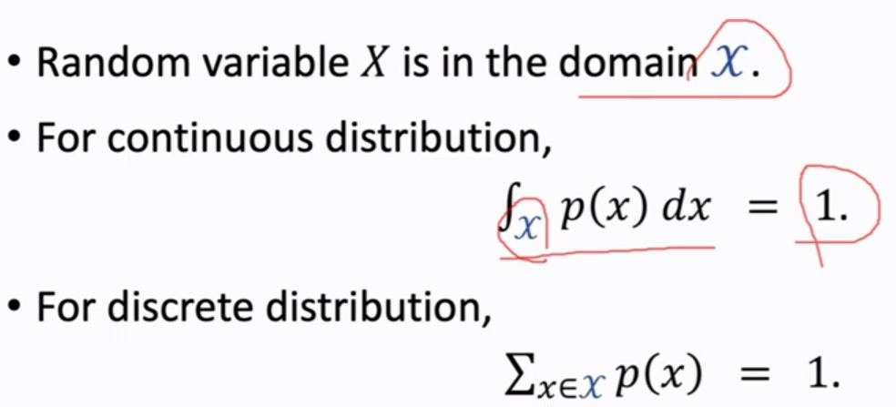
	- [[Expectation]]
	  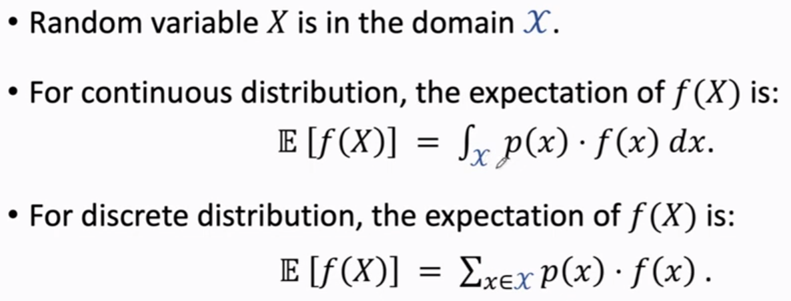
- [[return]] : cummulative future reward
  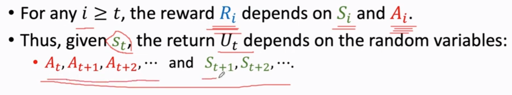
  [[discounted return]]: cummulative discounted future reward
  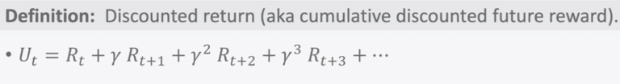
	- [[return]] depends on 2 kind of randomness:
		- [[policy function]]
		  
		- [[state transition]]
		  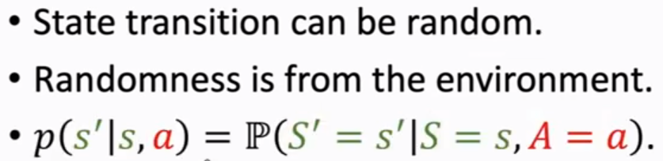
- [[random sampling]]
  **~** means **sampling from** a [[PDF]]
  **.** denotes variable that was sampled
  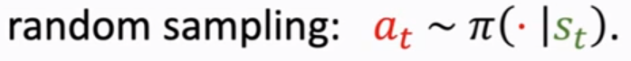{:height 76, :width 697}
- [[value function]], $V(s)$
	- [[action value function]], $Q_{\pi}(s_t, a_t)$
	  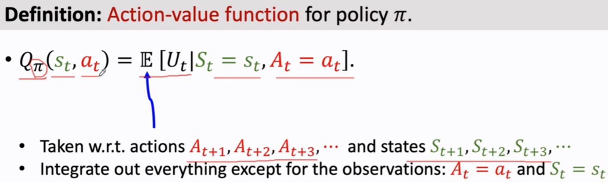
	  {:height 104, :width 743}
		- [[optimal action-value function]]
		  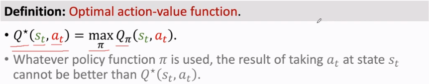
	- [[state value function]], $V_{\pi} (s_t)$
	  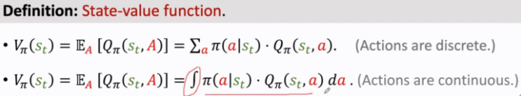$
	  E_A$: expectation w.r.t action $a_t \sim \pi(.|s_t)$
	  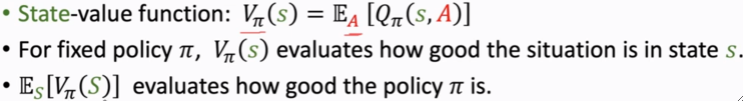
		- assets:///home/koksyuen/Logseq/assets/image_1691878944537_0.png
- [[mdp]]
  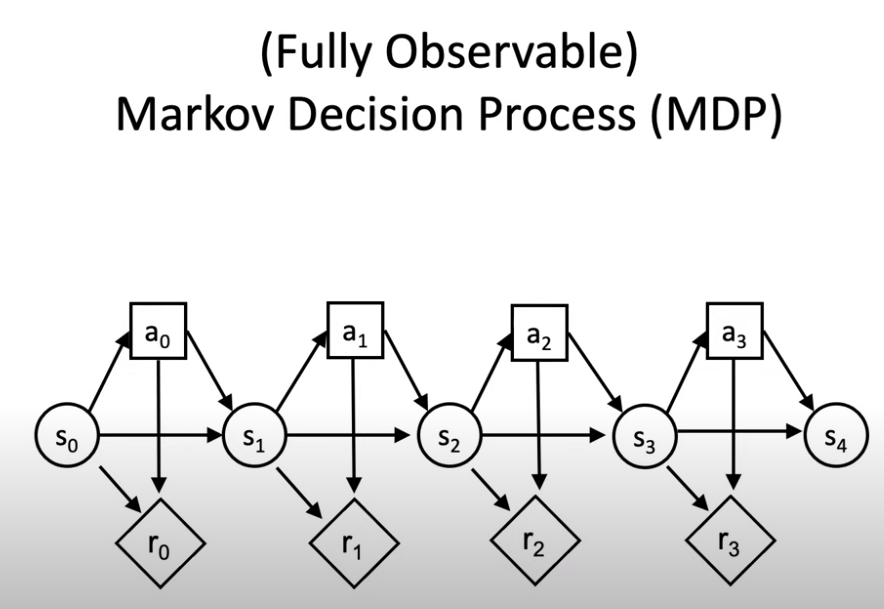
- [[pomdp]]
  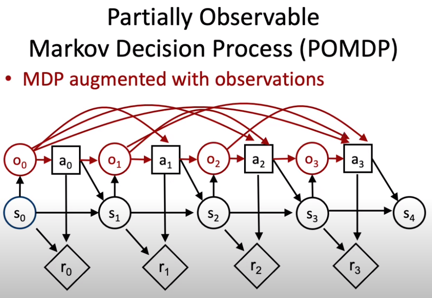