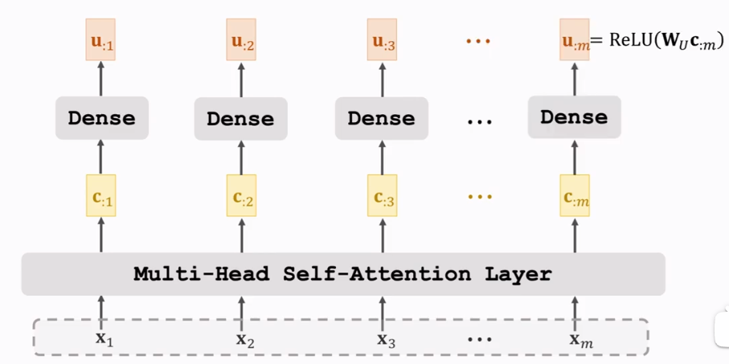
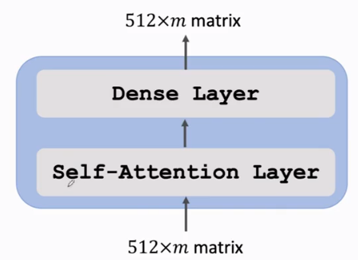
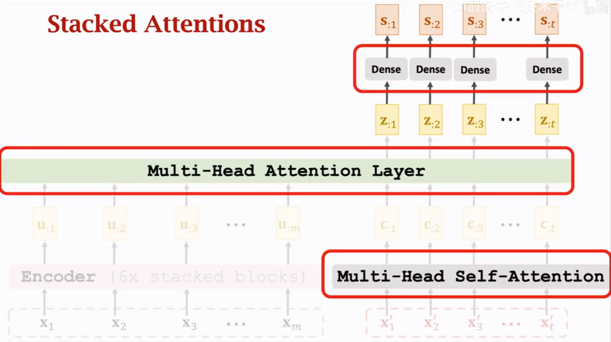
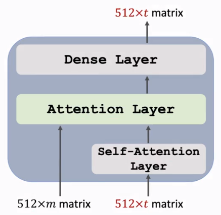
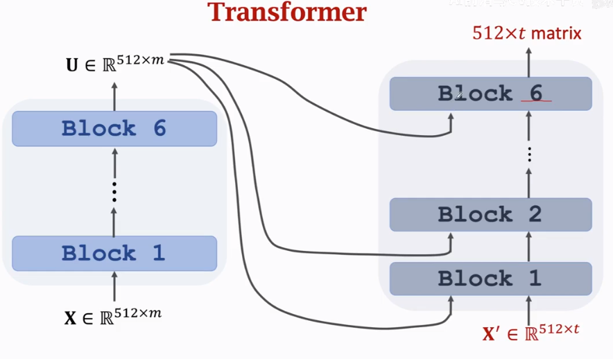

alias:: transformer

- [[attention]]
- [[self attention]]
- [[multi head attention]]
- https://machinelearningmastery.com/wp-content/uploads/2021/08/attention_research_1.png{:height 34, :width 713}
	- [[positional encoding]] is needed because [[Transformers]] doesn't capture positional relationship
	- [[transformer/encoder]]
		- One block of encoder
		  
		  Consist of one [[self attention]] layer and one dense layer
		  
	- [[transformer/decoder]]
		- One block of decoder
		  
		  Consists of one [[self attention]] layer, one [[attention]] layer, and one dense layer
		  
	- Overall
	  