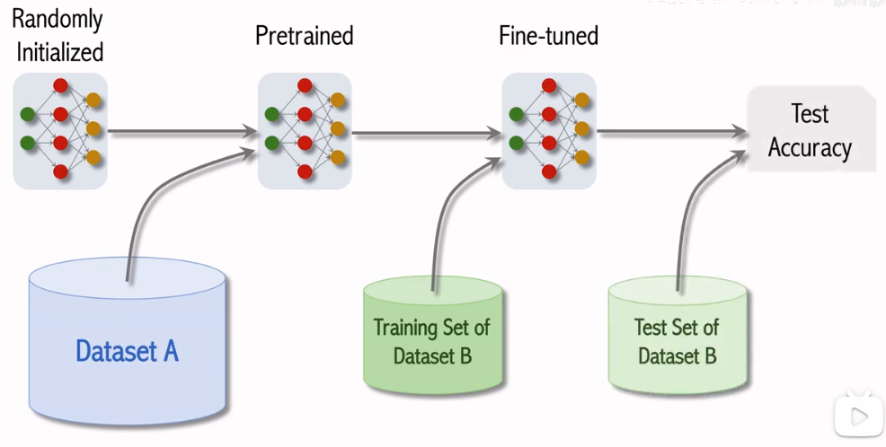
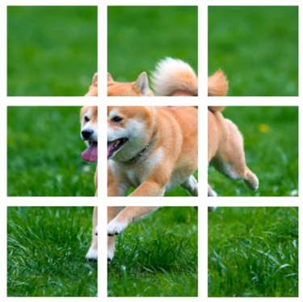
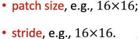
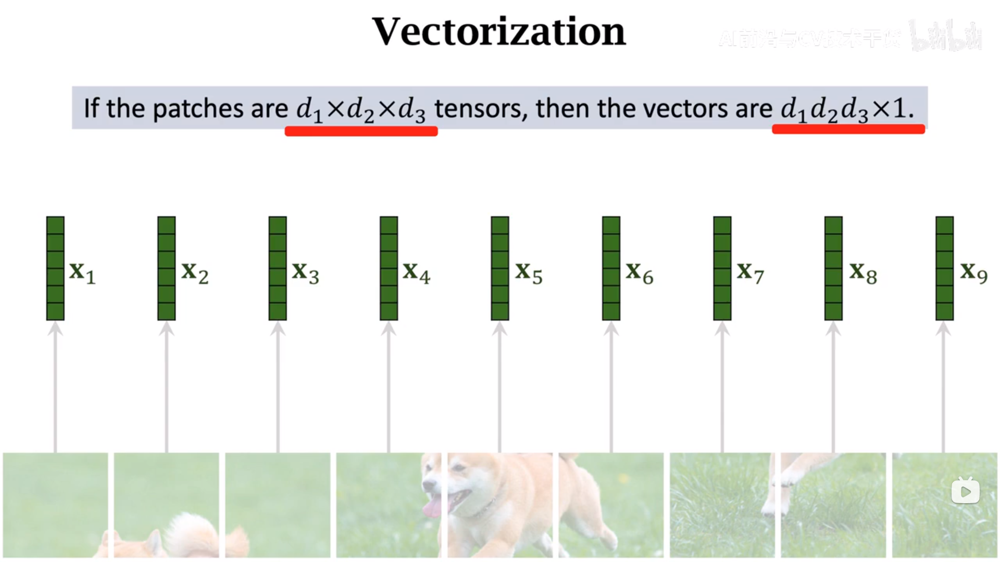
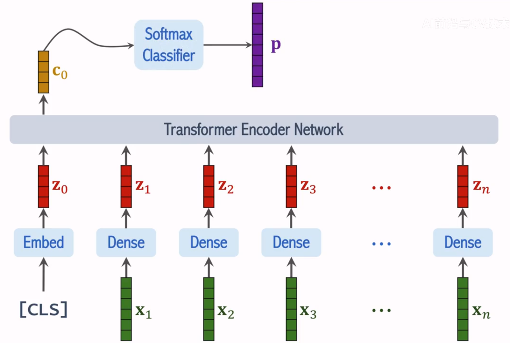

alias:: Vision Transformer

- need very large dataset for pretraining
  
- **split image into patches**
  
  [[hyperparameter]]
  
- [[vectorization]]
  flatten a matrix to a vector
  
- [[positional encoding]] is needed because [[Transformers]] doesn't capture positional relationship
- the transformer encoder network may consist of multiple blocks of [[transformer/encoder]] 
  