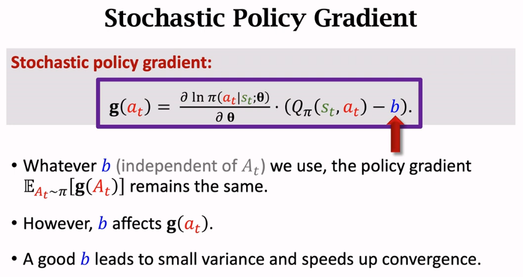
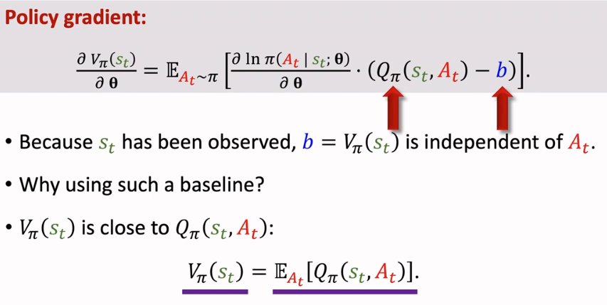
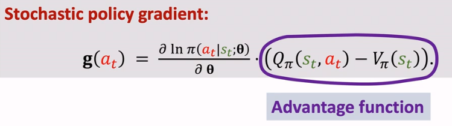
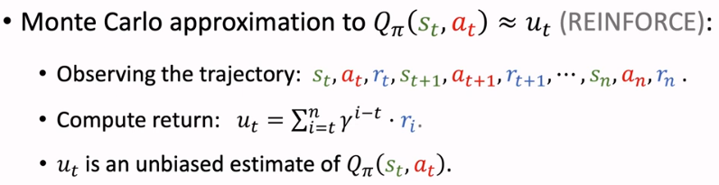
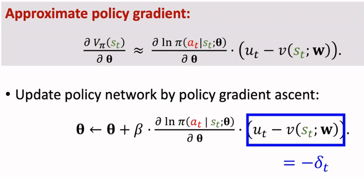
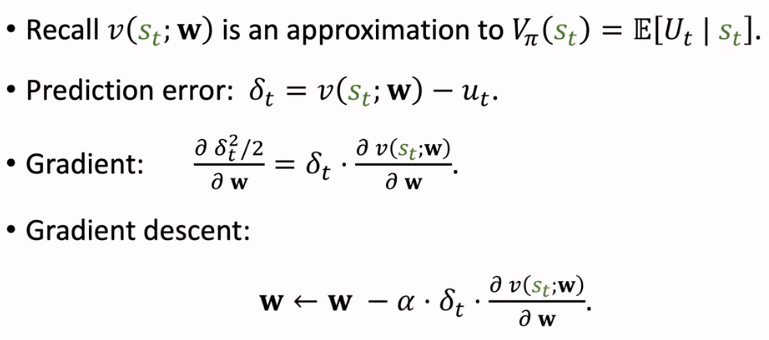

alias:: reinforce with baseline

- [[Policy Gradient]] with Baseline, $b$
  $b$ speed up the **convergence** of [[stochastic policy gradient]]
  
	- if $b = 0$, will be just standard [[Policy Gradient]]
	- if $b = V_{\pi}(s)$
	  
	  It is then called [[advantage function]]
	  
		- apply $b = V_{\pi}(s)$ to [[stochastic policy gradient]]
			- $Q_{\pi}(s_t, A_t)$ could be approximated from [[discounted return]] with aid of [[Monte Carlo]] 
			  id:: 64f60c4a-fd9a-4123-a838-7f2c2f114f66
			  
			- [[policy gradient ascent]] with [[baseline]]
			  
			- update [[value network]] with [[baseline]] in [[stochastic policy gradient]]
			  