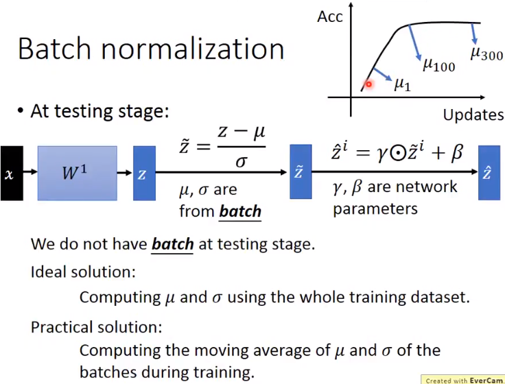

alias:: batch normalisation

- Benefit of [[batch normalisation]]
	- [[regularization]]
	- avoid [[exploding/vanishing gradient]]
	- reduce [[internal covariate shift]], thus allow higher [[learning rate]]
	- learning is less affected by [[initialization]] of weights
		- 
- {{video https://www.bilibili.com/video/BV1bx411V798/?vd_source=a35754dd1fb6720eedad1b04619c7217}}
- The main idea is to reduce the [[internal covariate shift]] by applying [[normalization]] to the hidden layer
	- [[internal covariate shift]] occurs because weight of different layers is changing simultaneously, although [[internal covariate shift]] can be reduced by reducing [[learning rate]].
	- 
	- [[batch normalisation]] allows the statistics of different hidden layers remain consistent (mean=0, standard deviation=1)
	- [[batch normalisation]] is applied before [[activation layer]]
		- to avoid [[exploding/vanishing gradient]]
		- [[batch normalisation]] cannot be applied on small batch, because the $\mu$ and $\sigma$ is to approximate the mean and standard deviation of the whole training set
		- {:height 469, :width 729}
	- [[backpropagation]] do not treats $\mu$ and $\sigma$ as constant, because $\mu$ and $\sigma$ depends on $z^i$
		- 
	- $\beta$ and $\gamma$ are used to shift the $\tilde{z}^i$
		- $\beta$ and $\gamma$ is **trainable**
		- $\beta$ and $\gamma$ are different from $\mu$ and $\sigma$, because $\beta$ and $\gamma$ are independent from $z^i$
		- 
- implementation of [[batch normalisation]] during [[testing]] phase
	- the calculation of moving average of $\mu$ and $\sigma$ only **considered the several latest epochs** of training
	- 