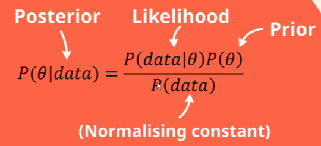
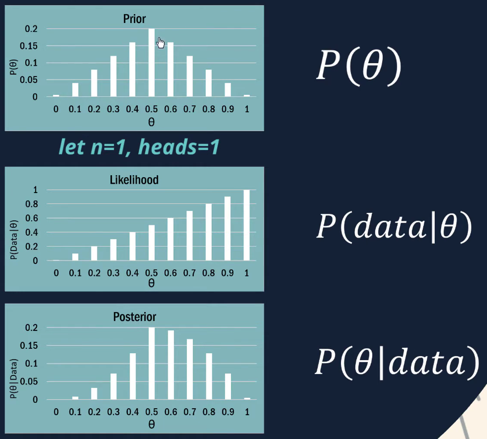

- 
	- 
		- \(\theta\) is the **target variable** that we would like to estimate.
		- \(P(data|\theta)\) is [[likehood]] of \(\theta\) based on sampling (\(data\))
		- \(P(data)\) is just a **normalizing constant** to ensure  the total of \(P(data|\theta)\) remains zero.
			- it is just the total product of \(P(data∣\theta_i​)\) and \(P(\theta_i​)\)
			  $$P(data)=∑_i​P(data∣\theta_i​)P(\theta_i​)$$
- {{video https://youtu.be/Pahyv9i_X2k?si=aGJdkpO9ajcPV4Bv}}