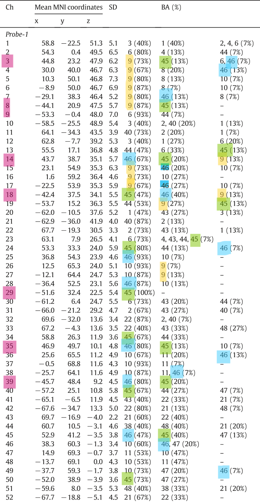
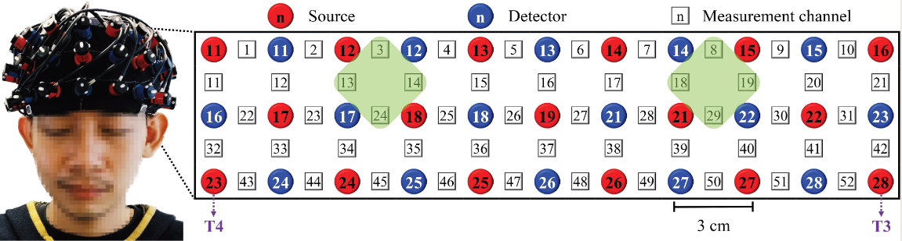

- [Brodmann Areas Of The Brain: Anatomy And Functions (simplypsychology.org)](https://www.simplypsychology.org/brodmann-areas.html)
- {{video https://youtu.be/AvcB9cXI1Yk?si=GznUw03bMsadVLck}}
- https://www.simplypsychology.org/wp-content/uploads/Brodmann-areas-map-1024x796.jpeg
- [[brodmann area 4]]
	- equal to [[primary motor cortex]]
	- control [[voluntary movement]]
- [[brodmann area 6]]
	- contains:
		- [[premotor cortex]]
		- [[supplementary motor cortex]]
	- planning of [[voluntary movement]]
- [[brodmann area 8]]
	- equal to [[frontal eye field]]
	- plays a role in [[eye movement]]
- [[brodmann area 9]] and [[brodmann area 46]]
	- part of [[Dorsolateral Prefrontal Cortex]]
	- [[fNIRS]] channels arrangement used by [[An adaptive block-design paradigm with a novel deep learning-assisted approach for better cognitive load estimation]]
		- {:height 1455, :width 749}
		- 
			- left [[dorsolateral pfc]]: 8, 18, 19, 29
			- right [[dorsolateral pfc]]: 3, 13, 14, 24
	- function:
		- [[working memory]]
		- [[motor planning]]
		- [[organization]]
		- [[regulation]]
		- [[sustaining attention]]