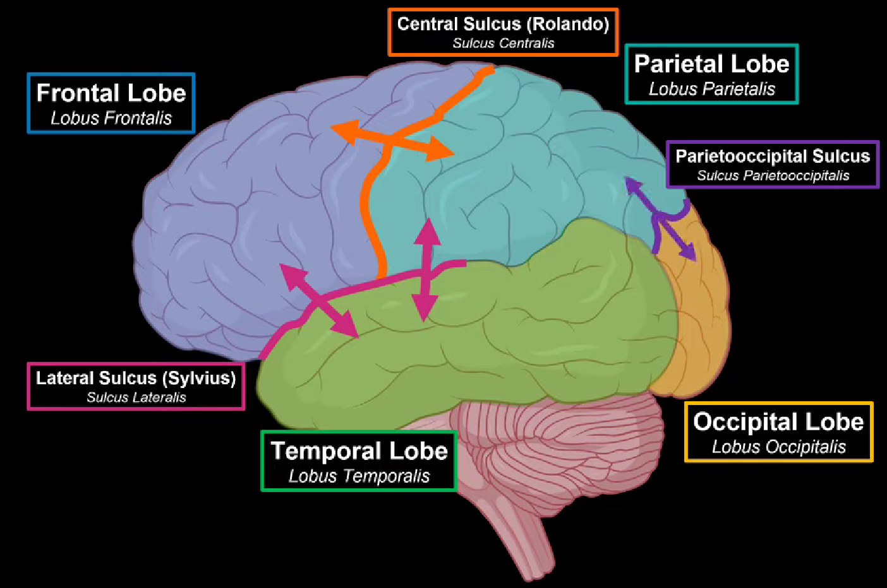
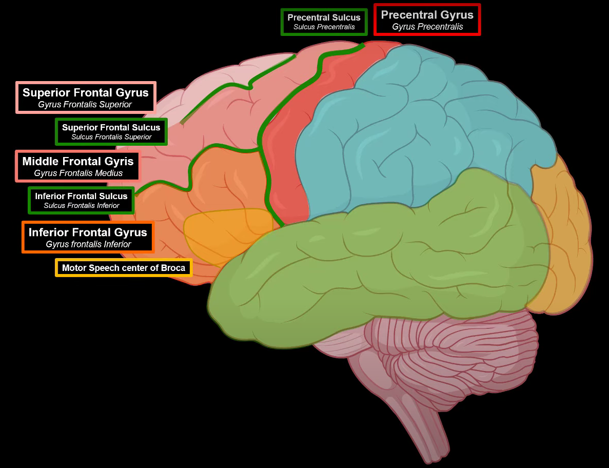
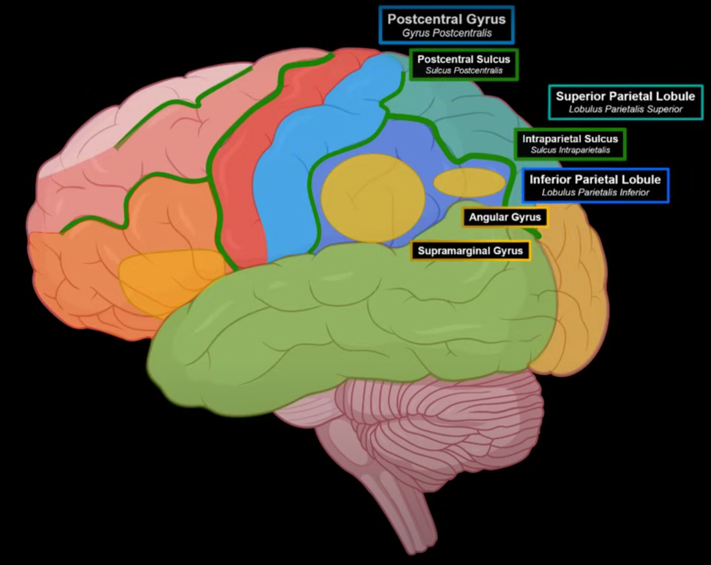
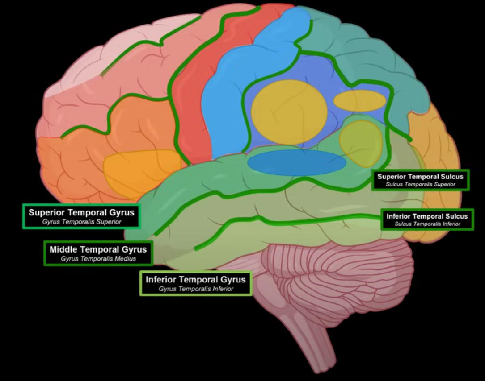
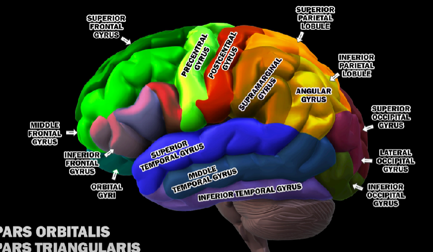

alias:: cerebrum cortex

- {{video https://youtu.be/qdfADIodJ4Y?si=wnZLNW6kCa3tBnyf}}
- [[lobe]]
	- [[lateral view]]
	  
		- [[frontal lobe]]
			- 
			- [[gyrus]]
				- [[precentral gyrus]]
					- [[primary motor cortex]]
				- [[Prefrontal Cortex]]
					- [[superior frontal gyrus]]
					- [[middle frontal gyrus]]
					- [[inferior frontal gyrus]]
						- [[broca area]]
			- [[sulcus]]
				- [[precentral sulcus]]
				- [[superior frontal sulcus]]
				- [[inferior frontal sulcus]]
		- [[parietal lobe]]
			- 
			- [[gyrus]]
				- [[postcentral gyrus]]
					- [[primary somatosensory cortex]]
				- [[superior parietal lobule]]
				- [[inferior parietal lobule]]
					- [[supramarginal gyrus]]
					- [[angular gyrus]]
			- [[sulcus]]
				- [[postcentrial sulcus]]
				- [[intraparietal sulcus]]
		- [[temporal lobe]]
			- 
			- [[gyrus]]
				- [[superior temporal gyrus]]
					- blue area: [[primary auditory cortex]]
					- yellow area: [[Wernicke area]]
				- [[middle temporal gyrus]]
				- [[inferior temporal gyrus]]
			- [[sulcus]]
				- [[superior temporal sulcus]]
				- [[inferior temporal sulcus]]
		- [[occipital lobe]]
		  collapsed:: true
			- [[primary visual cortex]]
	- [[medial surface]]
	- [[inferior surface]]
- all the important [[gyrus]]
  collapsed:: true
	- 