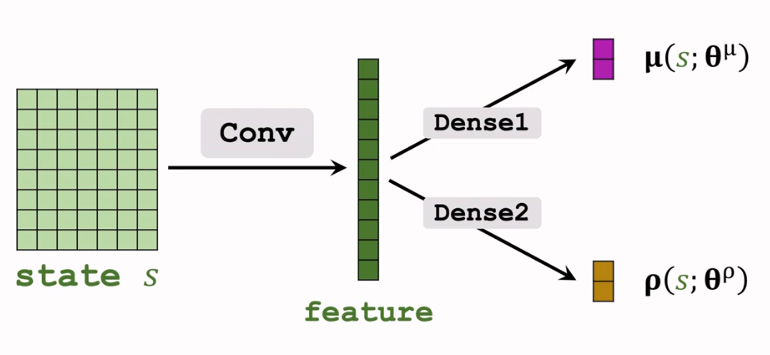
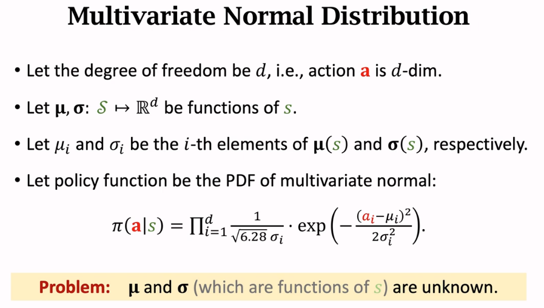
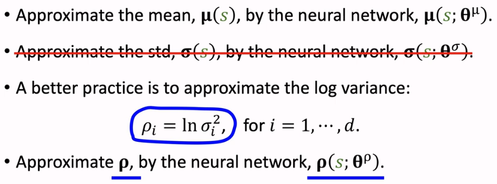
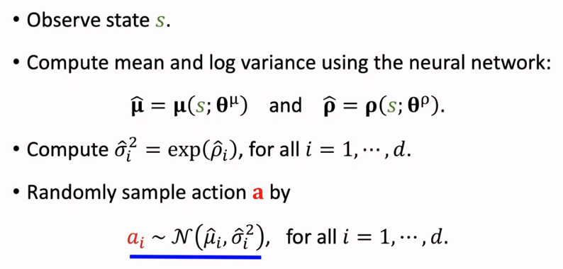
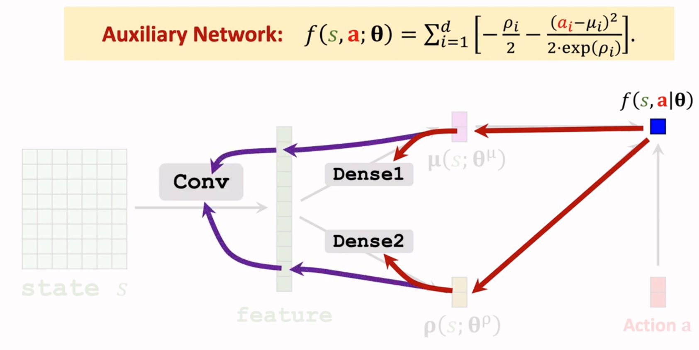
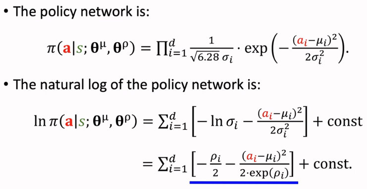
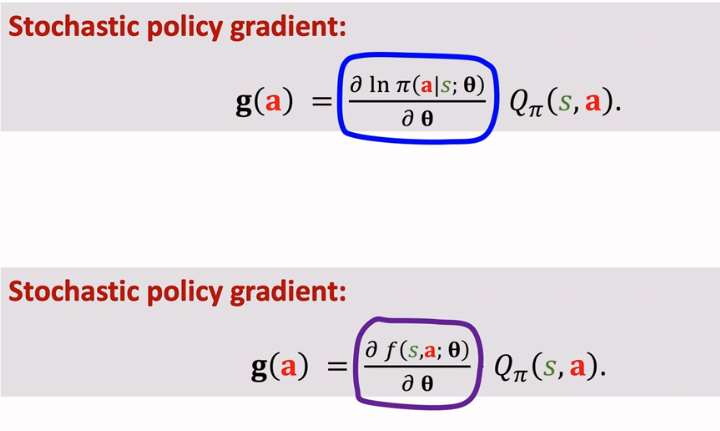
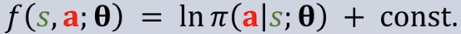

- 
- 
	- Thus, use **neural networks** to approximate the functions
	  
	- Hence, action sampling can be done by
	  
- **Training**
	- to compute the derivative, [[auxiliary network]] is needed
	  
	  where $\mathbf{\theta} = (\mathbf{\theta}^{\mu}, \mathbf{\theta}^\rho)$
		- where [[auxiliary network]] is the natural log of policy network (needed for derivative / backpropagation)
		  
		- [[auxiliary network]] is **only** needed for training (computes derivative for backpropagation)
	- As the result, [[Policy Gradient]] for [[continuous action]]
		- would have only one difference from [[Policy Gradient]]
		  
		  since 