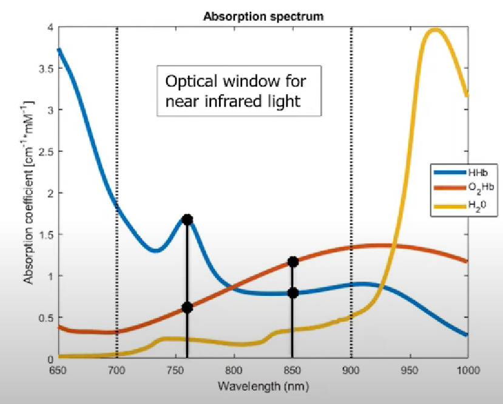
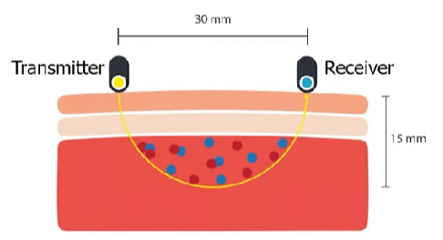
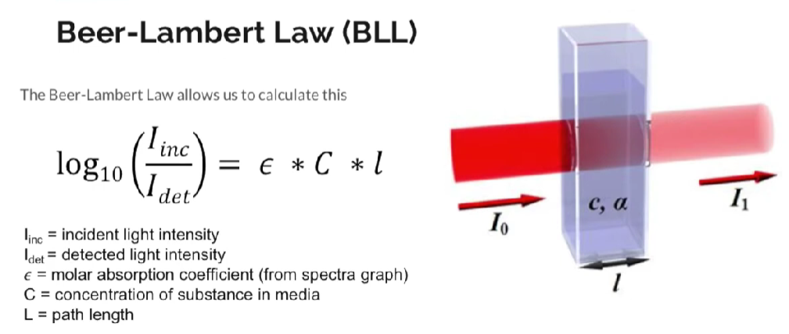
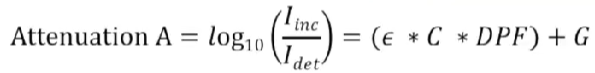

alias:: functional near-infrared spectroscopy

- Mechanism
	- [[attenuation]]
		- [[light intensity]] lost due to [[absorption]] and [[scattering]]
			- [[absorption]]
				- decrease in [[light intensity]] due to absorption of [[NIR]] light of [[oxyhemoglobin]] and [[deoxyhemoglobin]]
				- [[absorption spectrum]] illustrates changes in [[absorption coefficient]] based on the [[wavelength]] of light
				  
			- [[scattering]]
				- 
				- depth is **half** of [[inter-optode]] distance
				- [[scattering]] allows measure amount of [[oxyhemoglobin]] and [[deoxyhemoglobin]] of a **volume**
- Calculation
	- [[Beer-Lambert Law]]
		- calculate [[optical density]] (changes in [[light intensity]]) due to [[absorption]]
		- 
			- Physical pathlength (30mm)
				- [[inter-optode]] distance
			- $\epsilon$: [[absorption coefficient]]
				- based on [[absorption spectrum]]
	- [[modified Beer-Lambert Law]]
		- calculates [[attenuation]]
			- equivalent [[optical densities]] (changes in [[light intensity]]) due to [[absorption]] and [[scattering]]
		- 
			- [[DPF]]
				- accounts for [[scattering]] of [[NIR]] lights
				- depend on age and type of tissue
			- G: [[geometry dependent factor]]
				- intensity lost due to [[scattering]]
	- [[differential modified Beer-Lambert Law]]
		- calculates changes in concentration of [[oxyhemoglobin]] and [[deoxyhemoglobin]] based on change in [[optical density]]
		-