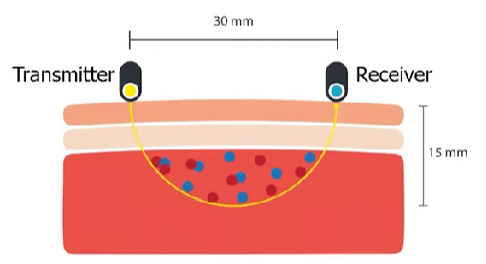
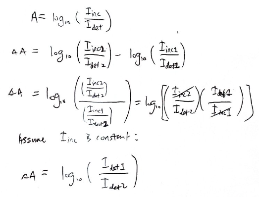
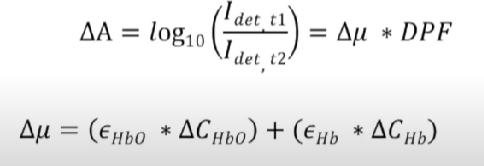
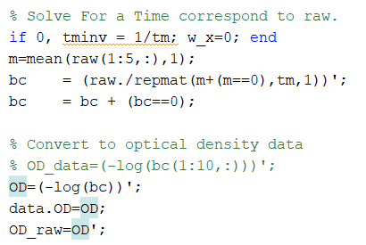
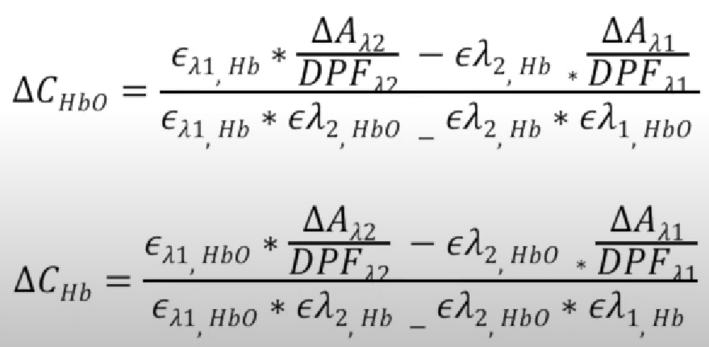

alias:: functional near-infrared spectroscopy

- {{video https://youtu.be/TEMNe5ROsw4?si=8UMEVUr1P7-4n1dW}}
- Mechanism
	- [[attenuation]]
		- [[light intensity]] lost due to [[absorption]] and [[scattering]]
			- [[absorption]]
				- decrease in [[light intensity]] due to absorption of [[NIR]] light of [[oxyhemoglobin]] and [[deoxyhemoglobin]]
				- [[absorption spectrum]] illustrates changes in [[absorption coefficient]] based on the [[wavelength]] of light
				  
			- [[scattering]]
				- {:height 272, :width 486}
				- depth is **half** of [[inter-optode]] distance
				- [[scattering]] allows measure amount of [[oxyhemoglobin]] and [[deoxyhemoglobin]] of a **volume**
- Calculation
	- [[Beer-Lambert Law]]
		- calculate [[optical density]]
		- 
			- [[path length]]
				- e.g.: [[inter-optode]] distance = 30mm
				  
			- $\epsilon$: [[absorption coefficient]]
				- refer to on [[absorption spectrum]]
				- changes based on [[wavelength]]
	- [[modified Beer-Lambert Law]]
		- calculates [[attenuation]]
			- equivalent to [[optical density]], but not only considers intensity lost due to [[absorption]], while also takes [[scattering]] into account (by increasing [[path length]])
			- greater values indicates greater **intensity lost**
		- 
			- [[DPF]]
				- accounts for [[random walk]] nature of light photons in a [[scattering]] medium
					- thus increase the [[path length]] to be more than [[inter-optode]] distance
				- depend on age and type of tissue
			- G: [[geometry dependent factor]]
				- [[light intensity]] lost due to [[scattering]] of light out of the system
	- [[differential modified Beer-Lambert Law]]
		- since [[geometry dependent factor]] is unknown and assumed to be [[time-invariant]], we cancel out G from [[MBLL]] via differentiation
			- Since $I_{inc}$ remains constant throughout an experiment
			  
			- 
				- $I_{det, t1}$: baseline value (commonly use average [[light intensity]] over entire scan)
					- 
				- $I_{det, t2}$: current detected [[light intensity]]
		- finally, we can calculate changes in concentration of [[oxyhemoglobin]] and [[deoxyhemoglobin]] based on change in [[attenuation]]
			- 
		- Pros of using dMBLL:
			- We can calculate both changes in concentration of [[oxyhemoglobin]] and [[deoxyhemoglobin]], separately (but fMRI only gets us a ratio of the two)
		- Cons of using dMBLL:
			- Does not give us absolute concentration, only **change in concentration**
			- Assumes we know [[DPF]], [[geometry dependent factor]] is constant, and [[absorption]] of a medium is homogenous. None are actually true with [[CWfNIRS]] units
			- [[FDfNIRS]] can measure real [[DPF]] and [[geometry dependent factor]], but is way more expensive and time-intensive. Means [[CWfNIRS]] measurements may not replicate as well across different subjects' heads or different parts of the scalp
			- AKA, introduces more measurement noise across subjects, can't compare activation between brain areas (only within), thus requires [[GLM]]
	- Usability Properties:
		- Cost & Portability: Generate light with lasers or LED, much smaller/lighter/cheaper than a magnet
		- Motion tolerance: so long as optode doesn't move on scalp, the whole measurement system is localized and not affected by movement elsewhere in the body
		- Sampling rate: Take measurements as fast as you can flash through all your different light sources
		- Spatial resolution: Determined by [[geometry dependent factor]] (which we can estimate from prior [[FDfNIRS]] work). Can make this better with multi-distance channel measurement
		- Signal depth: Restricted by channel spacing: a wider channel gets signal to bounce deeper, but with diminishing signal quality due to increased scattering and absorption until you hit a floor of no light bouncing back out. Thus, **3 cm is a common spacing**.
		- Participant comfort: Optodes must touch scalp to work and could potentially be too tight, but that's the only risk