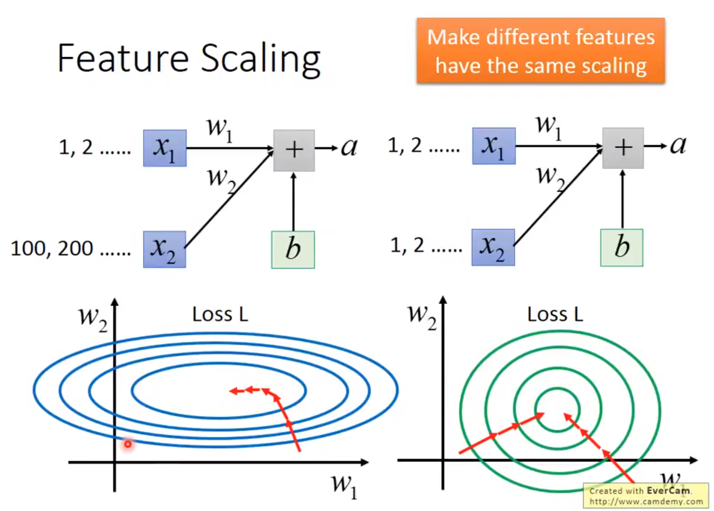
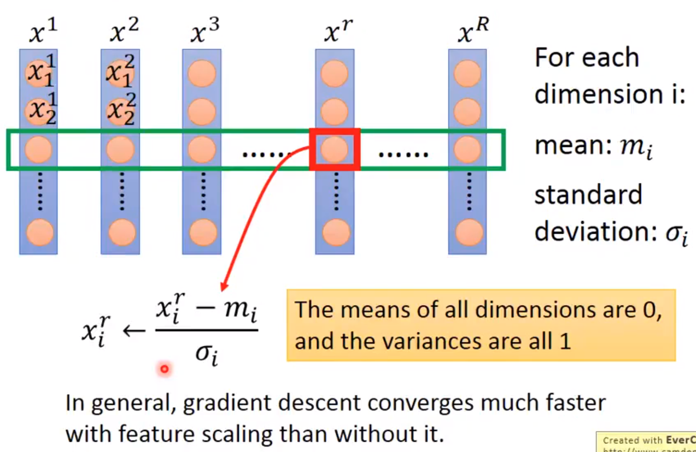

alias:: normalization, normalisation

- 
- Without [[feature scaling]], different features require different [[learning rate]] to obtain good training result
- With [[feature scaling]], all features could utilize identical [[learning rate]] to obtain good training result
- 