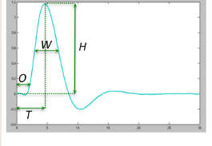
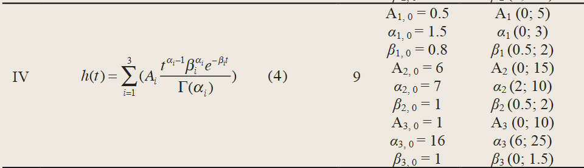

alias:: HRF

- 
	- T: time to peak
	- O: the onset
	- W: full width at half maximum
	- H: maximum signal change during the peri-stimulus time window
- When neurons are active, [[BOLD]] signal provided by [[MRI]] will rise after 6-12 seconds
	- [[BOLD]] signal peak after 5-6 seconds
- three gamma function
	- 