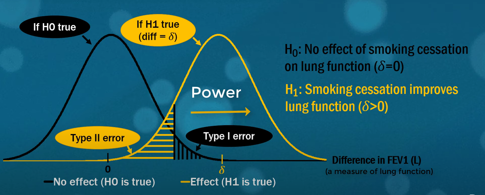
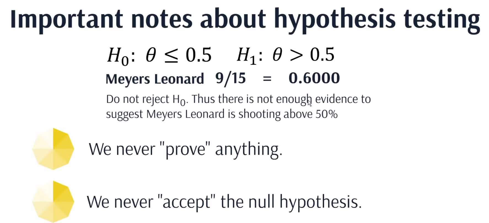

- Black shaded area: [[type 1 error]]
  [[confidence interval]]: 1 - [[type 1 error]] 
  Yellow shaded area: [[Type 2 error]]
  [[power]]: 1 - [[Type 2 error]]
	- 
- How should we make conclusion formally
	- 
		- {{video https://youtu.be/kyjlxsLW1Is?si=e7EEdOLwGbUI47my&t=1793}}