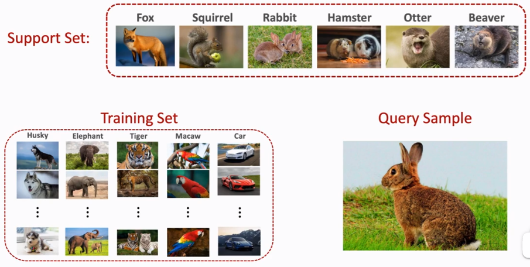
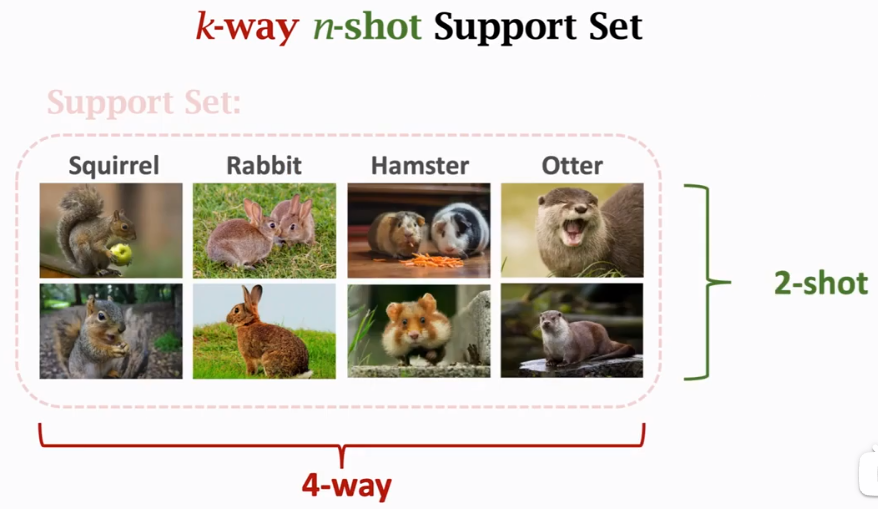
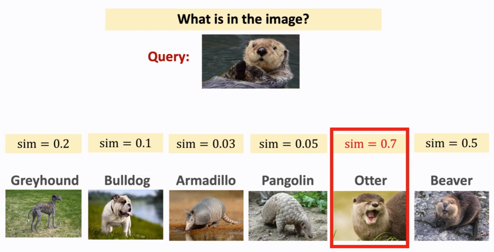
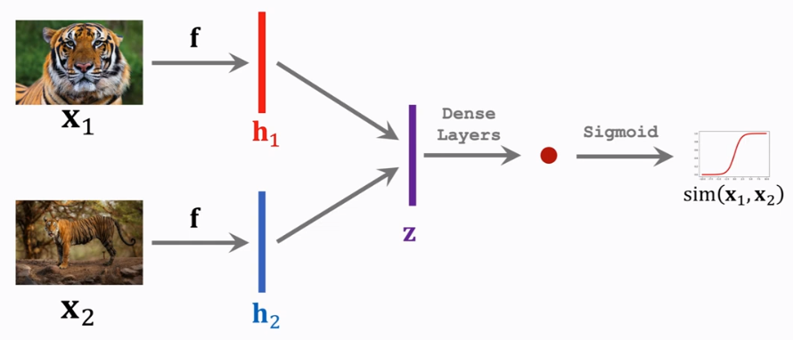
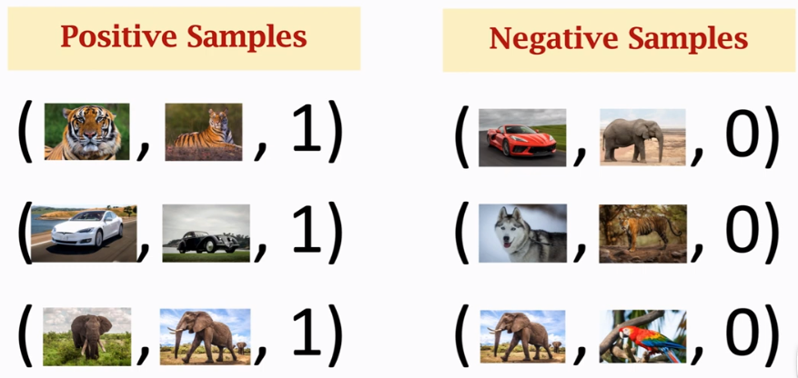
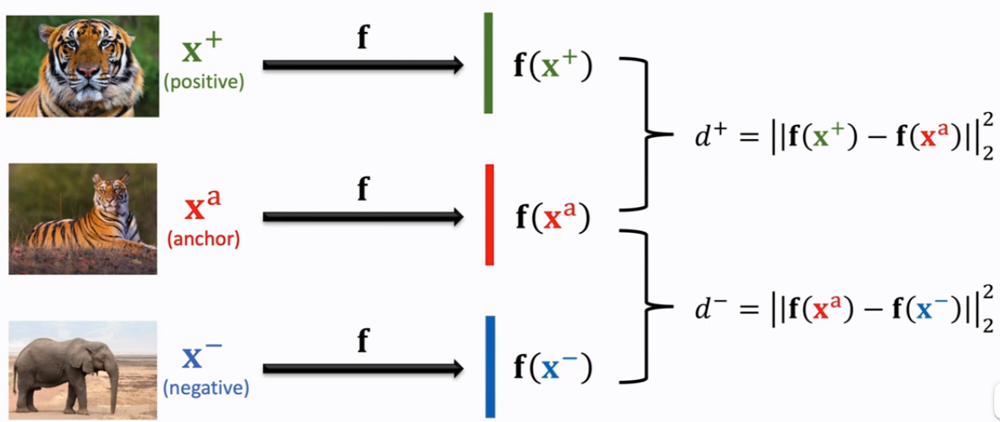
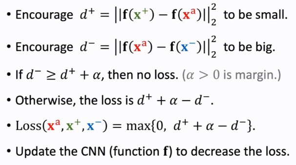
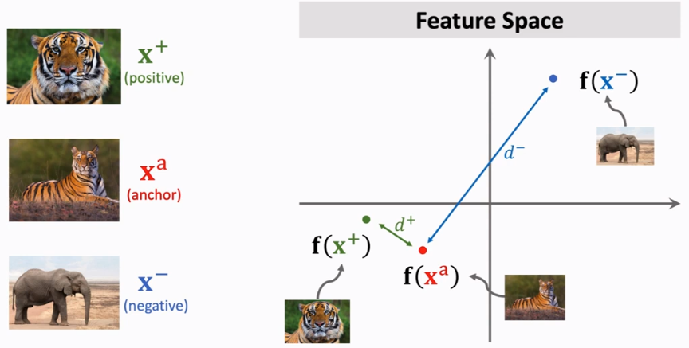

alias:: Meta Learning

- [[few-shot learning]]
	- [[training set]], [[support set]] and [[query]]
	  
		- [[support set]]
		  
	- basic idea
	  
		- assets:///home/koksyuen/Logseq/assets/image_1695584744744_0.png
- [[siamese network]]
	- [[pairwise similarity]]
	  **f** (feature extractor) are same network
	  $$z = |h_1 - h_2|$$
	  
		- [[training set]]
		  
	- [[triplet loss]]
	  
	  
	  