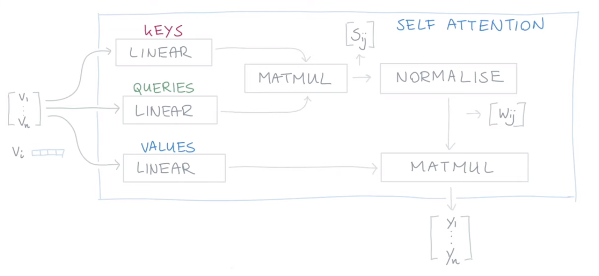

- {{video https://youtu.be/tIvKXrEDMhk}}
	- ### Overview
	  Framework of self attention mechanism which input are a batch of input vectors
	  {{youtube-timestamp 665}} 
	  
	  length of $v$ = length of $y$
	- ### Video notes
	  {{youtube-timestamp 559}} example of self attention mechanism with only one input vector