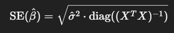
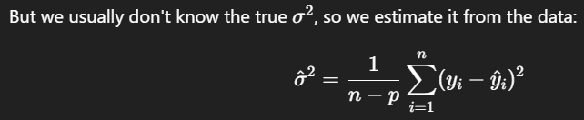
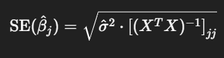
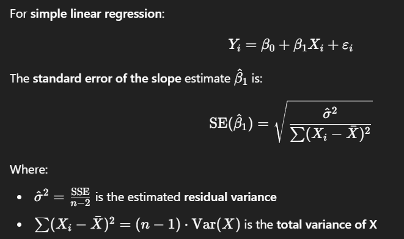

- https://chatgpt.com/share/67f553ac-8d5c-8008-8970-b37503d7a036
	- Matrix form (reduce computation time)
	  
		- [[estimated variance]] (similar to [[SSE]])
		  
			- n: number of data points
			- p: number of [[regression coefficient]] (including intercept)
		- output standard error for every $\hat{\beta}$ estimates in vector form
		- so, standard error for each $\hat{\beta}$
		  
			- $(X^TX)^{−1}$ is the **inverse of the information matrix**, giving variance-covariance info for the $\hat{\beta}$ estimates
			- $[(X^TX)^{−1}]_{jj}$ is the **j-th diagonal element** of that matrix, where, $$[(X^TX)^{−1}]_{jj} = \frac{1}{\sum{x_{ij} - \bar{x}_j}^2}$$
				- j: 1 ~ number of beta
				- i: 1 ~ number of data points
		- standard error equation (theoretical form)
		  
			- standard error is **directly proportional** to [[Sum of Square Error]]
			- standard error is **inversely proportional** to [[variance]] of [[independent variable]] $x_i$
- {{video https://youtu.be/rJFAGGvXj2U?si=gDGb8VKEu_Bn-fkI}}
	- In [[Linear Regression]] or [[General Linear Model]],  [[standard error]] of $\beta$ of [[independent variable]] $x_i$ is
		- {{youtube-timestamp 80}} directly proportional to [[Sum of Square Error]]
		- {{youtube-timestamp 181}} inversely proportional to [[variance]] of [[independent variable]] $x_i$