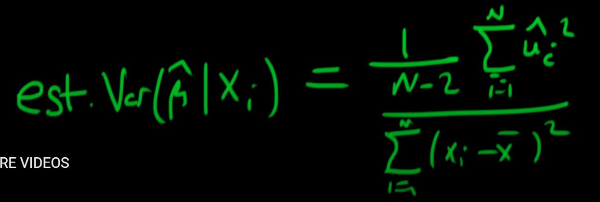

- 
- {{video https://youtu.be/rJFAGGvXj2U?si=gDGb8VKEu_Bn-fkI}}
	- In [[Linear Regression]] or [[General Linear Model]],  [[standard error]] of $\beta$ of [[independent variable]] $x_i$ is
		- {{youtube-timestamp 80}} directly proportional to [[Sum of Square Error]]
		- {{youtube-timestamp 181}} inversely proportional to [[variance]] of [[independent variable]] $x_i$