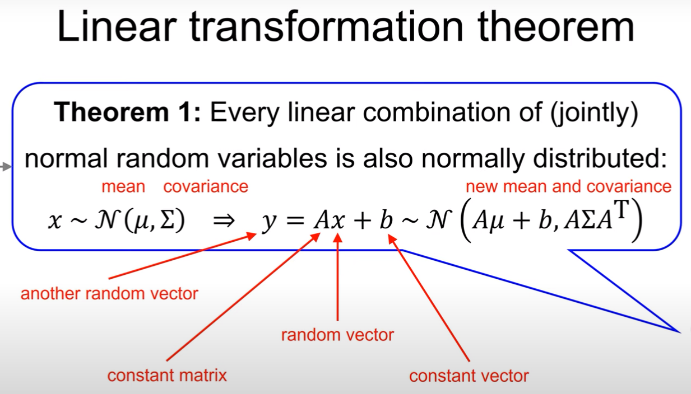
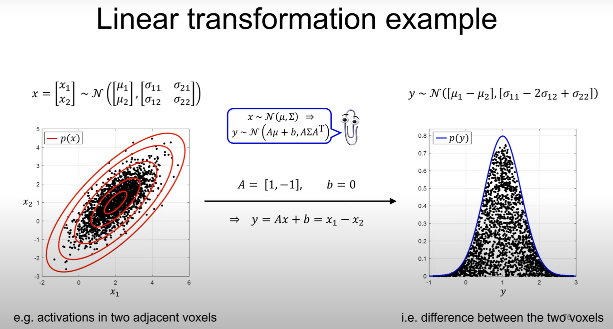
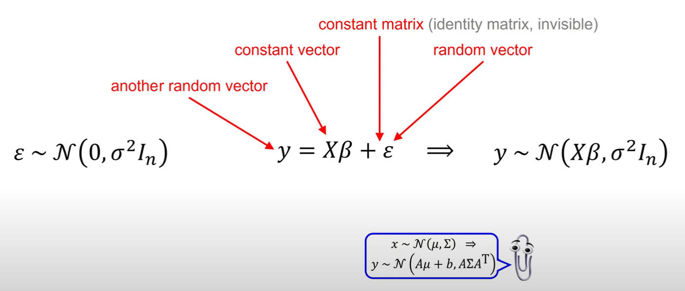
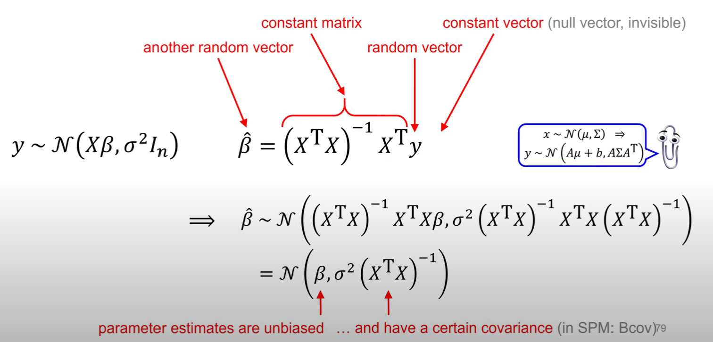
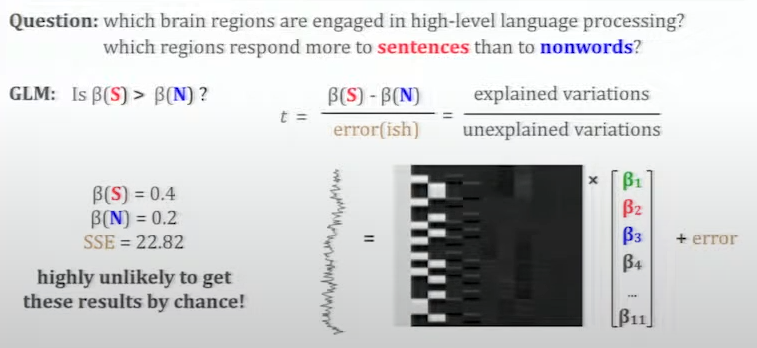
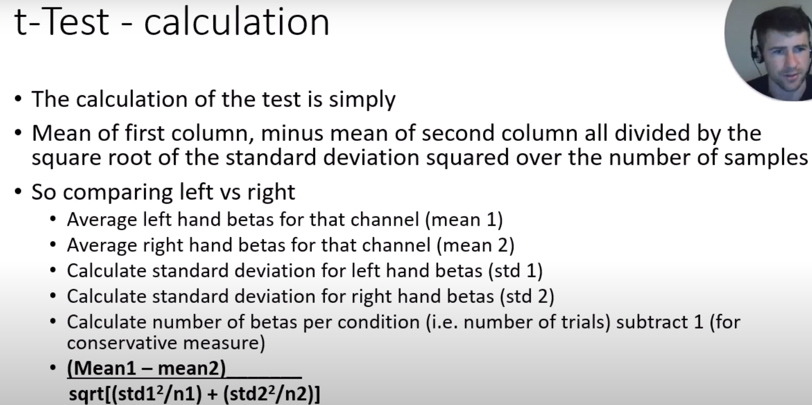
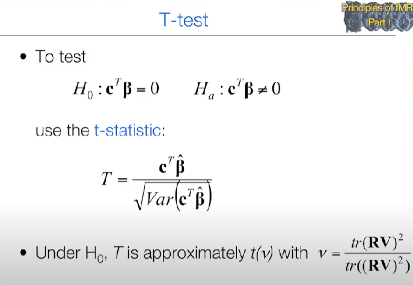
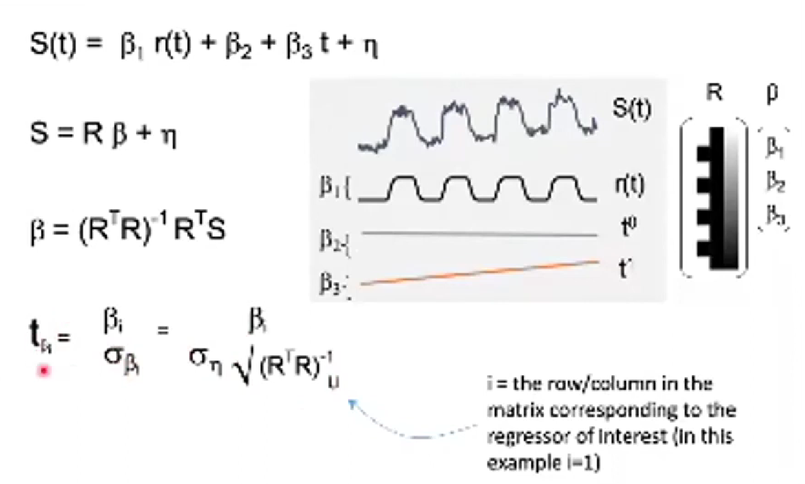

- {:height 322, :width 600}
- Approaches:
	- most understandable and formal mathematical method to apply t-test for [[GLM]]
		- [[linear transformation theorem]]
		  collapsed:: true
			- 
			- 
		- derivation
		  collapsed:: true
			- 
			- 
		- {{video https://youtu.be/ZVXZS5yKtUs?si=-EL0TStCOx9WF4RW}}
	- uses [[Sum of Square Error]] as noise
		- 
		- {{video https://youtu.be/BjDRsCC-8p8?si=IBfvLsAGu9ZVFfMo&t=119}}
	- isolate time series data into blocks, and perform [[GLM]] on every block. Finally perform t-test using mean and standard deviation of obtained betas.
		- 
		- {{video https://youtu.be/9VGX1ui4nFk?si=357XRVJcKF3aEhEX&t=900}}
	- Uses [[covariance matrix]] to calculate noise
		- 
			- {{video https://youtu.be/NRunOo7EKD8?si=Z2tXAwVXK2-HU5JU&t=169}}
		- 
			- {{video https://youtu.be/qnjiJ41cryQ?si=tOekyqOUwu_15Wcx&t=309}}