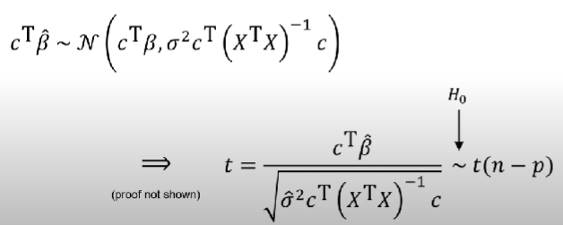

- {:height 322, :width 600}
- [[t-distribution]]
  collapsed:: true
	- {{video https://youtu.be/UetYS3PaHIo?si=VrveawAeFXmRA36e}}
- Implementation of [[t-test]] for [[Linear Regression]]
	- {{video https://youtu.be/fZV4ntLEPlU?si=KbWcD8Ko9F2oM0Uf}}
	- {{video https://youtu.be/78YNvrsRzVw?si=tRyptoXTKk8RdHmb}}
	- [[t-value]] of $\beta_i$ for [[independent variable]] $x_i$ = $\beta_i$ / [[standard error]] of $\beta_i$
		- Based on the formula of [[standard error]], [[t-value]] is
			- directly proportional to:
				- $\beta_i$
				- variance of [[independent variable]] $x_i$
			- inversely proportional to:
				- [[Sum of Square Error]] of [[Linear Regression]]
			- Therefore, for [[GLM]], the magnitude of [[regressor]] does not affect the [[t-value]], because the product of $\beta_i$ and $var(x_i)$ will still be same
- Implementation of [[t-test]] for [[GLM]] :
	- formal mathematical method to apply t-test for [[GLM]]
		- [[linear transformation theorem]]
			- 
			- 
		- derivation
			- 
			- 
			- 
		- {{video https://youtu.be/ZVXZS5yKtUs?si=-EL0TStCOx9WF4RW}}
	- uses [[Sum of Square Error]] as noise
	  collapsed:: true
		- 
		- {{video https://youtu.be/BjDRsCC-8p8?si=IBfvLsAGu9ZVFfMo&t=119}}
	- isolate time series data into blocks, and perform [[GLM]] on every block. Finally perform t-test using mean and standard deviation of obtained betas.
	  collapsed:: true
		- 
		- {{video https://youtu.be/9VGX1ui4nFk?si=357XRVJcKF3aEhEX&t=900}}
	- Uses [[covariance matrix]] to calculate noise
	  collapsed:: true
		- 
			- {{video https://youtu.be/NRunOo7EKD8?si=Z2tXAwVXK2-HU5JU&t=169}}
		- 
			- {{video https://youtu.be/qnjiJ41cryQ?si=tOekyqOUwu_15Wcx&t=309}}