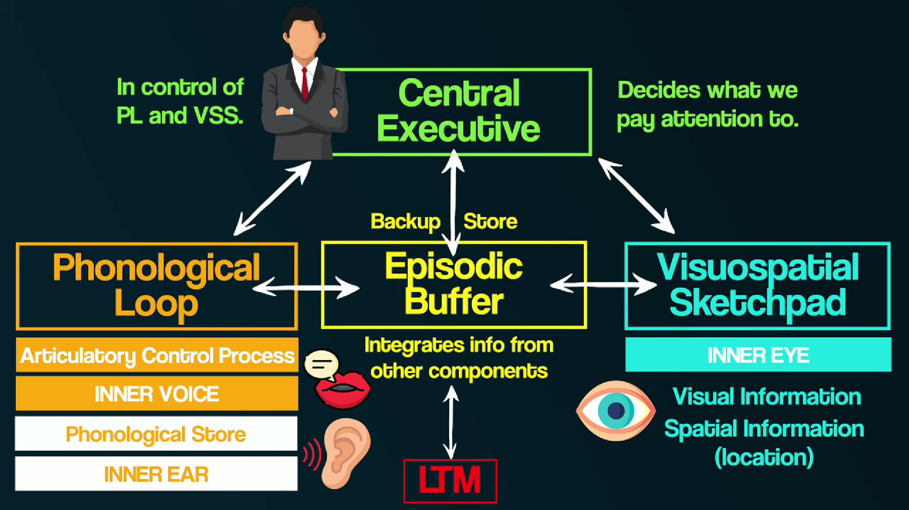

alias:: short term memory, working memory tasks

- seem like computer's RAM
- everyone's working memory has limited capacity [[working memory capacity]]
- model
  {{video https://youtu.be/We2GH6NIEBs?si=qi1oKwkNuXqWNCXI}}
	- [[phonological loop]]
		- inner ear / inner voice
	- [[visual spatial sketch pad]]
		- inner eye
	- [[central exceutive]]
		- boss of [[phonological loop]] and [[visual spatial sketch pad]]
		- decide the distribution of focus to [[phonological loop]] and [[visual spatial sketch pad]] if reach [[working memory capacity]]
	- [[episodic buffer]]
	  
		- integrate [[long term memory]] with [[working memory]] ([[phonological loop]] and [[visual spatial sketch pad]])
- test / evaluation
  {{video https://youtu.be/PWHq95-hkkA?si=Dg4uiOJFptMFfRIi}}
	- [[n-back test]] {{youtube-timestamp 311}}
	- [[calculation test]] {{youtube-timestamp 368}}
	- [[rotation test]] {{youtube-timestamp 403}}